# Literature Review: Fine-Grained GPU Sharing and Co-Location Scheduling

## Scope and Reading Guide

This review covers the seven PDF files stored directly in the main `orion-citation` directory. The collection spans several layers of the GPU-sharing stack. Bless, Hummingbird, Tally, MMK, and LithOS directly manipulate GPU execution at kernel, thread-block, stream, context, or SM/TPC granularity. SMore performs cluster-level admission and placement for serverless inference functions. The file named `Harli SLO-Aware Co-location of LLM Inference and PEFT Finetuning.pdf` contains the OSDI 2024 paper *Usher: Holistic Interference Avoidance for Resource Optimized ML Inference*, not Harli; this review follows the paper content and records the filename mismatch.

The review begins with fine-grained temporal sharing for HP/BE workloads, then extends the bubble-reclamation perspective to quota-aware spatial sharing before moving to broader hierarchical and GPU-OS designs. It concludes with complementary workload-level systems. The papers are reviewed with an emphasis on five questions:

1. What resource-underutilization or interference problem does the paper target?
2. At what layer and granularity does it make scheduling decisions?
3. How does it observe, intercept, transform, or control GPU work?
4. What guarantees and performance improvements does it provide?
5. How closely does it match the Orion-style research direction of transparent kernel interception and scheduling?

## 1. Hummingbird and Tally: Transparent Fine-Grained Temporal Sharing

> **In brief:** Both systems turn best-effort (BE) kernels into **bounded execution units**, place them in high-priority (HP) **GPU bubbles**, and stop admitting BE work when HP work returns. **Hummingbird** emphasizes bubble detection and split-kernel launch control; **Tally** chooses per kernel between slicing and persistent-worker preemption.

### Common motivation and system abstraction

Both systems explicitly target the same two-workload setting on a shared GPU:

- A **high-priority (HP) workload**, typically online inference, whose latency or SLO must remain close to exclusive execution.
- A **best-effort (BE) workload**, typically offline inference or training, whose throughput should be maximized without violating the HP objective.

The HP workload is often bursty: GPU kernels are separated by CPU processing, synchronization, communication, or request-arrival gaps. Exclusive execution protects HP latency but leaves these intervals unused. The common goal of Hummingbird and Tally is therefore to **harvest HP-idle intervals with BE execution while bounding the delay imposed on the next HP kernel**.

At the highest level, both systems try to maximize useful BE work subject to a bound on HP waiting time:

$$
T_{\mathrm{HP\ wait}} \lesssim T_{\mathrm{residual\ BE\ unit}} + T_{\mathrm{runtime}}.
$$

Here, **residual BE unit time** is the remaining execution time of the BE work already admitted when an HP kernel arrives, while **runtime overhead** includes detection, scheduling, and launch costs. The central design problem is therefore to keep the admitted BE unit short enough for rapid HP response, but large enough to avoid excessive fragmentation overhead and preserve BE throughput.

Whole-kernel temporal sharing cannot provide a tight bound because a long BE kernel may already be resident when HP work arrives. CUDA stream priority only prioritizes pending kernels; it cannot evict resident blocks. Neither Hummingbird nor Tally introduces instruction- or warp-level hardware preemption. Instead, both implement **cooperative software preemption** by turning a monolithic BE kernel into smaller units that drain at safe boundaries.

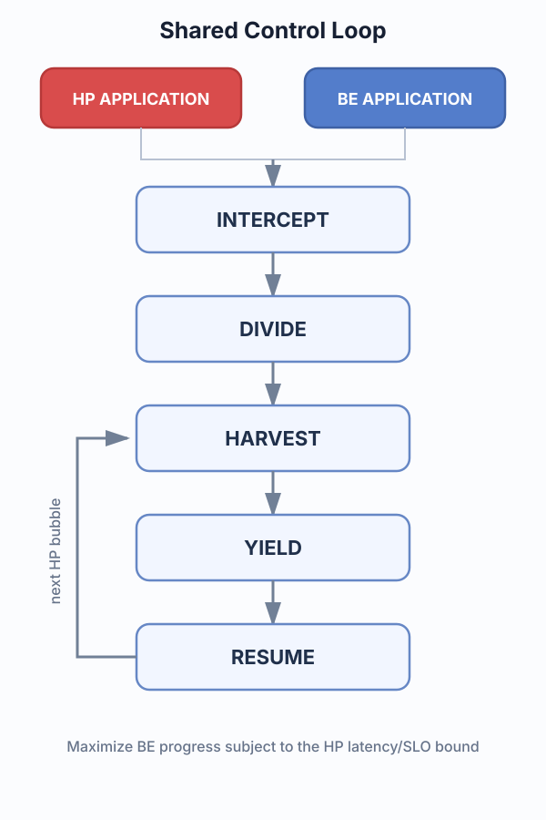

Only after establishing the HP waiting-time objective do the lower-level mechanisms enter the picture. Both systems transparently control HP and BE applications through a five-stage loop: they observe CUDA work, create bounded BE units, place those units in HP-idle intervals, yield when HP work returns, and resume unfinished BE work later.

The two systems mainly differ below this shared abstraction. Hummingbird discovers and predicts HP bubbles, then controls a sequence of ordinary split-kernel launches. Tally treats HP inactivity as the opportunity signal and chooses per BE kernel between slicing and persistent-worker preemption.

Both systems perform important transformations at the **PTX (Parallel Thread Execution)** level. PTX is NVIDIA's virtual GPU instruction-set representation: CUDA, Triton, and other frontends can compile a kernel into PTX, which the CUDA driver later translates into architecture-specific machine instructions (**SASS**) for the target GPU. Rewriting PTX is lower-level and more framework-independent than modifying PyTorch operators or CUDA source, while still retaining concepts such as thread/block indices, branches, and barriers that these systems need to manipulate. However, the approach depends on PTX being available; opaque or precompiled library kernels may require a fallback mechanism.

The shared loop is **cooperative**, not immediate hardware preemption. When HP work arrives, the currently admitted BE unit must still drain. Kernel division matters because it bounds this residual work, while interception lets the runtime stop further BE admission and prioritize the HP launch.

 

*Shared control loop. Both systems repeatedly transform available HP-idle time into BE progress while bounding how long BE work takes to drain.*

*Unified high-level view. Blue units are best-effort work admitted into gaps between red high-priority intervals. Hummingbird bounds interference by keeping at most one split-kernel in the device queue; Tally either does the same with slices or lets persistent workers stop between logical thread blocks.*

### Hummingbird: bubble-aware split-kernel scheduling

Hummingbird intercepts low-level CUDA Driver APIs and combines three ideas:

- **Split-kernel execution.** It profiles an efficient sub-grid size, then rewrites PTX with `blockIdx` offsets so one logical grid becomes a sequence of smaller launches.
- **Bubble-aware admission.** It recognizes short synchronization/communication bubbles from CUDA and NCCL API patterns, while longer idle periods are detected by queue inactivity and optionally predicted from request intervals.
- **Kernel-tick scheduling.** It keeps at most one BE split-kernel in the device queue and launches the next near the previous split's completion. When HP work arrives, a **host-side control flag** stops further launches; the running split drains normally.

This last point is important: Hummingbird does **not** turn the BE kernel into a persistent worker or terminate its current split early. Its preemption bound comes from making each ordinary launch short and limiting queue depth. For long bubbles, **split consolidation** restores larger grids to reduce launch overhead and improve BE throughput.

Hummingbird also provides **priority-aware memory management**, retaining local HBM for HP data while offloading BE pages to NVLink-connected HBM or host DRAM. The paper reports **9.7x/3.5x** higher HP SLO attainment than representative spatial/temporal approaches, less than **1%** loss versus exclusive HP execution, and up to **2.4x** higher BE throughput than REEF.

### Tally: profile-guided slicing or persistent-worker preemption

Tally uses a centralized **client/server CUDA virtualization** layer to intercept operations, preserve CUDA semantics, profile kernels, and dispatch HP work before BE work. It creates bounded BE units using one of two per-kernel mechanisms:

- **Kernel slicing** rewrites block indices and issues small sub-grids one at a time. It is simple but pays repeated launch overhead.
- **Persistent-worker preemption** launches a fixed set of physical worker blocks. Each worker obtains a logical block ID from a global counter, executes that block, and checks a device-visible **preemption flag** before claiming another. On HP arrival, workers drain at logical-block boundaries and later resume from the saved counter.

Persistent conversion can deadlock if some threads return while others wait at a block-wide barrier. Tally's **unified-synchronization transformation** rewrites return and barrier paths so threads exit together at safe boundaries. Tally then profiles both primitives and their parameters, choosing the configuration that maximizes BE performance under a turnaround bound.

Unlike Hummingbird, Tally does not require semantic CUDA/NCCL bubble patterns: generic HP inactivity is sufficient. Its adaptivity concerns **how each kernel yields**, rather than **how long the current bubble will last**. Tally reports **7.2%** average HP P99 latency overhead while retaining more than **80%** of TGS's aggregate throughput.

### Direct comparison between the two systems

The systems belong to the same design family. Their differences are mainly in **opportunity detection** and **yield implementation**:

| Dimension | Hummingbird | Tally |
|---|---|---|
| Opportunity | CUDA/NCCL hints plus large-idle detection/prediction | Generic HP inactivity |
| BE primitive | PTX-rewritten split-kernel launches | Per-kernel slicing or persistent workers |
| HP arrival | Stop the host launch loop; current split drains | Stop slices, or set a device flag and drain logical blocks |
| Adaptation | Profile split size; consolidate in long bubbles | Profile primitive and parameters under a turnaround bound |
| Extra emphasis | Bubble structure and memory offloading | Semantics-safe, general block-level yield |

In short, **Hummingbird controls a sequence of ordinary short launches**, whereas **Tally can additionally stop inside a persistent kernel at logical-block boundaries**. Hummingbird invests more in finding and sizing bubbles; Tally invests more in selecting a safe yield mechanism.

### Comparison with Orion

All three intercept unmodified applications, but **Orion spatially co-executes compatible whole kernels**, whereas Hummingbird and Tally primarily perform **fine-grained temporal borrowing**. Once Orion admits a BE kernel, it normally runs to completion and may interfere with an HP kernel; Hummingbird and Tally pay transformation overhead to bound withdrawal at a split or logical-block boundary. They therefore offer stronger tail-latency isolation when kernels are long or interference is difficult to predict.

Orion can still achieve higher utilization by exploiting complementary resources while HP work is active, and it can schedule opaque library kernels without transformable PTX. The tradeoff is therefore **overlap and lower mechanism cost** in Orion versus **bounded yield and stronger isolation** in Hummingbird/Tally.

### Summary and research implications

The shared recipe is **intercept, divide, harvest, yield, and resume**. Hummingbird contributes workload-aware bubble detection, paced split launches, consolidation, and memory management; Tally contributes a profile-guided choice between slicing and semantics-safe persistent workers.

A natural combined design would use Hummingbird to decide **when and for how long BE may run**, Tally to decide **how the current kernel should yield**, and Orion to decide **when controlled spatial overlap is preferable to temporal withdrawal**.

## 2. Bless: Quota-Aware Reclamation of Spatial GPU Bubbles

> **In brief:** Bless targets multiple GPU tenants with explicit SM quotas. It transparently groups their kernels into short **kernel squads**, selects a profiled MPS allocation for each squad, and lets one tenant reclaim capacity that another tenant cannot currently use - while preserving every tenant's quota-equivalent progress.

### Target problem: allocation is not utilization

The first section treated an HP-idle interval as reclaimable time. Bless starts from a related but broader observation: **a tenant may leave GPU capacity idle even while it is actively running**. The setting is no longer restricted to one HP workload and one BE workload. Multiple inference applications share a GPU, and each tenant is assigned a quota representing the SM capacity it should receive.

Static spatial sharing appears to provide a clean guarantee: for example, two tenants may receive 60% and 40% of the SMs. In practice, a kernel may lack enough thread blocks to fill its partition, may saturate memory bandwidth before using all assigned SMs, or may temporarily have no launch ready. The tenant still owns its quota, but part of that quota becomes a **spatial bubble**. Static MPS cannot give that unused capacity to another tenant without changing the partition, while coarse mechanisms such as MIG expose only a small set of rigid configurations.

Bless therefore asks a different high-level question:

> How can the system make GPU sharing work-conserving while ensuring that every tenant progresses at least as fast as it would under its promised quota?

For tenant *i*, the desired guarantee can be summarized as:

$$
P_i(t) \geq P_i^{\mathrm{quota}}(t),
$$

Here, **actual progress** should not fall behind the progress the application would have made in isolation with its quota. The optimization objective is then to reduce request latency and reclaim idle capacity subject to this per-tenant progress constraint. Bless is therefore not simply maximizing aggregate throughput; its target problem is **fair bubble reclamation under proportional resource guarantees**.

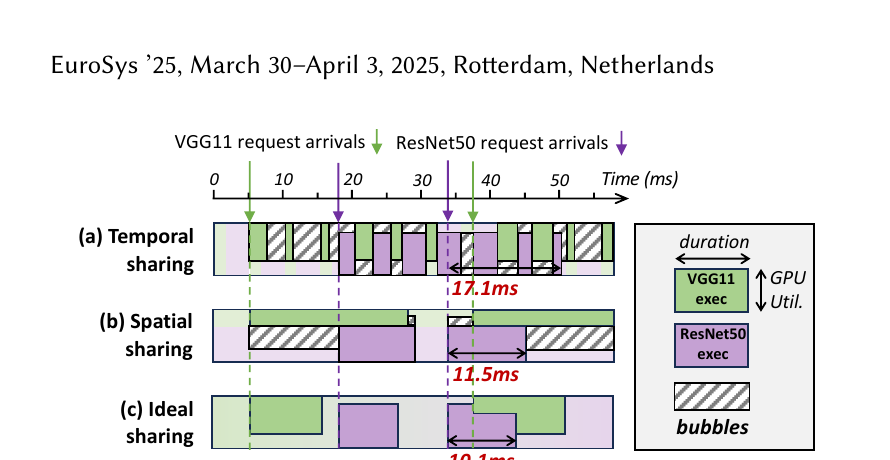

*Motivation (Figure 1): a nominal spatial allocation can contain unused capacity because kernels do not continuously consume their full quota. Bless seeks the bubble-free schedule while retaining quota-derived progress guarantees.*

### System abstraction: short spatial scheduling epochs

The key design decision is to avoid treating either a whole request or a static MPS allocation as the control unit. Bless introduces a **kernel squad**: a short group of kernels selected from several tenants and dispatched under one resource configuration. A squad typically lasts roughly **0.7-10 ms**, so the runtime can reconsider both kernel composition and SM allocation many times within a request.

This produces a control loop that is analogous to reclaiming bubbles, but its bounded unit is a **spatial configuration epoch** rather than a preemptible kernel fragment:

1. **PROFILE** how each application's kernels behave under different SM allocations.
2. **TRACK** each tenant's actual progress against its quota-derived baseline.
3. **GROUP** ready kernels from several tenants into the next kernel squad.
4. **CONFIGURE** the squad by selecting a profiled MPS/SM allocation.
5. **RECLAIM** unused quota with tenants that can make useful progress, then repeat for the next squad.

Bless does not interrupt a running thread block or split a kernel into resumable sub-grids. Its responsiveness comes from keeping squads short and changing the resource configuration between squads. Once a kernel is admitted, it remains non-preemptive; the next scheduling opportunity arrives when the current squad completes.

### Main innovation: adaptive spatial-temporal sharing

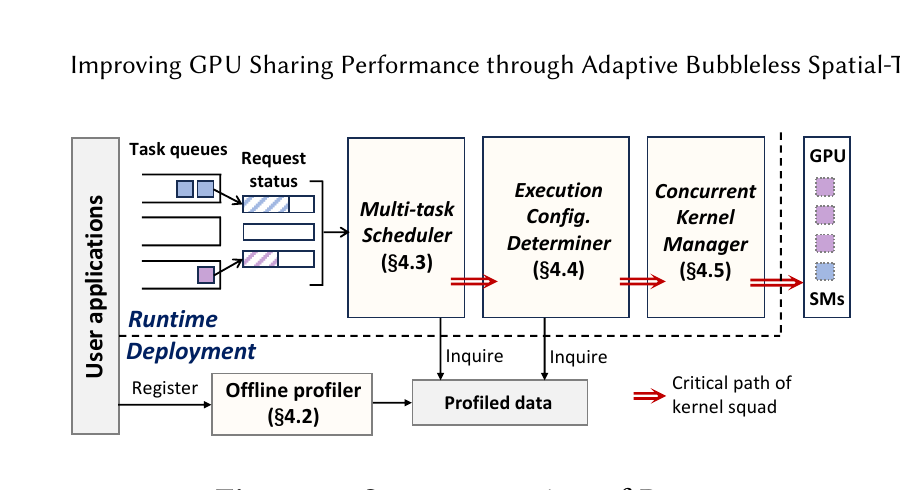

*Main mechanism (Figure 5): wrapped CUDA requests enter the multi-task scheduler; the configuration determiner chooses a profiled allocation; and the concurrent-kernel manager dispatches the resulting squad through resource-configured GPU contexts.*

Bless combines four components into an adaptive spatial-temporal scheduler:

- The **offline profiler** runs each long-lived application under multiple MPS allocations. It records kernel sequences, execution progress, and performance as the available SM fraction changes.
- The **multi-task scheduler** intercepts CUDA launches, observes ready kernels, and tracks whether each active tenant is ahead of or behind its quota-equivalent progress.
- The **execution-configuration determiner** predicts how a candidate squad will perform under alternative concurrent allocations. It selects a configuration that reclaims bubbles without violating the progress constraint.
- The **concurrent-kernel manager** dispatches the squad through pre-created GPU contexts that encode different MPS allocations. Pre-creation avoids constructing or reconfiguring a context on every scheduling decision.

The paper's central innovation is the combination of **progress-aware fairness** and **intra-request configuration changes**. A tenant that cannot currently consume its full allocation does not lose its long-term guarantee: another tenant may borrow the bubble only while the quota owner remains on schedule. If a tenant falls behind its baseline, subsequent squads prioritize its kernels or choose a more favorable allocation.

This is also why kernel-level profiling matters. Free SM capacity does not imply that arbitrary overlap is beneficial: concurrent kernels may contend for compute pipelines, cache, or memory bandwidth. Bless uses measured configurations to choose both **which kernels should overlap** and **how SM capacity should be divided**, instead of relying on the GPU's default concurrent-kernel scheduler.

### Evaluation and limitations

Bless is implemented in more than 5,000 lines of C++ and wraps CUDA runtime operations such as `cudaLaunchKernel`. It supports TVM- and PyTorch-based applications and is evaluated primarily on NVIDIA A100 GPUs with different model combinations, quota ratios, and request traces.

The paper reports a **21.1%-37.3% average latency reduction** over prior sharing approaches while preserving tenant quotas. Homogeneous experiments report a 39.1% reduction for two colocated BERT instances and 41.2% for four instances. These gains show that spatial bubbles occur frequently enough within requests for millisecond-scale reconfiguration to be useful.

The main limitation is that Bless relies on **offline profiles** and a **finite set of pre-created MPS configurations**. Dynamic shapes, previously unseen kernels, rapidly changing LLM batches, or architecture-dependent interference may reduce prediction accuracy. Moreover, short squads improve adaptivity but cannot bound the residual time of an unusually long kernel already launched inside the squad.

### Comparison with Orion

Both systems transparently observe CUDA launches and schedule kernels from independent applications, but they optimize different contracts. Orion is primarily **interference-aware**: it classifies whole kernels by resource behavior and overlaps compatible kernels to improve utilization and throughput. Bless is primarily **quota- and progress-aware**: it asks whether each tenant is receiving the execution progress promised by its SM allocation and uses safe overlap to reclaim unused quota.

Their enforcement mechanisms also differ. Orion schedules individual non-preemptive kernels through intercepted queues and relies on concurrent CUDA streams. Bless schedules short **kernel squads** through pre-created MPS contexts representing different SM allocations. This gives Bless a more explicit proportional-allocation guarantee, at the cost of offline profiling and a discrete configuration space. Orion is the leaner mechanism for beneficial kernel pairing; Bless's innovation is turning such overlap into a work-conserving policy with per-tenant quota guarantees.

### Summary

Bless can be summarized as **PROFILE → TRACK → GROUP → CONFIGURE → RECLAIM**. Its target problem is not merely an idle GPU, but the gap between **allocated SM quota** and **useful kernel execution**. Its main innovation is to make that stranded capacity reclaimable at millisecond-scale kernel-squad boundaries without allowing any tenant to fall behind its quota-equivalent progress.

## 3. MMK: A Hybrid Scheduling Framework for Fine-Grained GPU Sharing for Deep Learning Applications

> **In brief:** MMK composes MIG, MPS, and intercepted kernel scheduling into a three-level hierarchy: MIG supplies coarse isolation, MPS controls intra-partition SM shares, and the kernel scheduler handles short-term contention. The framework shows that hardware partitioning and fine-grained software scheduling are complementary rather than competing approaches.

### Problem and motivation

MMK starts from the observation that no single NVIDIA sharing mechanism simultaneously provides strong isolation, fine-grained flexibility, and high utilization. MIG provides hardware-enforced partitions of compute, memory bandwidth, cache, and memory capacity, but supports only a small set of static configurations and is expensive to reconfigure. MPS permits concurrent execution and configurable SM percentages, but offers weaker isolation and leaves important resources shared. Kernel-level scheduling can respond at very fine granularity, but adds runtime overhead and must manage interference explicitly.

MMK therefore proposes a hybrid hierarchy that combines **MIG**, **MPS**, and **kernel scheduling**. Rather than treating them as competing alternatives, it assigns each mechanism a role at a different layer.

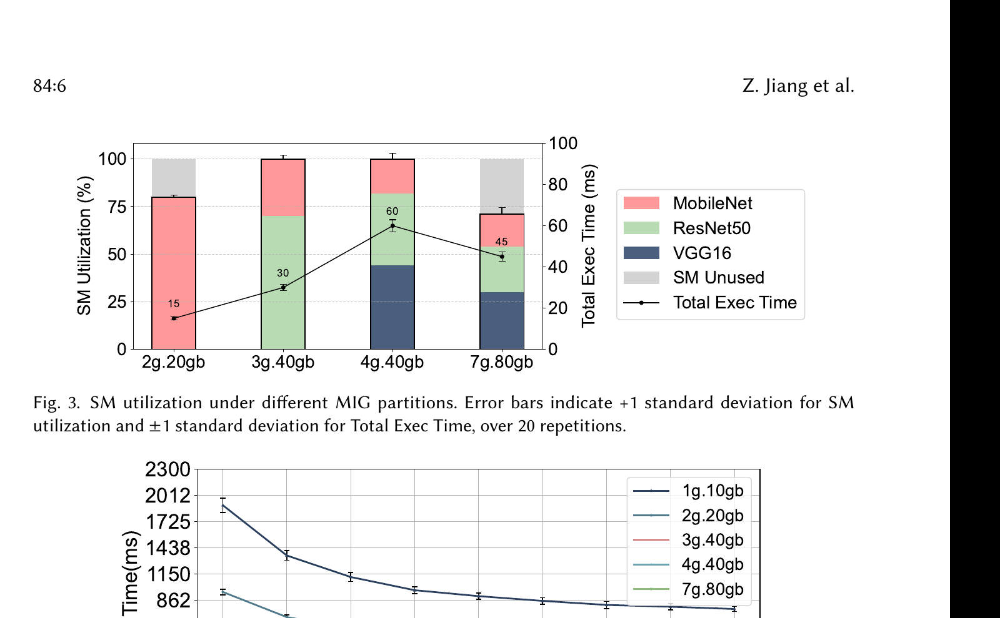

*Motivation (Figures 3-4): workload mixtures leave different amounts of SM capacity unused, and sensitivity to MPS limits changes across MIG partitions. A fixed choice of either mechanism cannot consistently provide both isolation and efficiency.*

### Three-level scheduling architecture

At the outer level, MMK partitions a GPU with MIG. Workloads that strongly interfere or require hard memory/fault isolation can be separated into different MIG instances. This limits cross-group contention and creates coarse resource envelopes.

Within each MIG instance, MMK uses MPS to control the share of SM resources available to colocated processes. MPS provides a more flexible spatial division than MIG and allows concurrent kernels from multiple clients.

At the finest level, MMK intercepts kernel launches and schedules kernels according to priority and interference characteristics. This corrects problems that static MIG/MPS allocations cannot handle, such as short-term phase changes, long blocking kernels, and latency-critical work arriving behind best-effort execution.

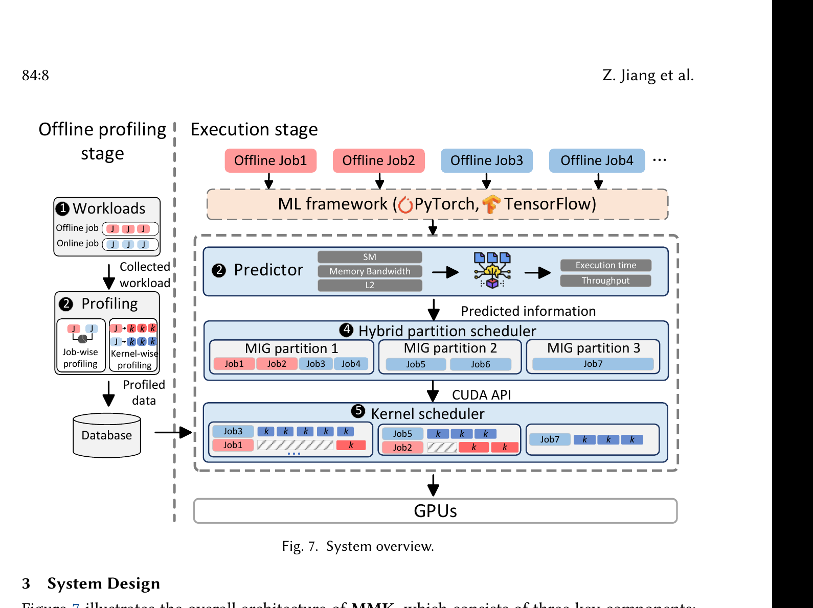

*Main mechanism (Figure 7): offline job- and kernel-level profiles train a performance predictor. At runtime, the hybrid partition scheduler assigns jobs and MPS quotas across MIG instances, then a kernel scheduler controls launches inside each partition.*

The central systems idea is hierarchical control:

1. use MIG to isolate workloads whose interference is difficult to control;
2. use MPS to create a configurable compute partition inside an instance;
3. use kernel scheduling to exploit transient idle resources and protect high-priority execution.

### Profiling and scheduling

MMK profiles workloads to characterize kernel duration, resource demand, and pairwise interference. The scheduler uses these profiles to decide which workloads should share a MIG instance, what MPS allocation each receives, and how kernels should be ordered inside the shared execution domain.

The runtime distinguishes latency-sensitive and throughput-oriented work. It prioritizes latency-sensitive kernels while allowing best-effort kernels to fill unused capacity. Hybrid placement reduces the search space and the amount of interference the kernel scheduler must handle. Compared with a global kernel scheduler, the MIG layer prevents the most damaging pairs from sharing low-level resources; compared with pure MIG, the inner layers recover capacity that would otherwise remain stranded.

MMK must coordinate changes across very different time scales. MIG configuration is coarse and slow, so it is suitable for stable workload grouping. MPS allocation changes are finer but still not intended for every kernel. Kernel scheduling handles short-term variation. This separation of time scales is one of the paper's most important design choices.

### Evaluation and contributions

The evaluation compares the hybrid design against standalone MIG, MPS, and existing sharing/scheduling mechanisms using diverse DL training and inference workloads. It examines throughput, latency/SLO behavior, utilization, and interference under different workload mixes. The results show that the hybrid design provides better aggregate efficiency than relying on any one mechanism while retaining stronger isolation than unconstrained MPS or stream concurrency.

The broader contribution is not a new hardware primitive but an orchestration framework for composing existing and software-defined controls. MMK demonstrates that coarse isolation and fine scheduling are complementary: isolation reduces the scheduler's burden, and kernel scheduling recovers utilization lost by isolation.

### Comparison with Orion

Orion uses a single fine-grained software layer: it intercepts launches, predicts kernel resource behavior, and schedules compatible kernels across application queues. MMK places a similar kernel-level control plane at the bottom of a **three-level hierarchy**. MIG first separates workloads requiring stronger isolation, MPS assigns SM shares within each partition, and the kernel scheduler handles transient contention inside those envelopes. MMK thus restricts the interference domain before applying Orion-like launch scheduling.

The hierarchy addresses a limitation that Orion cannot fully solve in software: two kernels may use different execution units yet still interfere through L2 cache, HBM bandwidth, or faults. MIG can isolate several of those resources, making performance more predictable. The tradeoff is substantially greater operational complexity and less agility: MIG layouts are coarse and slow to change, MPS quotas add another control loop, and profiling must inform decisions at all three levels. Orion is simpler and can react directly at every launch, while MMK is preferable when strong isolation and predictable service quality justify a more static outer partitioning layer.

### Assessment

MMK belongs to the target category because kernel interception and scheduling are part of its essential mechanism. However, its novelty is broader than the interception layer: it is a policy for deciding when to use MIG, MPS, or software scheduling. For related-work positioning, MMK is best described as a **hybrid hierarchical GPU-sharing framework**, whereas Orion and Tally focus more directly on fine-grained runtime execution control. A limitation is the operational complexity of coordinating MIG configuration, MPS processes, profiling, and kernel scheduling. The design also inherits MIG's generation-specific constraints and MPS's incomplete isolation of shared caches, memory bandwidth, and interconnect resources.

## 4. LithOS: An Operating System for Efficient Machine Learning on GPUs

> **In brief:** LithOS is a GPU operating-system layer that schedules individual TPCs and atomized kernel fragments rather than whole kernels or processes. By integrating TPC stealing, hardware right-sizing, and power management, it provides work-conserving isolation and substantially improves colocated ML latency and throughput.

### Problem and motivation

LithOS argues that GPU resource management needs an operating-system-like layer rather than isolated mechanisms for priority, sharing, or power control. Existing software typically schedules whole kernels, streams, processes, or inference requests. These units are too coarse: a kernel can occupy the GPU long after a latency-critical request arrives, static SM partitioning strands capacity, and allocating a fixed hardware width ignores the fact that different kernels saturate at different numbers of SMs/TPCs.

LithOS treats the GPU's Texture Processing Clusters (TPCs) as schedulable compute units. Its goal is to provide transparent spatial scheduling, work conservation, fine-grained preemption-like behavior, performance isolation, hardware right-sizing, and power management within one runtime.

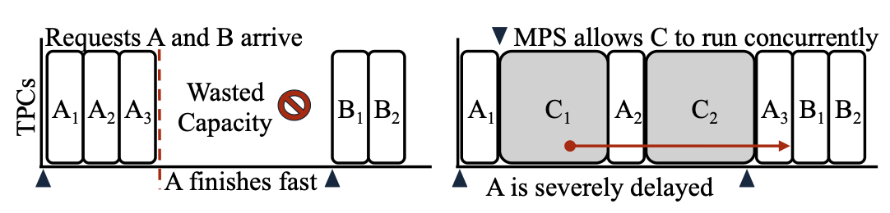

*Motivation (Figure 3): even when MPS admits two workloads concurrently, long kernels and fixed resource use can delay later requests and leave capacity unused. LithOS seeks finer control than stream- or process-level multiplexing.*

### Architecture

LithOS introduces four mechanisms:

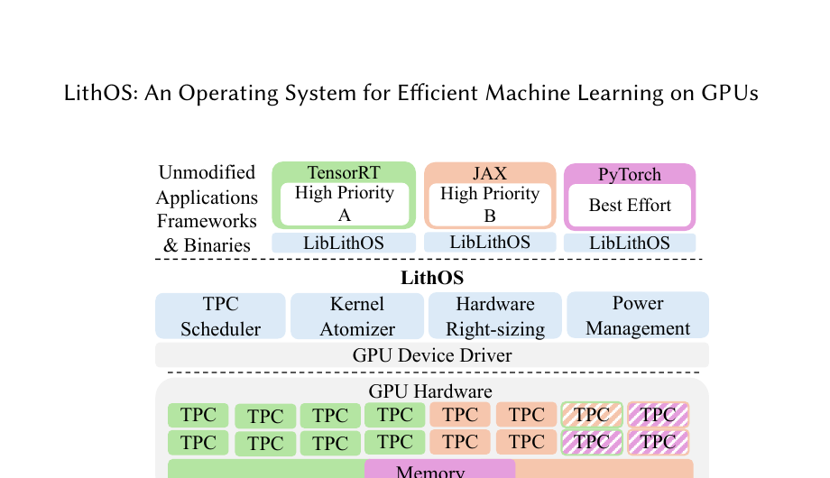

*Main mechanism (Figure 7): unmodified frameworks send work through LibLithOS to a unified device driver. The runtime jointly controls TPC placement, atomized kernel execution, hardware width, and power instead of treating them as separate policies.*

- **TPC scheduler.** Each workload receives a logical allocation of TPCs. The scheduler maps ready work onto physical TPCs and can steal idle TPCs from a workload that cannot currently use its allocation. This separates reservation from instantaneous use: quotas provide isolation, while stealing makes the system work-conserving.
- **Kernel atomizer.** A kernel is transformed into smaller atoms, each containing a subset of the original thread blocks. Atoms are scheduled independently, so LithOS can change a workload's physical width between atoms instead of waiting for a full kernel to finish. This reduces head-of-line blocking and provides a software analogue of fine-grained preemption.
- **Hardware right-sizing.** More TPCs do not always reduce kernel latency proportionally. LithOS predicts each kernel's scaling curve and allocates the smallest width that stays within an acceptable performance loss, leaving the remaining TPCs for other workloads.
- **Transparent power management.** The runtime chooses frequency/power settings using the characteristics of in-flight work. It can reduce frequency for kernels that are insensitive to compute frequency while maintaining latency or throughput targets.

Applications interact with a userspace layer that submits work to LithOS queues. The GPU-side execution engine decouples logical kernel work from physical thread-block execution. Kernel atomization makes the original grid schedulable in pieces, and the TPC scheduler dynamically maps those pieces to resources.

### Scheduling behavior

LithOS combines reservations, priorities, and TPC stealing. Latency-sensitive work receives enough dedicated capacity to meet its target. Best-effort work consumes otherwise idle TPCs but yields as atom boundaries permit. Right-sizing prevents a single workload from receiving resources beyond its saturation point. Because decisions occur below the model/request layer, LithOS can support inference-inference and inference-training colocation without requiring each ML framework to implement a custom scheduler.

Its performance models operate online and are kernel-dependent. The system learns how execution time scales with TPC count and uses this information for subsequent atoms. This is more adaptive than a fixed per-process MPS percentage, although early invocations and shape changes can cause prediction errors.

### Implementation and evaluation

LithOS is implemented in Rust and evaluated against NVIDIA mechanisms and research systems including MPS, MIG, time slicing, REEF, TGS, priority-based execution, and Orion. Workloads include Llama 3, GPT-J, BERT, RetinaNet, YOLO, MobileNet, DLRM, and training/inference combinations.

For inference stacking, LithOS reports up to **13x lower tail latency than MPS**. Relative to the best-performing prior system, it reduces tail latency by about **4x** while improving aggregate goodput by approximately **1.3x**. For inference-training stacking, it reduces tail latency by **4.7x** relative to MPS; against the strongest prior baseline, it reduces tail latency by about **1.18x** while improving aggregate throughput by roughly **1.35x**.

Right-sizing saves approximately one quarter of GPU capacity on average for less than 4% performance loss. The transparent power-management mechanism reduces total GPU energy by approximately one quarter at around 7% performance cost. The evaluation also studies atom size, prediction errors, kernel-dependent scaling, scheduler overhead, and the contribution of TPC stealing.

### Comparison with Orion

Orion is principally a host-side kernel scheduler: it intercepts launches, selects whole kernels from application queues, and relies on the existing GPU scheduler for block placement and concurrent execution. LithOS moves the control boundary deeper by presenting an operating-system abstraction over GPU **TPCs**. Its atomizer breaks kernels into smaller pieces, and its TPC scheduler explicitly controls their physical width, reservations, and borrowing. LithOS can therefore reclaim idle spatial capacity or reduce head-of-line blocking even within a kernel, whereas Orion must wait for an admitted kernel to complete and cannot directly assign its blocks to a chosen TPC subset.

LithOS also covers a broader resource-management scope. Kernel-dependent right-sizing avoids allocating TPCs beyond a kernel's saturation point, and power management incorporates energy into the scheduling policy; neither is a central Orion mechanism. In exchange, LithOS requires a more invasive and architecture-specific GPU-OS substrate, kernel atomization support, and online scaling models. Orion is easier to deploy as an interception-based scheduler and is useful when whole-kernel pairing is sufficient. LithOS is the more complex design, but it offers finer spatial control and a path toward a unified GPU resource manager rather than a dedicated colocation scheduler.

### Assessment

LithOS is highly relevant to kernel scheduling, but architecturally more ambitious than an interposition-only scheduler. It presents a unified GPU OS abstraction and uses transparent kernel atomization to enable sub-kernel scheduling. Its strength is the integration of isolation, work conservation, capacity right-sizing, and energy management. Its risks are implementation complexity, dependence on GPU-specific low-level mechanisms, and the cost of maintaining compatibility with proprietary drivers and rapidly changing architectures. It is a particularly useful comparison point for any new work claiming that a CUDA interception layer should evolve into a general resource-management substrate.

## 5. SMore: Enhancing GPU Utilization in Deep Learning Clusters by Serverless-Based Co-Location Scheduling

> **In brief:** SMore colocates short serverless inference functions with long-running training jobs using learned interference predictions, deadline-aware admission and placement, and proactive model warming. It improves cluster utilization at the workload level, but does not intercept or schedule individual CUDA kernels.

### Problem and motivation

SMore operates at a higher layer than the kernel schedulers in this collection. It observes that long-running DL training jobs often leave GPU capacity unused because of communication, synchronization, input-pipeline stalls, or inherently low SM demand. It proposes filling this capacity with short-lived serverless inference functions.

The paper divides workloads into two classes:

- **Serverful workloads:** long-running training jobs that form the stable background allocation.
- **Serverless workloads:** short inference functions with deadlines and bursty arrivals.

Naive colocation can slow both classes, cause serverless deadlines to be missed, and introduce large cold-start overheads when models must be loaded into GPU memory. SMore addresses all three issues with degradation prediction, admission/placement scheduling, and proactive model warming.

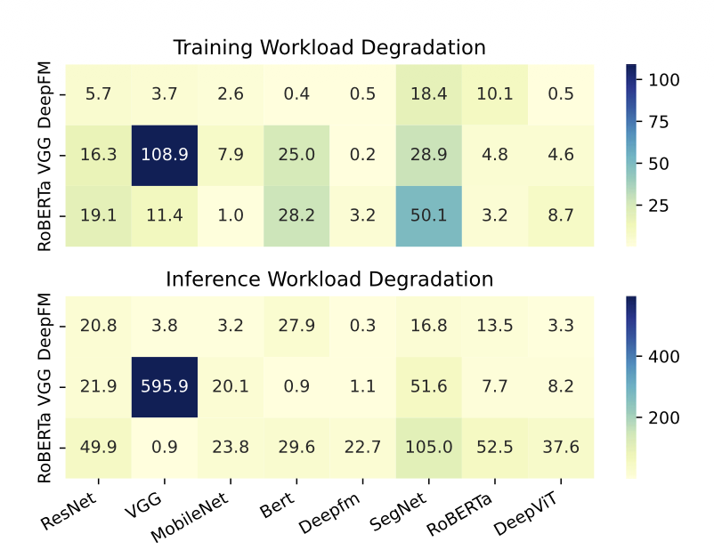

*Motivation (Figure 2): the heat maps show highly non-uniform slowdowns across training/inference pairs, including extreme outliers. Utilization alone is therefore insufficient for safe serverless admission and placement.*

### Co-location degradation predictor

SMore uses a two-stage predictor. A pairwise model estimates the degradation when one training workload and one inference function are colocated. Its 24-dimensional input concatenates twelve features from each model, including SM utilization, memory utilization, FLOPs, memory footprint, model depth, and operator composition. Random Forest performs best among the tested regressors.

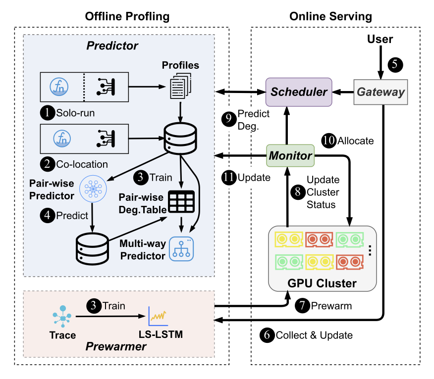

*Main mechanism (Figure 4): offline solo/co-location profiles train pairwise and multi-way degradation models. Online, the gateway, scheduler, and monitor use those predictions plus live cluster state to admit, place, and continually update serverless functions.*

For one training job colocated with multiple functions, SMore avoids profiling the combinatorial space. Its multi-way predictor represents total degradation as an online-updated weighted sum of pairwise degradation estimates. This is inexpensive and data-efficient, but assumes that higher-order cache, bandwidth, and saturation effects can be approximated by additive terms.

The predictor is initially trained offline and updated with observed online outcomes. With 20% of 1,024 collected samples, the Random Forest predictor reaches an RMSLE of approximately 0.3; the reported full comparison gives RMSLE 0.305 and MAE 0.473.

### Degradation-aware scheduling

For each function type, SMore computes a priority proportional to expected utilization gain divided by expected degradation. The scheduler then performs admission control and placement. A request is admitted only when GPU memory is sufficient, the function can meet its latency SLO, and predicted degradation of the serverful workload remains within the configured bound, set to approximately 10% in the paper.

At low load, the scheduler searches broadly for the GPU with minimum predicted interference. At high load, it samples a bounded number of GPUs and chooses the first feasible placement. This hybrid policy keeps decision latency low when request rates are high. The scheduling overhead is about 0.01 ms for eight GPUs and remains below 1 ms in simulations with 1,024 GPUs; under high load at that scale, the reported latency is approximately 0.1 ms per request.

### Cold-start management

The LS-LSTM prewarmer predicts whether and how many requests for a function will arrive in the next interval using both long- and short-term patterns. It preloads models before predicted arrivals and offloads models when continued idleness is expected. In one evaluated trace, it reduces cold-start rate by 15% at the cost of 10% more idle resource time. In a burstier trace, it keeps the cold-start rate nearly unchanged while reducing wasted loaded-model time from 75% to 32%.

### Evaluation

The prototype is implemented in more than 3,000 lines of Python. The primary testbed uses RTX 3090 GPUs; an additional experiment combines SMore with MISO-managed MIG instances on an A100 40 GB GPU. Workloads cover CV, NLP, recommendation, and multi-task models, while arrival patterns are derived from scaled Azure Functions traces.

Across multi-GPU configurations, average GPU utilization improves by **3%-34%**. Gains are smaller when the training workload already has high utilization. Compared with Random, EDF-util, and a modified ElasticFlow baseline, SMore achieves a favorable balance among deadline-satisfaction ratio, utilization improvement, serverful degradation, and serverless degradation. In the MIG experiment, it admits approximately 30% additional serverless functions while maintaining degradation within the configured range.

### Assessment

SMore is not an Orion-style kernel scheduler. It schedules functions and chooses GPUs; the underlying GPU-sharing mechanism performs actual concurrent execution. It does not intercept CUDA launches, transform PTX, preempt kernels, or schedule thread blocks. The paper is relevant as an upper-level policy that could feed a kernel scheduler: SMore could decide which workloads should colocate, while Orion, Tally, Bless, or Hummingbird could enforce the resulting priorities inside each GPU. Its limitations include the additive multi-way interference model, mostly non-LLM workloads, reliance on scaled rather than native GPU-serverless production traces, and evaluation centered on RTX 3090 with only a limited A100/MIG extension.

## 6. Usher: Holistic Interference Avoidance for Resource-Optimized ML Inference

> **In brief:** Usher jointly chooses model batch sizes, replication, GPU types, and placements using kernel-based compute/memory estimation, then merges compatible operator graphs to reduce cache interference. It is an upper-layer multi-model inference optimizer rather than a runtime kernel scheduler.

> **Filename note:** the directory file is named `Harli SLO-Aware Co-location of LLM Inference and PEFT Finetuning.pdf`, but its contents are the OSDI 2024 Usher paper. It should not be cited as Harli.

### Problem and motivation

Usher targets multi-model inference serving. Increasing batch size raises compute utilization but also raises latency and memory demand; it cannot independently tune compute and memory utilization. Spatially colocating multiple models can fill both resources, but existing systems often optimize only compute allocation and suffer severe cache and bandwidth interference. The paper reports that, in representative GPUlet and AlpaServe configurations, most colocated models retain no more than 55% of their standalone goodput.

Usher treats GPU compute capacity and memory capacity as a two-dimensional packing problem. It aims either to maximize goodput in a fixed cluster or to minimize GPU cost in an elastic cluster while satisfying all latency SLOs.

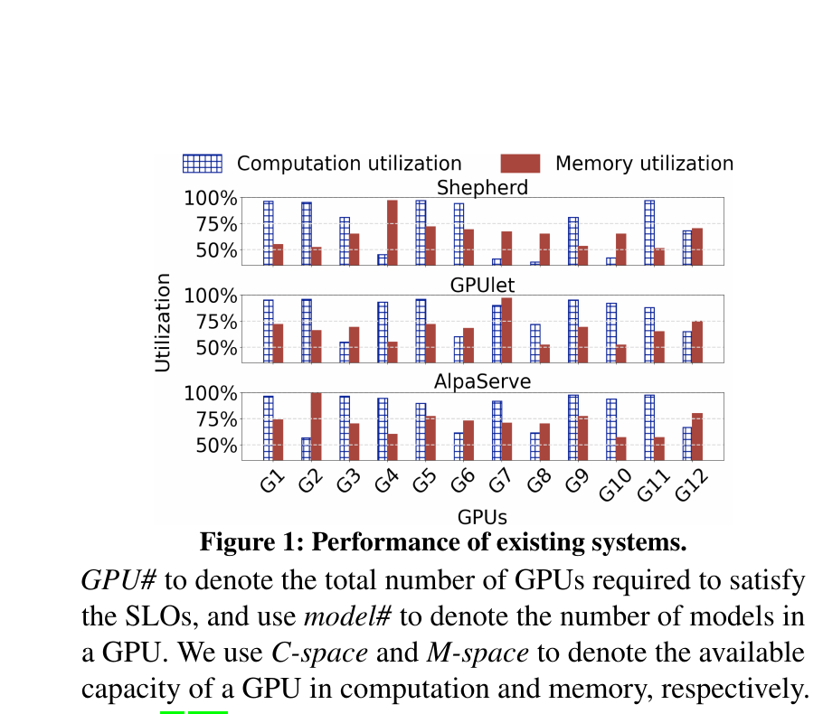

*Motivation (Figure 1): Shepherd, GPUlet, and AlpaServe often fail to fill computation and memory simultaneously. Usher treats both dimensions as first-class placement constraints rather than tuning only batch size or compute allocation.*

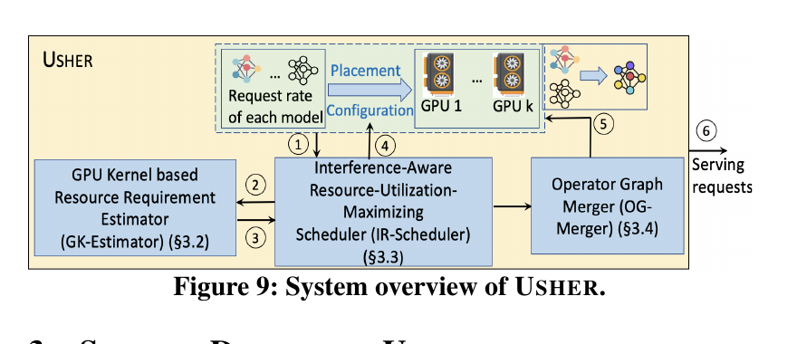

*Main mechanism (Figure 9): the kernel-based estimator predicts each model's compute and memory requirements; the scheduler jointly chooses configuration and placement; the graph merger then mitigates cache interference among colocated models.*

### GK-Estimator

Usher avoids per-model profiling with a GPU-kernel-based estimator. It expands an ONNX operator graph into a kernel-level graph using a pre-profiled mapping from known operators to the GPU kernels they invoke. A time regressor predicts kernel duration, while a memory regressor predicts intermediate-data footprint from batch size, tensor dimensions, FLOPs, weights, and GPU type. Kernels with predicted start times within a small threshold are treated as potentially concurrent; Usher sums their resource demands and takes the maximum over concurrent sets.

The stacked regression design combines Lasso, kernel-ridge, gradient-boosting, and XGBoost models. The reported computation- and memory-requirement accuracy is **99.98%**, with an estimation time of 31.6 ms. The comparison profiling approach is exact but requires about 4.8 hours and $42.7 for the evaluated model/configuration space. Usher therefore moves profiling cost from each new model to a reusable per-operator/per-kernel model.

### Interference-aware scheduler

For each model, Usher jointly chooses batch size, replication degree, GPU type, and placement. It classifies models as compute-heavy or memory-heavy and groups complementary models so that total compute demand is close to total memory demand. Within each group it enumerates candidate batch-size and replica configurations and uses a multidimensional best-fit heuristic to pack replicas.

A notable result is that increasing replication degree can reduce total GPU count even when one replica could satisfy the SLO. Splitting the request stream across more replicas permits smaller batches and footprints; those replicas may then pack more efficiently with complementary models. This illustrates why workload division, batch sizing, and placement must be optimized jointly.

### Operator Graph Merger

Compute and memory packing alone does not eliminate GPU-cache interference. Usher observes weight overlap among models with related CNN or Transformer architectures. The Operator Graph Merger identifies structurally similar operator graphs and common weight submatrices, then creates a merged graph that executes operations sharing cached weight regions together. Weight elements are considered equivalent only within a very small tolerance, approximately \(10^{-7}\), which keeps average accuracy loss near **0.0003% per request batch**.

Graph merging takes approximately 2.3 s; grouping takes 0.1 s, scheduling about 0.51 s, and model loading about 0.63 s. Since the paper reschedules only when request rate changes substantially, typically at intervals of 45-300 s in its traces, these control-plane costs are amortized.

### Evaluation

Usher evaluates twenty models, including CNNs, GNMT, BERT, GPT-2, and Llama-2 13B, on homogeneous and heterogeneous AWS GPU clusters and in large-scale simulation. Baselines include Shepherd, GPUlet, and AlpaServe.

The paper reports up to **2.6x higher goodput** and **3.5x better cost efficiency**. In heterogeneous non-fixed clusters it achieves 2.8x-3.5x lower cost, 19%-24.1% higher compute utilization, and 25.2%-40.3% higher memory utilization. Under varied SLOs, fixed-cluster goodput is 2.2x-2.7x higher, while non-fixed deployments use 3.2x-4.3x fewer GPUs. Ablation shows that compute/memory classification, workload division, model ordering, and graph merging all contribute materially; removing graph merging alone causes a large goodput loss, with the complete system achieving 55.7% higher goodput than that variant.

### Assessment

Despite using kernel-level graphs for estimation, Usher is not a runtime kernel scheduler. It does not intercept and reorder application kernel launches, implement preemption, or schedule thread blocks. Its decisions concern model configuration, replication, and GPU placement on a tens-of-seconds time scale. It is also not specifically an LLM-serving system: Llama-2 and GPT-2 are evaluation workloads, but the design does not center on autoregressive decoding, KV-cache management, continuous batching, or prefill/decode separation. Usher is best classified as interference-aware multi-model inference placement and graph optimization. It could complement a kernel scheduler by selecting good model combinations before a lower-level runtime controls their execution.

## 7. Cross-Paper Comparison

| Paper | Primary scheduling object | Control layer | CUDA/kernel interception | Kernel transformation | Main objective | Fit to Orion-style kernel scheduling |
|---|---|---|---|---|---|---|
| Hummingbird | Split-kernel sub-grids | CUDA Driver interposition runtime | Yes | Yes, PTX splitting and offset injection | Bubble-aware microsecond preemption and SLO protection | Very high |
| Tally | Kernels and logical thread blocks | CUDA virtualization server | Yes | Yes, slicing and persistent preemption | Non-intrusive performance isolation | Very high |
| Bless | Kernel squads and SM configurations | Host runtime + multiple GPU contexts | Yes, CUDA runtime wrapping | No general PTX rewrite; controls launches/configured contexts | Reclaim bubbles while enforcing quotas | Very high |
| MMK | MIG groups, MPS shares, and kernels | Hierarchical cluster/GPU runtime | Yes at fine-grained layer | Limited/implementation-dependent | Combine isolation and utilization across three mechanisms | High |
| LithOS | Kernel atoms and TPC allocations | GPU OS/runtime layer | Transparent low-level submission control | Yes, kernel atomization | Isolation, work conservation, right-sizing, energy | Very high |
| SMore | Serverless function admission and GPU placement | Cluster/serverless scheduler | No | No | Harvest idle training capacity | Low; complementary upper layer |
| Usher | Models, batches, replicas, and GPU placement | Inference-serving control plane | No runtime launch scheduling | Operator-graph merging, not scheduling transformation | Multi-model goodput and cost efficiency | Low; complementary upper layer |

## 8. Synthesis and Research Opportunities

The five low-level systems reveal a common architecture: transparent interception creates a global observation and control point; profiling or prediction estimates kernel behavior; a policy selects priorities or resource shares; and a mechanism translates policy into enforceable execution units. Their key difference is the unit of control. Bless uses kernel squads and context configurations. Hummingbird schedules PTX-rewritten sub-grids, while Tally adds slicing and persistent-worker yield at logical-block boundaries. LithOS generalizes fine-grained execution into kernel atoms scheduled onto TPCs. MMK composes kernel scheduling with coarse MIG isolation and intermediate MPS partitioning.

Three unresolved problems recur across the papers.

First, **preemption granularity and overhead are inseparable**. Smaller slices or atoms reduce blocking but increase launch, synchronization, counter, and scheduling overhead. Current systems choose granularity through profiling or heuristics. A promising direction is an online controller that predicts the marginal SLO benefit and overhead of the next finer granularity under changing shapes and request mixes.

Second, **SM isolation does not isolate shared resources**. L2 cache, HBM bandwidth, power limits, copy engines, PCIe/NVLink, and collective communication remain sources of interference. Bless and Usher explicitly model some interference; LithOS right-sizes compute; MMK uses MIG where stronger isolation is needed. A unified scheduler should jointly reason about compute allocation and bandwidth/cache pressure rather than treating SM count as the complete resource state.

Third, **upper- and lower-layer schedulers are disconnected**. SMore and Usher make workload-level placement decisions using predicted degradation, while Tally, Hummingbird, Bless, and LithOS control actual kernel execution. A hierarchical system could use workload-level models to choose colocations and reserve SLO budgets, then use a kernel scheduler to enforce those budgets and return online interference measurements. This feedback loop could correct prediction errors and adapt to phase changes without exhaustive pairwise profiling.

For LLM systems specifically, the most important extension is phase awareness. Prefill, decode, attention, MoE routing, KV-cache movement, and collectives have different compute, bandwidth, and latency behavior. Existing generic kernel schedulers can intercept them, but do not automatically understand TTFT/TPOT semantics or distributed parallelism dependencies. Hummingbird begins to bridge this gap through API-pattern bubble detection across vLLM, SGLang, llama.cpp, DeepSpeed, and Megatron. A strong next step would combine phase-aware request scheduling with portable kernel/thread-block control and explicit modeling of HBM and interconnect contention.

## 9. Overall Classification

For a literature review centered on transparent CUDA interception and fine-grained GPU scheduling, the primary papers are **Tally, Hummingbird, Bless, LithOS, and MMK**. Tally and Hummingbird are the closest methodological matches because both intercept CUDA execution and transform kernels to create software-controlled preemption points. Bless is particularly relevant for quota-aware kernel-squad scheduling and bubble reclamation. LithOS offers the broadest OS-level abstraction, while MMK provides the clearest argument for combining coarse hardware isolation with fine software scheduling.

SMore and Usher should be treated as adjacent rather than central work. Their value lies in admission, placement, and interference prediction above the kernel layer. They provide useful mechanisms and objective functions for deciding *what should share a GPU*, whereas the primary kernel-scheduling papers decide *how that sharing should be executed safely and efficiently*.
