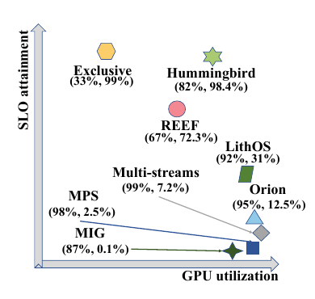
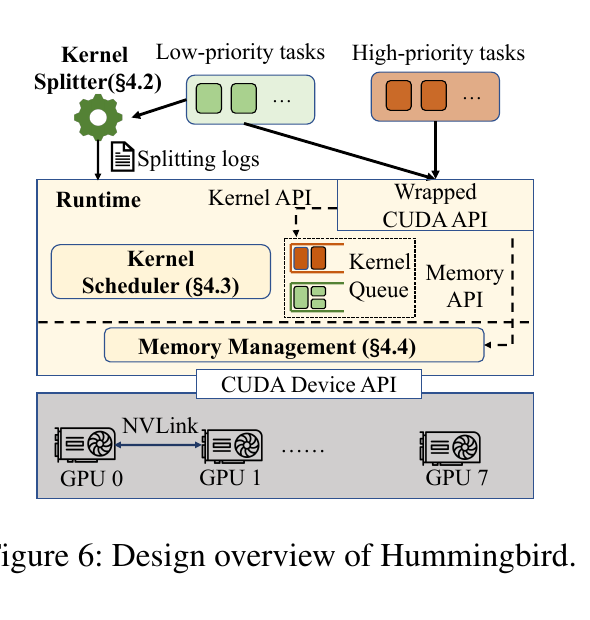
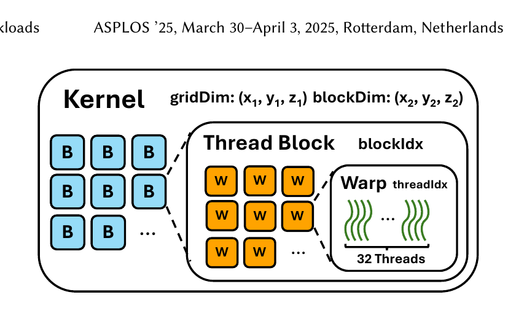
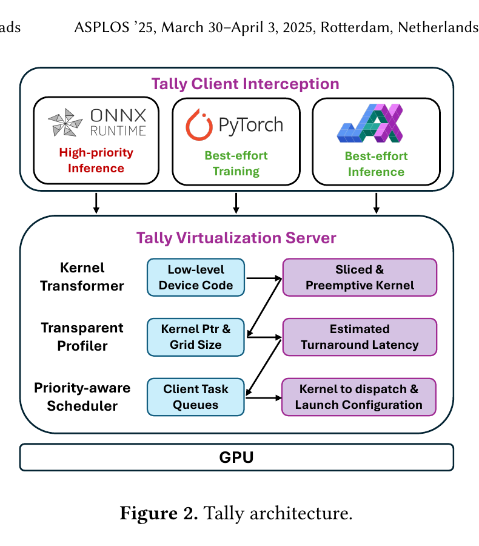

# Literature Review: Fine-Grained GPU Sharing and Co-Location Scheduling

## Scope and Reading Guide

This review covers the seven PDF files stored directly in the main `orion-citation` directory. The collection spans several layers of the GPU-sharing stack. Bless, Hummingbird, LithOS, MMK, and Tally directly manipulate GPU execution at kernel, thread-block, stream, context, or SM/TPC granularity. SMore performs cluster-level admission and placement for serverless inference functions. The file named `Harli SLO-Aware Co-location of LLM Inference and PEFT Finetuning.pdf` contains the OSDI 2024 paper *Usher: Holistic Interference Avoidance for Resource Optimized ML Inference*, not Harli; this review follows the paper content and records the filename mismatch.

The papers are reviewed with an emphasis on five questions:

1. What resource-underutilization or interference problem does the paper target?
2. At what layer and granularity does it make scheduling decisions?
3. How does it observe, intercept, transform, or control GPU work?
4. What guarantees and performance improvements does it provide?
5. How closely does it match the Orion-style research direction of transparent kernel interception and scheduling?

## 1. Bless: Improving GPU Sharing Performance through Adaptive Bubbleless Spatial-Temporal Sharing

### Problem and motivation

Bless addresses a limitation shared by conventional temporal and spatial GPU multiplexing. Temporal sharing controls how frequently each application's kernels may be launched, but non-preemptive and heterogeneous kernels make time-based quotas imprecise. Spatial sharing, such as NVIDIA MPS, allocates a fraction of the GPU's SMs to each application, but statically reserved SMs become bubbles whenever an application temporarily lacks enough parallel work. MIG provides stronger isolation, but at coarse, inflexible partition sizes. In all three cases, nominal allocation is not equivalent to useful execution: a tenant can own a quota while leaving part of it idle, yet other tenants cannot safely and fairly reclaim the unused capacity.

Bless defines a bubble as GPU capacity that is temporarily unused under an application's assigned quota. Its objective is to squeeze these bubbles without violating any application's promised quota. This is more subtle than maximizing aggregate throughput. The system must improve latency fairly across tenants, avoid making a quota-compliant tenant slower than isolated execution at that quota, and react within a request rather than waiting for request boundaries.

*Motivation (Figure 1): temporal sharing creates gaps between non-preemptive kernels, while static spatial sharing leaves reserved SMs idle. Bless targets the bubble-free schedule in the bottom timeline while retaining quota guarantees.*

### System design

Bless combines temporal and spatial sharing at the granularity of a **kernel squad**. A kernel squad is a short group of kernels drawn from different applications and scheduled together. Because a squad lasts much less time than an end-to-end inference request, Bless can reconfigure GPU allocation multiple times during a request and reclaim transient bubbles.

*Main mechanism (Figure 5): wrapped application requests enter the multi-task scheduler; the execution-configuration determiner selects a profiled allocation, and the concurrent-kernel manager dispatches the resulting kernel squad to resource-configured GPU contexts.*

The system contains four main components:

- **Offline profiler.** Bless profiles each long-running application under multiple SM configurations using MPS. It records kernel sequences, execution progress, and latency/resource behavior under different allocations. The resulting profiles let the runtime estimate request progress and the performance of possible concurrent kernel configurations without exhaustively measuring every online combination.
- **Multi-task scheduler.** The scheduler tracks the progress of every active request and decides which kernels should form the next squad. It attempts to preserve quota-derived progress while giving temporarily unused capacity to applications that can use it. This makes the policy work-conserving while maintaining fairness.
- **Execution-configuration determiner.** For each candidate squad, Bless estimates how kernels will perform under alternative concurrent configurations. It chooses a configuration that reduces bubbles and latency without violating quota guarantees.
- **Concurrent kernel manager.** Bless enforces the chosen configuration using multiple pre-established GPU contexts with different resource allocations. Applications submit through wrapped CUDA runtime APIs, including `cudaLaunchKernel`, and Bless redirects kernel execution to an appropriate context. Contexts encode heterogeneous SM configurations, allowing the runtime to change effective allocation without paying the full cost of creating or reconfiguring a context for every squad.

The important distinction is that Bless does not merely set a static MPS percentage. It performs host-side scheduling of kernel squads and selects among resource-configured contexts during execution. This allows it to approximate a continuously adjustable allocation using a finite set of contexts.

### Scheduling policy and guarantees

Bless uses request progress as a fairness signal. A tenant with quota \(q\) should make at least as much progress as it would make in isolation with that quota. When one application falls behind its expected progress, the scheduler prioritizes its kernels. When an application has no useful work or cannot consume its full allocation, another application can borrow the bubble.

The performance estimator predicts a squad's duration under possible concurrent kernel allocations. Bless thereby avoids relying on the hardware scheduler to colocate arbitrary kernels blindly; uncontrolled concurrency could create cache, bandwidth, or compute contention that increases latency even when idle SM capacity exists.

### Implementation and evaluation

Bless is implemented in more than 5,000 lines of C++ and supports applications built with TVM and PyTorch. It is evaluated primarily on NVIDIA A100 GPUs using synthetic and real-world query-arrival traces, multiple applications, quota ratios, and model combinations.

The main reported result is a **21.1%-37.3% average latency reduction** over state-of-the-art sharing approaches while preserving promised quotas. In homogeneous cases, colocating two BERT inference instances reduces average latency by 39.1%; with four BERT instances, the reduction reaches 41.2%. The paper also evaluates beyond pairwise sharing, quota combinations, kernel-squad granularity, prediction accuracy, and scheduling overhead. Kernel squads in the evaluation generally last approximately 0.7-10 ms, enabling allocation changes substantially faster than request-level schedulers.

### Assessment

Bless belongs strongly in the kernel-scheduling category. It wraps CUDA launch APIs, observes individual kernels, creates cross-application kernel squads, and enforces spatial configurations through multiple contexts. Relative to Orion, Bless focuses more directly on accurate quota enforcement and bubble reclamation. Its key limitation is dependence on offline profiling and a discrete set of pre-created contexts. Its ability to generalize to dynamic-shape workloads, unseen kernels, rapidly changing LLM batches, and GPUs with different resource-partitioning behavior depends on the quality and coverage of those profiles.

## 2. Hummingbird: SLO-Oriented GPU Preemption at Microsecond Scale

### Problem and motivation

Hummingbird targets the conflict between strict latency SLOs and work conservation. Spatial partitioning isolates high-priority work but strands resources when that workload is idle. Temporal sharing can reclaim idle periods, but a long low-priority kernel may block newly arrived high-priority work because commodity NVIDIA GPUs lack a public, low-overhead kernel-preemption interface.

The paper's central observation is that full DL kernels may last too long for responsive scheduling, while individual thread blocks are usually short. Across the characterized workloads, almost all thread blocks complete at microsecond scale. If a low-priority kernel is transformed so that it can stop between small groups of thread blocks, then a runtime can achieve practical preemption even without hardware support for terminating an arbitrary kernel immediately.

Hummingbird also observes that high-priority workloads contain predictable small bubbles. LLM inference has synchronization gaps between iterations; distributed training and parallel inference expose gaps around NCCL communication. A low-priority task can run during these bubbles if it can be stopped quickly when high-priority computation resumes.

*Motivation (Figure 1): prior spatial and temporal approaches occupy different points in the utilization-SLO tradeoff. Hummingbird aims for the upper-right region by making best-effort work preemptible at microsecond scale.*

### Transparent interception and kernel transformation

Hummingbird interposes on low-level CUDA Driver APIs. It hooks module-loading and kernel-related calls, identifies the application's GPU code, and redirects launches through its runtime. This provides application transparency across frameworks such as PyTorch, DeepSpeed, Megatron, vLLM, SGLang, and llama.cpp.

*Main mechanism (Figure 6): low-priority kernels are split before admission; a kernel scheduler arbitrates them against high-priority launches, while the memory manager coordinates GPU and NVLink-backed memory through the intercepted CUDA path.*

The **kernel splitter** transforms available PTX. It injects offset logic so that an original grid can be executed as a sequence of smaller sub-grids while preserving the original interpretation of `blockIdx`. Each sub-grid contains a bounded amount of work and becomes a preemption unit. The runtime uses a preemption flag to prevent further low-priority chunks from starting when high-priority work arrives.

The system must preserve CUDA semantics. Splitting is safe only if synchronization and data dependencies are respected. Hummingbird therefore reasons about thread-block independence and handles kernel launch metadata carefully. Closed-source kernels whose PTX cannot be obtained, notably some cuBLAS and cuDNN kernels, limit the applicability of transformation; the system must handle such kernels through coarser mechanisms.

### Runtime scheduler

Hummingbird maintains separate high- and low-priority queues. High-priority kernels launch immediately. Low-priority kernels execute through short ticks or split segments. When high-priority work appears, the scheduler sets the preemption flag; running low-priority work stops at a safe boundary, and high-priority kernels take over.

Bubble detection combines runtime API patterns with lightweight CUDA events. For example, repeated `cudaStreamSynchronize` boundaries in LLM decoding or NCCL send/receive patterns in distributed execution act as host-side hints. When the runtime detects the beginning of a bubble, it admits low-priority chunks; when the bubble ends or high-priority work returns, it preempts them. The design therefore combines reactive priority scheduling with proactive harvesting of predictable gaps.

Hummingbird also manages memory for colocated jobs. Compute preemption alone is insufficient if low-priority tensors consume memory needed by high-priority work. Its runtime coordinates the execution and memory footprints of both classes while retaining transparency.

### Evaluation

The evaluation covers different NVIDIA GPU architectures, DNN inference, CNN workloads, LLM inference, training, and distributed execution. It includes Llama/Qwen-style inference and GPT training with tensor, pipeline, data, and expert parallel communication patterns. The paper reports that Hummingbird improves high-priority SLO attainment by **9.7x** over representative spatial-sharing approaches and **3.5x** over temporal-sharing approaches. Relative to exclusive execution, high-priority SLO attainment drops by less than 1%, while low-priority throughput is up to **2.4x** that of prior temporal-sharing systems.

The results also separate the gains from splitting, scheduling, and bubble harvesting. The value of splitting is largest when low-priority kernels otherwise have long blocking times. Bubble harvesting contributes most when high-priority workloads contain recurrent synchronization or communication gaps.

### Assessment

Hummingbird is directly aligned with the target research direction: it intercepts CUDA Driver APIs, transforms kernels at PTX level, and schedules at microsecond-scale boundaries. Compared with Tally, it places greater emphasis on bubble detection across modern LLM and distributed-training stacks and on SLO-oriented preemption. The major limitations are PTX availability, transformation correctness for unusual kernels, runtime complexity across CUDA versions, and shared-resource interference that cannot be eliminated merely by stopping thread blocks quickly.

## 3. LithOS: An Operating System for Efficient Machine Learning on GPUs

### Problem and motivation

LithOS argues that GPU resource management needs an operating-system-like layer rather than isolated mechanisms for priority, sharing, or power control. Existing software typically schedules whole kernels, streams, processes, or inference requests. These units are too coarse: a kernel can occupy the GPU long after a latency-critical request arrives, static SM partitioning strands capacity, and allocating a fixed hardware width ignores the fact that different kernels saturate at different numbers of SMs/TPCs.

LithOS treats the GPU's Texture Processing Clusters (TPCs) as schedulable compute units. Its goal is to provide transparent spatial scheduling, work conservation, fine-grained preemption-like behavior, performance isolation, hardware right-sizing, and power management within one runtime.

*Motivation (Figure 3): even when MPS admits two workloads concurrently, long kernels and fixed resource use can delay later requests and leave capacity unused. LithOS seeks finer control than stream- or process-level multiplexing.*

### Architecture

LithOS introduces four mechanisms:

*Main mechanism (Figure 7): unmodified frameworks send work through LibLithOS to a unified device driver. The runtime jointly controls TPC placement, atomized kernel execution, hardware width, and power instead of treating them as separate policies.*

- **TPC scheduler.** Each workload receives a logical allocation of TPCs. The scheduler maps ready work onto physical TPCs and can steal idle TPCs from a workload that cannot currently use its allocation. This separates reservation from instantaneous use: quotas provide isolation, while stealing makes the system work-conserving.
- **Kernel atomizer.** A kernel is transformed into smaller atoms, each containing a subset of the original thread blocks. Atoms are scheduled independently, so LithOS can change a workload's physical width between atoms instead of waiting for a full kernel to finish. This reduces head-of-line blocking and provides a software analogue of fine-grained preemption.
- **Hardware right-sizing.** More TPCs do not always reduce kernel latency proportionally. LithOS predicts each kernel's scaling curve and allocates the smallest width that stays within an acceptable performance loss, leaving the remaining TPCs for other workloads.
- **Transparent power management.** The runtime chooses frequency/power settings using the characteristics of in-flight work. It can reduce frequency for kernels that are insensitive to compute frequency while maintaining latency or throughput targets.

Applications interact with a userspace layer that submits work to LithOS queues. The GPU-side execution engine decouples logical kernel work from physical thread-block execution. Kernel atomization makes the original grid schedulable in pieces, and the TPC scheduler dynamically maps those pieces to resources.

### Scheduling behavior

LithOS combines reservations, priorities, and TPC stealing. Latency-sensitive work receives enough dedicated capacity to meet its target. Best-effort work consumes otherwise idle TPCs but yields as atom boundaries permit. Right-sizing prevents a single workload from receiving resources beyond its saturation point. Because decisions occur below the model/request layer, LithOS can support inference-inference and inference-training colocation without requiring each ML framework to implement a custom scheduler.

Its performance models operate online and are kernel-dependent. The system learns how execution time scales with TPC count and uses this information for subsequent atoms. This is more adaptive than a fixed per-process MPS percentage, although early invocations and shape changes can cause prediction errors.

### Implementation and evaluation

LithOS is implemented in Rust and evaluated against NVIDIA mechanisms and research systems including MPS, MIG, time slicing, REEF, TGS, priority-based execution, and Orion. Workloads include Llama 3, GPT-J, BERT, RetinaNet, YOLO, MobileNet, DLRM, and training/inference combinations.

For inference stacking, LithOS reports up to **13x lower tail latency than MPS**. Relative to the best-performing prior system, it reduces tail latency by about **4x** while improving aggregate goodput by approximately **1.3x**. For inference-training stacking, it reduces tail latency by **4.7x** relative to MPS; against the strongest prior baseline, it reduces tail latency by about **1.18x** while improving aggregate throughput by roughly **1.35x**.

Right-sizing saves approximately one quarter of GPU capacity on average for less than 4% performance loss. The transparent power-management mechanism reduces total GPU energy by approximately one quarter at around 7% performance cost. The evaluation also studies atom size, prediction errors, kernel-dependent scaling, scheduler overhead, and the contribution of TPC stealing.

### Assessment

LithOS is highly relevant to kernel scheduling, but architecturally more ambitious than an interposition-only scheduler. It presents a unified GPU OS abstraction and uses transparent kernel atomization to enable sub-kernel scheduling. Its strength is the integration of isolation, work conservation, capacity right-sizing, and energy management. Its risks are implementation complexity, dependence on GPU-specific low-level mechanisms, and the cost of maintaining compatibility with proprietary drivers and rapidly changing architectures. It is a particularly useful comparison point for any new work claiming that a CUDA interception layer should evolve into a general resource-management substrate.

## 4. MMK: A Hybrid Scheduling Framework for Fine-Grained GPU Sharing for Deep Learning Applications

### Problem and motivation

MMK starts from the observation that no single NVIDIA sharing mechanism simultaneously provides strong isolation, fine-grained flexibility, and high utilization. MIG provides hardware-enforced partitions of compute, memory bandwidth, cache, and memory capacity, but supports only a small set of static configurations and is expensive to reconfigure. MPS permits concurrent execution and configurable SM percentages, but offers weaker isolation and leaves important resources shared. Kernel-level scheduling can respond at very fine granularity, but adds runtime overhead and must manage interference explicitly.

MMK therefore proposes a hybrid hierarchy that combines **MIG**, **MPS**, and **kernel scheduling**. Rather than treating them as competing alternatives, it assigns each mechanism a role at a different layer.

*Motivation (Figures 3-4): workload mixtures leave different amounts of SM capacity unused, and sensitivity to MPS limits changes across MIG partitions. A fixed choice of either mechanism cannot consistently provide both isolation and efficiency.*

### Three-level scheduling architecture

At the outer level, MMK partitions a GPU with MIG. Workloads that strongly interfere or require hard memory/fault isolation can be separated into different MIG instances. This limits cross-group contention and creates coarse resource envelopes.

Within each MIG instance, MMK uses MPS to control the share of SM resources available to colocated processes. MPS provides a more flexible spatial division than MIG and allows concurrent kernels from multiple clients.

At the finest level, MMK intercepts kernel launches and schedules kernels according to priority and interference characteristics. This corrects problems that static MIG/MPS allocations cannot handle, such as short-term phase changes, long blocking kernels, and latency-critical work arriving behind best-effort execution.

*Main mechanism (Figure 7): offline job- and kernel-level profiles train a performance predictor. At runtime, the hybrid partition scheduler assigns jobs and MPS quotas across MIG instances, then a kernel scheduler controls launches inside each partition.*

The central systems idea is hierarchical control:

1. use MIG to isolate workloads whose interference is difficult to control;
2. use MPS to create a configurable compute partition inside an instance;
3. use kernel scheduling to exploit transient idle resources and protect high-priority execution.

### Profiling and scheduling

MMK profiles workloads to characterize kernel duration, resource demand, and pairwise interference. The scheduler uses these profiles to decide which workloads should share a MIG instance, what MPS allocation each receives, and how kernels should be ordered inside the shared execution domain.

The runtime distinguishes latency-sensitive and throughput-oriented work. It prioritizes latency-sensitive kernels while allowing best-effort kernels to fill unused capacity. Hybrid placement reduces the search space and the amount of interference the kernel scheduler must handle. Compared with a global kernel scheduler, the MIG layer prevents the most damaging pairs from sharing low-level resources; compared with pure MIG, the inner layers recover capacity that would otherwise remain stranded.

MMK must coordinate changes across very different time scales. MIG configuration is coarse and slow, so it is suitable for stable workload grouping. MPS allocation changes are finer but still not intended for every kernel. Kernel scheduling handles short-term variation. This separation of time scales is one of the paper's most important design choices.

### Evaluation and contributions

The evaluation compares the hybrid design against standalone MIG, MPS, and existing sharing/scheduling mechanisms using diverse DL training and inference workloads. It examines throughput, latency/SLO behavior, utilization, and interference under different workload mixes. The results show that the hybrid design provides better aggregate efficiency than relying on any one mechanism while retaining stronger isolation than unconstrained MPS or stream concurrency.

The broader contribution is not a new hardware primitive but an orchestration framework for composing existing and software-defined controls. MMK demonstrates that coarse isolation and fine scheduling are complementary: isolation reduces the scheduler's burden, and kernel scheduling recovers utilization lost by isolation.

### Assessment

MMK belongs to the target category because kernel interception and scheduling are part of its essential mechanism. However, its novelty is broader than the interception layer: it is a policy for deciding when to use MIG, MPS, or software scheduling. For related-work positioning, MMK is best described as a **hybrid hierarchical GPU-sharing framework**, whereas Orion and Tally focus more directly on fine-grained runtime execution control. A limitation is the operational complexity of coordinating MIG configuration, MPS processes, profiling, and kernel scheduling. The design also inherits MIG's generation-specific constraints and MPS's incomplete isolation of shared caches, memory bandwidth, and interconnect resources.

## 5. SMore: Enhancing GPU Utilization in Deep Learning Clusters by Serverless-Based Co-Location Scheduling

### Problem and motivation

SMore operates at a higher layer than the kernel schedulers in this collection. It observes that long-running DL training jobs often leave GPU capacity unused because of communication, synchronization, input-pipeline stalls, or inherently low SM demand. It proposes filling this capacity with short-lived serverless inference functions.

The paper divides workloads into two classes:

- **Serverful workloads:** long-running training jobs that form the stable background allocation.
- **Serverless workloads:** short inference functions with deadlines and bursty arrivals.

Naive colocation can slow both classes, cause serverless deadlines to be missed, and introduce large cold-start overheads when models must be loaded into GPU memory. SMore addresses all three issues with degradation prediction, admission/placement scheduling, and proactive model warming.

*Motivation (Figure 2): the heat maps show highly non-uniform slowdowns across training/inference pairs, including extreme outliers. Utilization alone is therefore insufficient for safe serverless admission and placement.*

### Co-location degradation predictor

SMore uses a two-stage predictor. A pairwise model estimates the degradation when one training workload and one inference function are colocated. Its 24-dimensional input concatenates twelve features from each model, including SM utilization, memory utilization, FLOPs, memory footprint, model depth, and operator composition. Random Forest performs best among the tested regressors.

*Main mechanism (Figure 4): offline solo/co-location profiles train pairwise and multi-way degradation models. Online, the gateway, scheduler, and monitor use those predictions plus live cluster state to admit, place, and continually update serverless functions.*

For one training job colocated with multiple functions, SMore avoids profiling the combinatorial space. Its multi-way predictor represents total degradation as an online-updated weighted sum of pairwise degradation estimates. This is inexpensive and data-efficient, but assumes that higher-order cache, bandwidth, and saturation effects can be approximated by additive terms.

The predictor is initially trained offline and updated with observed online outcomes. With 20% of 1,024 collected samples, the Random Forest predictor reaches an RMSLE of approximately 0.3; the reported full comparison gives RMSLE 0.305 and MAE 0.473.

### Degradation-aware scheduling

For each function type, SMore computes a priority proportional to expected utilization gain divided by expected degradation. The scheduler then performs admission control and placement. A request is admitted only when GPU memory is sufficient, the function can meet its latency SLO, and predicted degradation of the serverful workload remains within the configured bound, set to approximately 10% in the paper.

At low load, the scheduler searches broadly for the GPU with minimum predicted interference. At high load, it samples a bounded number of GPUs and chooses the first feasible placement. This hybrid policy keeps decision latency low when request rates are high. The scheduling overhead is about 0.01 ms for eight GPUs and remains below 1 ms in simulations with 1,024 GPUs; under high load at that scale, the reported latency is approximately 0.1 ms per request.

### Cold-start management

The LS-LSTM prewarmer predicts whether and how many requests for a function will arrive in the next interval using both long- and short-term patterns. It preloads models before predicted arrivals and offloads models when continued idleness is expected. In one evaluated trace, it reduces cold-start rate by 15% at the cost of 10% more idle resource time. In a burstier trace, it keeps the cold-start rate nearly unchanged while reducing wasted loaded-model time from 75% to 32%.

### Evaluation

The prototype is implemented in more than 3,000 lines of Python. The primary testbed uses RTX 3090 GPUs; an additional experiment combines SMore with MISO-managed MIG instances on an A100 40 GB GPU. Workloads cover CV, NLP, recommendation, and multi-task models, while arrival patterns are derived from scaled Azure Functions traces.

Across multi-GPU configurations, average GPU utilization improves by **3%-34%**. Gains are smaller when the training workload already has high utilization. Compared with Random, EDF-util, and a modified ElasticFlow baseline, SMore achieves a favorable balance among deadline-satisfaction ratio, utilization improvement, serverful degradation, and serverless degradation. In the MIG experiment, it admits approximately 30% additional serverless functions while maintaining degradation within the configured range.

### Assessment

SMore is not an Orion-style kernel scheduler. It schedules functions and chooses GPUs; the underlying GPU-sharing mechanism performs actual concurrent execution. It does not intercept CUDA launches, transform PTX, preempt kernels, or schedule thread blocks. The paper is relevant as an upper-level policy that could feed a kernel scheduler: SMore could decide which workloads should colocate, while Orion, Tally, Bless, or Hummingbird could enforce the resulting priorities inside each GPU. Its limitations include the additive multi-way interference model, mostly non-LLM workloads, reliance on scaled rather than native GPU-serverless production traces, and evaluation centered on RTX 3090 with only a limited A100/MIG extension.

## 6. Tally: Non-Intrusive Performance Isolation for Concurrent Deep Learning Workloads

### Problem and motivation

Tally focuses on transparent colocation of a latency-sensitive high-priority workload with a throughput-oriented best-effort workload. Existing systems face a three-way tradeoff: native time slicing and MPS are compatible but provide weak tail-latency isolation; research schedulers often require framework or application changes; and systems based on whole-kernel priority cannot promptly stop a long-running best-effort kernel.

Tally's objective is to preserve the high-priority task's performance while harvesting idle GPU cycles, without requiring application, framework, or kernel-source modifications.

*Motivation (Figure 1): whole-kernel scheduling is unnecessarily coarse because a grid is already decomposed into thread blocks. Tally exploits this structure to create safe yield points below the application-visible kernel boundary.*

### Virtualization and interception

Tally inserts a client/server virtualization layer between applications and CUDA. A preload/interposition library captures CUDA API calls from unmodified processes and forwards them to a centralized server that owns the GPU context and scheduling policy. The server maintains separate streams and queues for high- and low-priority work, controls memory and synchronization operations, and observes kernel launches before they reach the GPU.

*Main mechanism (Figure 2): unmodified frameworks are intercepted on the client side. The server transforms kernels into sliced or preemptible forms, profiles their turnaround behavior, and chooses dispatch configurations using a priority-aware scheduler.*

This architecture provides a global scheduling point across otherwise independent applications. It also lets Tally transform kernels before launch while keeping the original application binaries and ML frameworks unchanged.

### Thread-block-level scheduling primitives

Tally implements two software primitives through PTX transformation:

- **Kernel slicing.** The original grid is divided into multiple smaller kernel launches. Each slice receives a block offset, and transformed uses of `blockIdx` recover the original logical index. Smaller slices shorten the maximum time before high-priority work can run, but repeated launches add host and launch overhead.
- **Kernel preemption.** The kernel is converted into a persistent-worker style execution. Physical thread blocks repeatedly obtain logical block indices from a global counter. Between logical blocks they inspect a preemption flag. When high-priority work arrives, no new logical blocks are claimed, so the best-effort kernel drains quickly without a second launch for every slice.

The transformation must preserve synchronization semantics. A naive early return can deadlock if some threads exit before a block-wide barrier. Tally rewrites control flow so that threads reach required synchronization points consistently and only stop at safe logical boundaries.

Slicing and preemption have different overheads. Slicing is mechanically simpler but incurs repeated launches. Persistent preemption uses fewer launches but adds counter accesses, flag checks, and synchronization logic. Tally profiles each best-effort kernel online under candidate configurations and selects the primitive and granularity that keep high-priority turnaround below a bound while maximizing low-priority throughput. The default turnaround target used in the paper is approximately 0.0316 ms.

### Priority-aware scheduler

High-priority kernels are launched as soon as possible. Best-effort work runs opportunistically when the high-priority queue is empty and is provisioned in sufficiently small units that it can yield quickly. The scheduler accounts for kernel transformation overhead, expected segment duration, and the fact that aggressive slicing may improve isolation while reducing useful throughput.

Tally also virtualizes CUDA synchronization and memory-related calls so that application-visible ordering remains correct despite centralized execution. Its compatibility goal covers common DL frameworks and closed-source libraries; kernels for which transformable PTX is unavailable or that use unsupported features require conservative handling.

### Evaluation

The benchmark suite combines high-priority inference with best-effort training across vision, language, and generative workloads. The principal metric is P99 latency overhead of the high-priority task relative to exclusive execution, together with throughput retained by the best-effort task.

Tally reports an average high-priority P99 overhead of **7.2%**, compared with **252.3%** for GPU time slicing, **345%** for MPS, **195.5%** for MPS priority, and **188.9%** for TGS. At the same time, Tally retains more than **80% of TGS's aggregate throughput**. Kernel transformation adds roughly 25% overhead to best-effort execution in the reported decomposition, illustrating the deliberate tradeoff between isolation and harvested work.

### Assessment

Tally is one of the closest papers to the target direction. Its defining contribution is not merely interception but semantics-preserving PTX transformation that exposes thread-block-level yield points. Compared with Orion's one-kernel-at-a-time scheduling, Tally can interrupt the effective execution of a long best-effort kernel at much finer granularity. Its limitations include transformation complexity, unsupported CUDA/PTX features, overhead on low-priority kernels, shared cache and bandwidth interference that remains while kernels overlap, and the maintenance burden of tracking proprietary CUDA toolchain changes.

## 7. Usher: Holistic Interference Avoidance for Resource-Optimized ML Inference

### Problem and motivation

Usher targets multi-model inference serving. Increasing batch size raises compute utilization but also raises latency and memory demand; it cannot independently tune compute and memory utilization. Spatially colocating multiple models can fill both resources, but existing systems often optimize only compute allocation and suffer severe cache and bandwidth interference. The paper reports that, in representative GPUlet and AlpaServe configurations, most colocated models retain no more than 55% of their standalone goodput.

Usher treats GPU compute capacity and memory capacity as a two-dimensional packing problem. It aims either to maximize goodput in a fixed cluster or to minimize GPU cost in an elastic cluster while satisfying all latency SLOs.

*Motivation (Figure 1): Shepherd, GPUlet, and AlpaServe often fail to fill computation and memory simultaneously. Usher treats both dimensions as first-class placement constraints rather than tuning only batch size or compute allocation.*

*Main mechanism (Figure 9): the kernel-based estimator predicts each model's compute and memory requirements; the scheduler jointly chooses configuration and placement; the graph merger then mitigates cache interference among colocated models.*

### GK-Estimator

Usher avoids per-model profiling with a GPU-kernel-based estimator. It expands an ONNX operator graph into a kernel-level graph using a pre-profiled mapping from known operators to the GPU kernels they invoke. A time regressor predicts kernel duration, while a memory regressor predicts intermediate-data footprint from batch size, tensor dimensions, FLOPs, weights, and GPU type. Kernels with predicted start times within a small threshold are treated as potentially concurrent; Usher sums their resource demands and takes the maximum over concurrent sets.

The stacked regression design combines Lasso, kernel-ridge, gradient-boosting, and XGBoost models. The reported computation- and memory-requirement accuracy is **99.98%**, with an estimation time of 31.6 ms. The comparison profiling approach is exact but requires about 4.8 hours and $42.7 for the evaluated model/configuration space. Usher therefore moves profiling cost from each new model to a reusable per-operator/per-kernel model.

### Interference-aware scheduler

For each model, Usher jointly chooses batch size, replication degree, GPU type, and placement. It classifies models as compute-heavy or memory-heavy and groups complementary models so that total compute demand is close to total memory demand. Within each group it enumerates candidate batch-size and replica configurations and uses a multidimensional best-fit heuristic to pack replicas.

A notable result is that increasing replication degree can reduce total GPU count even when one replica could satisfy the SLO. Splitting the request stream across more replicas permits smaller batches and footprints; those replicas may then pack more efficiently with complementary models. This illustrates why workload division, batch sizing, and placement must be optimized jointly.

### Operator Graph Merger

Compute and memory packing alone does not eliminate GPU-cache interference. Usher observes weight overlap among models with related CNN or Transformer architectures. The Operator Graph Merger identifies structurally similar operator graphs and common weight submatrices, then creates a merged graph that executes operations sharing cached weight regions together. Weight elements are considered equivalent only within a very small tolerance, approximately \(10^{-7}\), which keeps average accuracy loss near **0.0003% per request batch**.

Graph merging takes approximately 2.3 s; grouping takes 0.1 s, scheduling about 0.51 s, and model loading about 0.63 s. Since the paper reschedules only when request rate changes substantially, typically at intervals of 45-300 s in its traces, these control-plane costs are amortized.

### Evaluation

Usher evaluates twenty models, including CNNs, GNMT, BERT, GPT-2, and Llama-2 13B, on homogeneous and heterogeneous AWS GPU clusters and in large-scale simulation. Baselines include Shepherd, GPUlet, and AlpaServe.

The paper reports up to **2.6x higher goodput** and **3.5x better cost efficiency**. In heterogeneous non-fixed clusters it achieves 2.8x-3.5x lower cost, 19%-24.1% higher compute utilization, and 25.2%-40.3% higher memory utilization. Under varied SLOs, fixed-cluster goodput is 2.2x-2.7x higher, while non-fixed deployments use 3.2x-4.3x fewer GPUs. Ablation shows that compute/memory classification, workload division, model ordering, and graph merging all contribute materially; removing graph merging alone causes a large goodput loss, with the complete system achieving 55.7% higher goodput than that variant.

### Assessment

Despite using kernel-level graphs for estimation, Usher is not a runtime kernel scheduler. It does not intercept and reorder application kernel launches, implement preemption, or schedule thread blocks. Its decisions concern model configuration, replication, and GPU placement on a tens-of-seconds time scale. It is also not specifically an LLM-serving system: Llama-2 and GPT-2 are evaluation workloads, but the design does not center on autoregressive decoding, KV-cache management, continuous batching, or prefill/decode separation. Usher is best classified as interference-aware multi-model inference placement and graph optimization. It could complement a kernel scheduler by selecting good model combinations before a lower-level runtime controls their execution.

## 8. Cross-Paper Comparison

| Paper | Primary scheduling object | Control layer | CUDA/kernel interception | Kernel transformation | Main objective | Fit to Orion-style kernel scheduling |
|---|---|---|---|---|---|---|
| Bless | Kernel squads and SM configurations | Host runtime + multiple GPU contexts | Yes, CUDA runtime wrapping | No general PTX rewrite; controls launches/configured contexts | Reclaim bubbles while enforcing quotas | Very high |
| Hummingbird | Split low-priority kernels/thread-block chunks | CUDA Driver interposition runtime | Yes | Yes, PTX splitting and offset injection | Microsecond preemption and SLO protection | Very high |
| LithOS | Kernel atoms and TPC allocations | GPU OS/runtime layer | Transparent low-level submission control | Yes, kernel atomization | Isolation, work conservation, right-sizing, energy | Very high |
| MMK | MIG groups, MPS shares, and kernels | Hierarchical cluster/GPU runtime | Yes at fine-grained layer | Limited/implementation-dependent | Combine isolation and utilization across three mechanisms | High |
| SMore | Serverless function admission and GPU placement | Cluster/serverless scheduler | No | No | Harvest idle training capacity | Low; complementary upper layer |
| Tally | Kernels and logical thread blocks | CUDA virtualization server | Yes | Yes, slicing and persistent preemption | Non-intrusive performance isolation | Very high |
| Usher | Models, batches, replicas, and GPU placement | Inference-serving control plane | No runtime launch scheduling | Operator-graph merging, not scheduling transformation | Multi-model goodput and cost efficiency | Low; complementary upper layer |

## 9. Synthesis and Research Opportunities

The five low-level systems reveal a common architecture: transparent interception creates a global observation and control point; profiling or prediction estimates kernel behavior; a policy selects priorities or resource shares; and a mechanism translates policy into enforceable execution units. Their key difference is the unit of control. Bless uses kernel squads and context configurations. Hummingbird and Tally expose safe thread-block boundaries through PTX rewriting. LithOS generalizes this idea into kernel atoms scheduled onto TPCs. MMK composes kernel scheduling with coarse MIG isolation and intermediate MPS partitioning.

Three unresolved problems recur across the papers.

First, **preemption granularity and overhead are inseparable**. Smaller slices or atoms reduce blocking but increase launch, synchronization, counter, and scheduling overhead. Current systems choose granularity through profiling or heuristics. A promising direction is an online controller that predicts the marginal SLO benefit and overhead of the next finer granularity under changing shapes and request mixes.

Second, **SM isolation does not isolate shared resources**. L2 cache, HBM bandwidth, power limits, copy engines, PCIe/NVLink, and collective communication remain sources of interference. Bless and Usher explicitly model some interference; LithOS right-sizes compute; MMK uses MIG where stronger isolation is needed. A unified scheduler should jointly reason about compute allocation and bandwidth/cache pressure rather than treating SM count as the complete resource state.

Third, **upper- and lower-layer schedulers are disconnected**. SMore and Usher make workload-level placement decisions using predicted degradation, while Tally, Hummingbird, Bless, and LithOS control actual kernel execution. A hierarchical system could use workload-level models to choose colocations and reserve SLO budgets, then use a kernel scheduler to enforce those budgets and return online interference measurements. This feedback loop could correct prediction errors and adapt to phase changes without exhaustive pairwise profiling.

For LLM systems specifically, the most important extension is phase awareness. Prefill, decode, attention, MoE routing, KV-cache movement, and collectives have different compute, bandwidth, and latency behavior. Existing generic kernel schedulers can intercept them, but do not automatically understand TTFT/TPOT semantics or distributed parallelism dependencies. Hummingbird begins to bridge this gap through API-pattern bubble detection across vLLM, SGLang, llama.cpp, DeepSpeed, and Megatron. A strong next step would combine phase-aware request scheduling with portable kernel/thread-block control and explicit modeling of HBM and interconnect contention.

## 10. Overall Classification

For a literature review centered on transparent CUDA interception and fine-grained GPU scheduling, the primary papers are **Tally, Hummingbird, Bless, LithOS, and MMK**. Tally and Hummingbird are the closest methodological matches because both intercept CUDA execution and transform kernels to create software-controlled preemption points. Bless is particularly relevant for quota-aware kernel-squad scheduling and bubble reclamation. LithOS offers the broadest OS-level abstraction, while MMK provides the clearest argument for combining coarse hardware isolation with fine software scheduling.

SMore and Usher should be treated as adjacent rather than central work. Their value lies in admission, placement, and interference prediction above the kernel layer. They provide useful mechanisms and objective functions for deciding *what should share a GPU*, whereas the primary kernel-scheduling papers decide *how that sharing should be executed safely and efficiently*.
