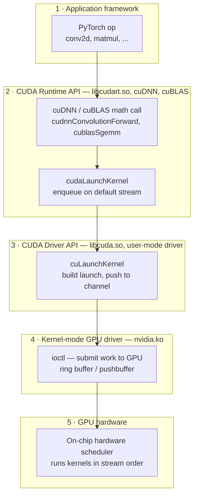
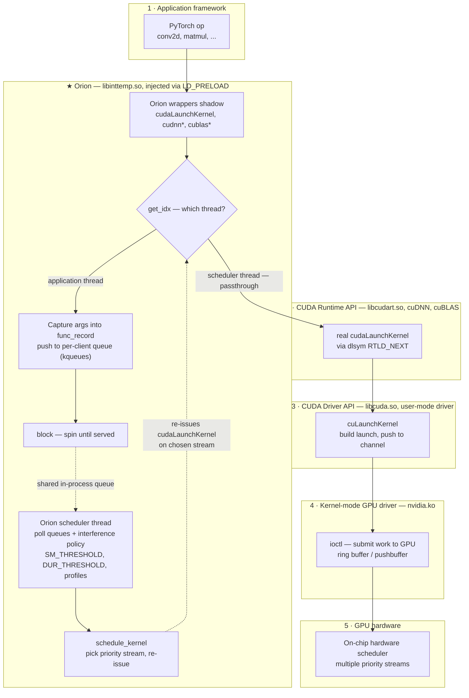

# Colocation — Orion-style GPU Kernel Colocator Prototype

A minimal prototype ("**colocator**") of the core mechanism of
[Orion (EuroSys '24)](https://dl.acm.org/doi/10.1145/3627703.3629578): transparently intercept the GPU operations
of unmodified PyTorch programs, buffer them in per-client software queues, and re-submit
them on colocator-owned CUDA streams under a pluggable scheduling policy (FCFS in v1).
An independent CUPTI-based **observer** records when each kernel was intercepted,
issued, and actually ran on the GPU, so we can measure real concurrency and
interference between two colocated clients.

Design and rationale: [PROPOSAL.md](PROPOSAL.md).
Reference system: [eth-easl/orion](https://github.com/eth-easl/orion) — read-only
reference (cloned locally at `orion/`), never modified or imported.

## Background: how Orion works

[Orion](https://dl.acm.org/doi/10.1145/3627703.3629578) colocates multiple DNN
jobs (e.g. a latency-sensitive inference job and a best-effort training job) on
one GPU. The problem it solves: normally an application's kernels go straight
from PyTorch through the CUDA Runtime and Driver to the hardware — there is no
point where an outside policy can decide *when* a kernel runs or *what* it runs
alongside. Orion creates that point in pure user space, with **zero changes to
the application**: it injects a shared library via `LD_PRELOAD` that shadows
the CUDA Runtime entry points (`cudaLaunchKernel`, cuDNN/cuBLAS calls).
Everything below the Runtime — `libcuda.so`, `nvidia.ko`, the GPU's on-chip
scheduler — is untouched.

### Normal pipeline (no Orion)



### Orion pipeline (LD_PRELOAD interception)



The interception, step by step:

1. **Shadow the symbol.** Orion's wrappers are compiled into `libinttemp.so`
   and injected with `LD_PRELOAD`, so its `cudaLaunchKernel` (and cuDNN/cuBLAS
   entry points) resolve before the real ones. PyTorch's call by name lands in
   Orion's function instead of the CUDA Runtime's.
2. **Identify the caller.** The wrapper reads the OS thread id (`gettid`) and
   looks it up in a shared table: which client does this launch belong to —
   or is the caller the scheduler itself?
3. **Capture, don't execute.** For an application thread, every launch
   argument (function pointer, grid/block dims, args, shared mem, stream) is
   packed into a `func_record` and pushed onto that client's software queue.
   The kernel is *not* sent to the GPU. The wrapper then spins until the entry
   is served, so PyTorch sees ordinary synchronous behavior and `cudaSuccess`.
4. **Scheduler decides.** A scheduler thread in the same process polls the
   queues and applies Orion's interference-aware policy — each kernel's SM
   footprint and compute-vs-memory profile against `SM_THRESHOLD` /
   `DUR_THRESHOLD` — to decide when a best-effort kernel may run alongside the
   high-priority job.
5. **Re-issue on a chosen stream.** The scheduler re-issues the captured
   launch as a *real* `cudaLaunchKernel` on a stream whose priority it picked.
   That call re-enters the same shadowed wrapper, but `get_idx` now recognizes
   the scheduler thread and takes the **passthrough** branch straight to the
   real runtime (`dlsym(RTLD_NEXT)`). From there down, everything is
   byte-for-byte the normal path — the driver just sees a normal application
   using multiple prioritized streams.

This prototype reimplements exactly that mechanism (interpose → queue → spin →
scheduler re-issues on its own streams → passthrough for the scheduler's own
calls), and adds what Orion doesn't have: a passive CUPTI observer measuring
what actually ran, an analysis pipeline joining interception/issue/GPU
timestamps, and a browser replay visualizer.

## Status

| Phase | Description | State |
|---|---|---|
| 0 | Environment & repo skeleton | **done** (verified 2026-07-27) |
| 1 | Interception proof-of-life (passthrough) | **done** — smoke test OK bare + intercepted |
| 2 | Workloads + custom SGEMM extension | **done** — both clients pass CPU-reference checks; kernel inventory fully intercepted |
| 3 | Colocator core (queues, FCFS, 2 streams) | **done** — all 3 modes correct; submitted == issued; non-blocking sync polling |
| 4 | Observer (CUPTI) | **done** — self-check passes: 4 timestamps/op, 0 leaked kernels, 0.02 ms clock drift |
| 5 | Demo & evaluation | **done** — see Results below; nsys cross-check matches observer exactly |
| 6a | Live queue + GPU state for policies | **done** — per-op completion events (exact in-flight counts, `SchedState.in_flight`) + observer live feed (measured per-stream busy); overhead below noise |

*(This table and the walkthrough below are updated as each phase lands.)*

## Requirements

- **Hardware:** NVIDIA GPU (verified on RTX 5090, sm_120). One GPU is enough; the demo
  colocates two clients on a single device.
- **Driver:** NVIDIA driver ≥ 570 (verified: 580.126).
- **CUDA toolkit:** 12.8 at `/usr/local/cuda` — provides `nvcc` and CUPTI
  (headers/libs under `/usr/local/cuda/extras/CUPTI` or `targets/x86_64-linux`).
- **Toolchain:** `g++`, `make`.
- **Conda** (Miniconda/Anaconda) for the Python environment.

## Setup

### 1. Create the conda environment

```bash
conda create -n colocator python=3.12 -y
```

```bash
conda activate colocator && pip install torch --index-url https://download.pytorch.org/whl/cu128 && pip install numpy pandas matplotlib ninja
```

### 2. Verify the environment

```bash
conda activate colocator && python colocator/tools/check_env.py
```

*(available after Phase 0; asserts torch+CUDA, GPU, nvcc, CUPTI, g++)*

### 3. Build the C++ libraries

```bash
make -C colocator
```

Builds `build/libcolocator.so` (LD_PRELOAD interception), `build/libsched.so`
(scheduler core), `build/libobserver.so` (CUPTI observer).

### 4. Build the workload CUDA extension

```bash
conda activate colocator && cd colocator/ext && python setup.py build_ext --inplace
```

## Running the demo

Eight workloads are registered (2 application clients + 6 resource probes from
the gpu-interfere profiler; see [demo/workload_defs/](colocator/demo/workload_defs/README.md)).
Run the full pair matrix + replays:

```bash
conda activate colocator && python colocator/demo/run_pairs.py && python colocator/visualizer/export_all.py
```

Or a single configuration:

```bash
conda activate colocator && python colocator/demo/run_demo.py --mode all --out runs/full
```

Modes: `seq` (clients run back-to-back, no colocator), `streams` (two plain
`torch.cuda.Stream`s, no colocator), `colocated` (through the colocator: LD_PRELOAD
interception → per-client queues → FCFS → per-client streams; the driver re-execs
itself with the right `LD_PRELOAD`, so no env setup is needed). Useful flags:
`--clients latency,throughput`, `--iters N`, `--priorities 0,0` (colocator stream
priorities; more negative = higher), `--observer on|off`, `--no-check`.

Analysis (after Phase 5):

```bash
conda activate colocator && python colocator/analysis/analyze.py runs/full && python colocator/analysis/plot_timeline.py runs/full
```

## Results (RTX 5090, 30 iters/client, FCFS)

Two clients: `latency` (chains of small SGEMM+relu, ~0.5 ms/iter solo) and
`throughput` (single 4096³ SGEMM saturating all 170 SMs, ~21 ms/iter solo).
Full data: `runs/full` (equal priorities) and `runs/prio` (latency stream at
high priority); plots `timeline_colocated.png` / `latency_cdf.png` in each.

| config | latency p50 / p95 | throughput iters/s | A/B kernel overlap |
|---|---|---|---|
| solo (`seq`) | 0.46 / 0.47 ms | 48.3 | — |
| plain streams, no colocator | 20.8 / 21.7 ms | 47.4 | ~0 |
| colocated FCFS, prio 0,0 | 20.8 / 21.7 ms | 47.6 | 42% of A's busy time |
| colocated FCFS, prio **−5**,0 | **0.98 / 5.2 ms** | 46.9 | **89% of A's busy time** |

What the observer's four-timestamps-per-op trace shows:

1. **Two streams alone buy nothing** when one client saturates the GPU: at
   equal priority the latency client's kernels sit in the hardware queue
   behind the big SGEMM's 16K blocks (`launch→gpu_start` p50 ≈ 20 ms while
   its software queue delay is 0.2 µs) — its p50 degrades 45× vs solo.
2. **Stream priority restores latency**: with the latency client's colocator
   stream at priority −5, its blocks enter SMs as they free up — p50 back to
   ~1 ms, p95 5 ms, while the throughput client loses only ~2% iters/s.
3. **True concurrency is real and measurable**: under priority, 89% of the
   latency client's GPU-busy time overlaps the throughput client's kernels,
   and contention is visible microscopically — its elementwise kernels slow
   1.5→3.1 µs, its SGEMMs 90→112 µs (the cross-mode duration table in
   `analyze.py` output).
4. **Colocator overhead is negligible** for these workloads: software queue
   delay p95 ≤ 1 µs; solo-through-colocator latency matches bare solo
   (0.46 ms p50 in both).
5. Found the hard way (now fixed in the workloads): D2H copies into
   *pageable* memory make `cudaMemcpyAsync` silently synchronous — under the
   colocator that stalls the *scheduler*, coupling both clients (20 ms
   queue-delay tail). Retrieval uses pinned buffers + redirected stream sync.

Cross-validated with Nsight Systems (`runs/nsys_check.nsys-rep`): kernel
instance counts match the observer exactly (170 sgemm / 136 elementwise /
68 reduce + 1 init), durations agree.

## Repository map

- [PROPOSAL.md](PROPOSAL.md) — architecture, Orion code study, phased plan with
  per-phase verification commands.
- `colocator/src/` — C++ core (interception, scheduler, observer); see its README for
  the module map and data-flow chart.
- `colocator/ext/` — custom tiled-SGEMM torch extension used by the workloads (stock
  `torch.matmul` would go through cuBLAS and bypass `cudaLaunchKernel` interception).
- `colocator/demo/` — the two client workloads and the demo driver; see its README for
  what each workload does and its kernel inventory.
- `colocator/analysis/` — metrics and plots from the observer's `trace.json`.
- `colocator/visualizer/` — animated browser replay of a colocated run
  (apps → interceptor → scheduler → streams → GPU, with per-timestamp
  measurement provenance); exports self-contained HTML files:
  `python colocator/visualizer/export_all.py` → `replays/<run>.html` +
  `replays/index.html` for every observed run (single run: `export.py`).
- `orion/` — Orion source, used only as a reference.
- `orion_pipeline_comparison_1.html` — earlier generated explainer of Orion's pipeline.
