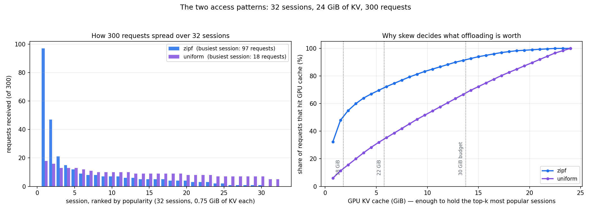
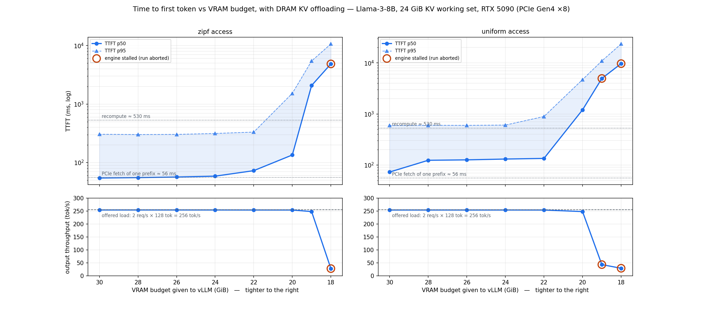
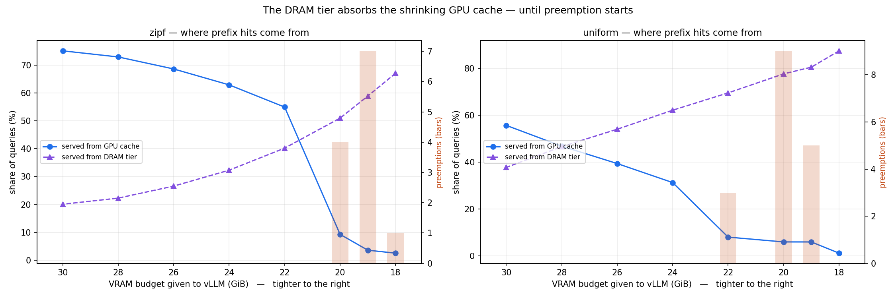
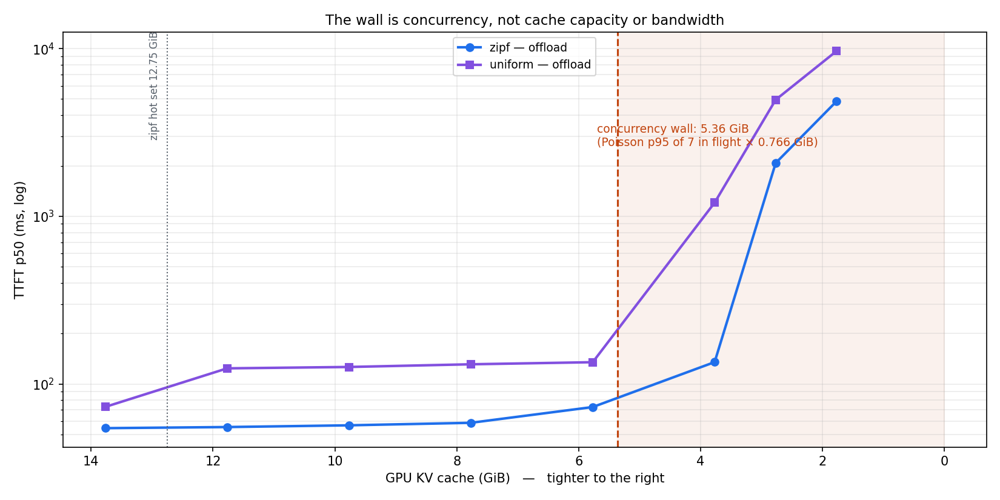

# How far can you shrink VRAM before DRAM offloading stops saving you?

**Llama-3-8B on an RTX 5090 (32 GB), with a KV working set that does not fit.**

An LLM server whose working set is ~39 GiB is run on a 32 GiB card, with the overflow held in
DRAM. As the VRAM budget is squeezed, what degrades, when, and why? This report walks the
setup first, then the mechanisms, then the measurements, then the analysis of why the limits
fall where they do — and states the answer at the end, where the evidence for it has already
been laid out.

---

## 1. Setup

### Hardware, measured rather than assumed

| | |
|---|---|
| GPU | RTX 5090, 32607 MiB raw, **31.354 GiB usable** (torch's view, which is what vLLM sizes against) |
| **PCIe** | **Gen4 ×8** — `Host Max: 4`, width `8x`. The card supports Gen5 ×16; this host does not. |
| **measured bandwidth** | **14.47 GB/s** H2D, 14.33 GB/s D2H (91% of theoretical), pinned |
| DRAM | 60 GiB; a 24 GiB pinned allocation succeeds in 2.95 s despite `ulimit -l` = 7.5 GiB |
| software | vLLM 0.15.1, torch 2.9.1+cu128, CUDA graphs and torch.compile **enabled** |

"Full VRAM" throughout means a **30 GiB budget = 95.7% utilization**, not the nameplate 32 GB.
Pushing higher risks OOM during vLLM's memory-profiling pass.

### How the oversubscription is formed

Demand and supply are controlled independently, which is what makes the sweep clean.

**Demand is fixed by the workload:** 32 sessions × 6144-token prefixes × 0.125 MiB/token =
**exactly 24.0 GiB of KV**, plus 14.96 GiB of weights ≈ **39 GiB of demand**.

**Supply is the knob:** `--gpu-memory-utilization` caps total allocation. Weights and overhead
never yield, so *every GiB removed comes out of the KV cache*:

| budget | GPU KV | oversubscription |
|---|---|---|
| 30 GiB | 13.77 GiB | 1.7× |
| 24 GiB | 7.77 GiB | 3.1× |
| 18 GiB | 1.77 GiB | 13.6× |

The overflow lives in a **24 GiB pinned DRAM pool, fixed across the entire sweep**, so only the
hot tier changes.

### What "offloading" is here — and what it is not

`--kv-offloading-backend native` is a **second-level prefix cache**, not demand paging.

```
request finishes → its KV blocks become idle cache entries
     ↓ GPU KV fills, LRU needs space
without offloading:  blocks DISCARDED      → next hit costs a 530 ms recompute
with offloading:     blocks COPIED to DRAM → next hit costs a 56 ms fetch
```

**An actively decoding sequence still needs all its KV in VRAM.** This does not let a 40 GiB
model run on a 32 GiB card. It rescues *reuse across requests*, nothing more.

### Workload

Every request is `6144-token session prefix + 128 unique tokens`, generating 128 tokens,
Poisson arrivals at **2 QPS**, **300 measured requests** per config after a 32-request warmup
that touches every session. Prompts are sent as **raw token IDs** so prefix lengths are exact
and block-aligned. Sessions are drawn Zipf-1.1 (90% of requests on 17 sessions = 12.75 GiB) or
uniform (90% on 28 sessions = 21 GiB).

### Access pattern: what "zipf" and "uniform" mean

Each request picks one of the 32 sessions. *How* it picks is the workload's locality, and it
turns out to matter more than anything else except VRAM itself.

- **uniform** — every session equally likely (1/32 each). In the realised 300-request sample
  the busiest session gets 18 requests and the quietest 5. No session is meaningfully hotter
  than any other, so there is no small "hot set" for a cache to hold: 90% of requests span
  **28 sessions = 21 GiB** of KV. This is the adversarial case for any cache.
- **zipf-1.1** — popularity follows a power law, session *i* chosen with probability ∝ 1/i^1.1.
  The realised sample is steeply skewed: the busiest session takes **97 of 300 requests**, the
  second 47, the median session 5, and several get none at all. 90% of requests land on just
  **17 sessions = 12.75 GiB**. This is the realistic case — real traffic is skewed, because
  some documents, system prompts and conversations are far more popular than others.



*Left: requests per session, rank-ordered, from the actual generator. Right: the ceiling on GPU
cache hits — holding the top-k sessions costs 0.75 GiB each, so this is the best hit rate any
GPU tier of a given size could achieve.*

The right panel is the whole locality argument in one line. At the **30 GiB** budget
(13.77 GiB of KV) zipf can serve **91%** of requests from GPU cache but uniform only **67%**;
at **22 GiB** it is **70% vs 32%**; at **18 GiB**, **48% vs 11%**. Uniform needs roughly three
times the cache for the same hit rate, which is exactly why offloading is worth 7.7× under
uniform access and only 1.1× under zipf (§4).

Zipf is a modelling choice borrowed from the caching literature (web and CDN workloads), not
something fitted to a production trace here. Both are run, and the pair brackets the range: the
truth for any real deployment sits between them.

### Prefix caching: the substrate this all sits on

Prefix caching is **on** (vLLM V1's default; `enable_prefix_caching=True` confirmed in the
server config). It hashes the prompt in 16-token blocks and reuses any block already in the
cache, skipping its prefill entirely.

**It is not optional here — it is what the experiment is built on:**

1. **The offload tier is keyed on the same block hashes.** Without prefix caching there are no
   hashes, so `OffloadingConnector` has nothing to look up and the feature cannot function.
2. **Without it there would be nothing to shrink.** Every request would fully prefill 6272
   tokens regardless of VRAM, GPU KV would only ever hold *running* sequences, and the
   24 GiB "working set" would not exist as a concept.
3. **It defines what the two arms actually differ on.** Both arms have it on. They differ only
   in what happens to an *evicted* block — discarded (recompute later) or copied to DRAM
   (fetch later). The comparison is one cache tier vs two, not caching vs no caching. This is
   why GPU hit rates are identical between arms at every budget (75.1% vs 75.1% at 30 GiB).

**What it means for the numbers:** most prompt tokens never get prefilled at all. At 30 GiB,
of 1,881,600 prompt tokens across 300 requests: **75.1% hit GPU cache (free), 20.1% come from
DRAM, 2.8% are recomputed, and 2.0% are the unique suffix that must always be prefilled.**

**Scope limit:** a workload with no reuse — all-unique prompts, no shared system prompt, no
conversation history — would gain nothing from either arm, and the DRAM tier would be pure
overhead. Everything here presumes reuse exists.

`--disable-hybrid-kv-cache-manager` is passed to **both** arms, because the offload connector
requires it and the arms must share one allocator.

### Preemption: what happens when VRAM runs out
vLLM decides how many requests to run at the same time based on how many free KV blocks it
has. Requests arrive at random times, so occasionally more end up in flight than there is room
for. When that happens, vLLM picks one of the **running** requests and kicks it out:

1. its KV cache is **deleted**
2. it goes back to the waiting queue
3. later it starts again, recomputing what it lost

Concretely: a request has already generated 60 of its 128 tokens. It gets preempted. The KV for
its 6144-token prompt *and* those 60 tokens is discarded. When it resumes, all of that is
computed again. The user sees no error — just a much slower response.

Three things it is **not**:

- **Not a dropped request.** Every run with preemptions in this study still completed all 300
  requests (`n_failed = 0`).
- **Not one request being too big.** A single request's KV is 0.766 GiB and fits even in the
  smallest tier tested (1.77 GiB). What overflows is the *total* of all requests running at
  once — at 5.77 GiB about 7 fit, so a burst of 8 forces an eviction.
- **Not chunked prefill.** Chunking splits one long prompt's prefill across several engine
  steps so decode is not starved; nothing is lost. Preemption throws away work already done.

**Why doesn't offloading prevent it?** Because offloading only takes KV that is *finished with*
— idle cache entries. A request that is still generating owns its blocks; they are live working
memory. And even if they could be pushed to DRAM, that would not help: to generate its next
token the request needs its KV **back in VRAM**, and the reason it was preempted is that VRAM
had no room. Offloading grows the **cache**; preemption is the **running set** not fitting.
Different resource, different problem — which is why §5 treats them as two separate walls.

Prefix caching does soften the restart. The evicted request's shared session prefix is still a
cache entry somewhere (GPU or DRAM), so the re-prefill can be much cheaper than a cold one.
What is gone for good is the KV for tokens it had already generated — those are unique to that
request, so nothing will ever reuse them.

---

## 2. The two constants everything rests on

Measured on this machine, not estimated:

| | |
|---|---|
| **fetch** a 6144-token prefix (0.75 GiB) from DRAM | **56 ms** |
| **recompute** the same prefix | **530 ms** |
| **ratio** | **9.5×** |

Every result below is a consequence of that ratio. Offloading does not add work to the GPU —
it **substitutes** a cheap transfer for expensive compute. Over one 300-request run at 30 GiB,
it converted 377,824 tokens of recompute into PCIe transfers: **31.7 s of GPU work replaced by
3.4 s of PCIe time.** The GPU does *less* work with offloading, not more.

---

## 3. What affects TTFT, and what affects throughput

### TTFT is the sensitive metric

TTFT = queue wait + block allocation + (**fetch or recompute**) + prefill of the uncached tail
+ first decode step. Offloading acts on the parenthesised term only.

Because 75% of prompt tokens hit GPU cache and are free, **the median request does almost
nothing** — 128 tokens of prefill, ~11 ms. The information is in the tail:

| at 30 GiB | offload | no offload |
|---|---|---|
| TTFT p50 | 54 ms | 61 ms (1.1×) |
| **TTFT p95** | **305 ms** | **925 ms (3.0×)** |

**p95 is the headline statistic in this study; p50 is a weak signal by construction.**

#### If cached hits are free, where does the TTFT rise come from?

A fair objection: with prefix caching on, most prefill is skipped, so what is actually getting
slower? Three distinct sources, and which one dominates changes across the sweep.

**(a) Hits migrate from GPU to DRAM.** A "hit" is not free once it comes from DRAM — the blocks
must cross PCIe before prefill can proceed. Hits are counted per *block*, so a request
typically gets part of its prefix from GPU and part from DRAM. The average fetch per request
follows directly from the DRAM hit rate:

| budget | DRAM hit rate | avg KV fetched per request | predicted transfer | measured TTFT p50 |
|---|---|---|---|---|
| 30 | 20.1% | 154 MiB | 11 ms | 54 ms |
| 24 | 32.3% | 248 MiB | 18 ms | 59 ms |
| 22 | 40.2% | 309 MiB | 23 ms | 73 ms |

The p50 rise of ~19 ms from 30 → 22 GiB tracks the ~12 ms rise in predicted transfer time.
**This is the gentle, well-behaved part of the curve** — and it is small precisely because a
fetch is 9.5× cheaper than the recompute it replaces.

**(b) Some blocks miss both tiers and are recomputed** — 2.8% of tokens at 30 GiB, rising as
VRAM shrinks. Each such prefix costs ~530 ms, which is what drives the **p95** tail while
leaving p50 largely untouched.

**(c) Below the concurrency wall, queueing dominates and (a) and (b) stop mattering.** At
19 GiB the DRAM hit rate is actually *higher* (59%), so caching is working *better* than at
30 GiB — yet TTFT is 2078 ms. That time is not fetch and not recompute; it is requests waiting
for KV blocks to be allocated at all. **The metric stops measuring the cache and starts
measuring the queue.** The tell is that ITL *improves* at the same time (13.3 → 12.2 ms),
because fewer sequences run concurrently.

### Decode is affected too — indirectly

At 30 GiB with **zero preemptions in both arms**, ITL is 12.84 ms with offloading and 13.82 ms
without — **7.6% slower**. vLLM batches prefill and decode in the same engine steps, so the
control arm's 530 ms recomputes steal GPU time from everyone's decode. Your neighbour's cache
miss slows your token generation. End-to-end p50 differs by 554 ms, far more than the 7 ms
TTFT gap, because that per-token penalty accumulates over 128 tokens.

### Throughput measured the load generator, not the server

Every healthy config returned **254.7 tok/s** against 256.0 tok/s offered (2 QPS × 128
tokens). With `ignore_eos=True`, tokens-out is *forced* to equal requests-in × 128 whenever the
server keeps up — it is a conservation law, not a performance result. Throughput only became
informative where the system failed to keep up (33–44 tok/s at the floor).

**Making throughput a real dependent variable requires a rising-QPS sweep**, which this design
cannot do. That is the single biggest limitation here.

---

## 4. Results



*Offload arm only, both access patterns. Top: TTFT p50 with the band out to
p95. Bottom: output throughput, pinned at the offered load until the server
can no longer keep up. The no-offload control is tabulated below rather than
plotted, since the question is how offloading itself degrades with VRAM.*

### The DRAM tier absorbs the shrinking GPU cache — until it can't



| budget | GPU KV | GPU hits | DRAM hits | TTFT p50 | TTFT p95 | preempt |
|---|---|---|---|---|---|---|
| 30 | 13.77 | 75% | 20% | 54 | 305 | 0 |
| 28 | 11.77 | 73% | 22% | 55 | 302 | 0 |
| 26 | 9.77 | 69% | 27% | 57 | 303 | 0 |
| 24 | 7.77 | 65% | 32% | 59 | 315 | 0 |
| 22 | 5.77 | 57% | 40% | 73 | 332 | 0 |
| 20 | 3.77 | 46% | 51% | 135 | 1528 | 4 |
| 19 | 2.77 | 37% | 59% | 2078 | 5451 | 7 |
| 18 | 1.77 | 28% | 67% | 4856 | 10666 | stalled |

The DRAM tier takes over smoothly and almost invisibly — GPU hits fall from 75% to 57% while
p95 moves 305 → 332 ms. Then the concurrency wall arrives and the curve goes vertical.

### Locality decides how much offloading is worth

At **full VRAM**, offloading's value depends entirely on access skew:

| at 30 GiB | no offload | offload | gain |
|---|---|---|---|
| **zipf-1.1** | 61 ms | 54 ms | **1.1×** |
| **uniform** | 559 ms | 73 ms | **7.7×** |

Under Zipf the GPU cache already holds the hot set, so offloading is nearly redundant. Under
uniform access there is no hot set to hold, the GPU cache thrashes, and offloading is worth
**7.7×**. Uniform also leans far harder on the DRAM tier (38% of hits at full VRAM vs 20%).

Both skews collapse at the same place, because the concurrency wall is set by request size and
arrival rate — not by locality.

### Offloading buys stability, not just latency

The clearest single comparison, at 22 GiB with identical GPU KV:

| | TTFT p50 | TTFT p95 | preemptions |
|---|---|---|---|
| offload | **73 ms** | **332 ms** | **0** |
| no offload | 666 ms | 2214 ms | **20** |

**9.1× on latency, and zero preemptions against 20.** The control arm enters a feedback loop
that offloading avoids entirely:

> less KV → more misses → **slower service** → more requests in flight (Little's law) → more KV
> pressure → preemption → slower still

Offloading keeps service time low, so in-flight count stays low, so the loop never starts.

### The failure mode at the floor

At 18 GiB the offload arm **deterministically stalls**: two independent runs froze at a
byte-identical state (0 running, 14 waiting, 85.0% KV used, 49.0% DRAM hit rate), with the
engine ceasing to log entirely — the loop itself blocked, not idling. It served 85 of 100
requests at 6 s TTFT first, so the deadlock is the *endpoint of the degradation*, not a separate cliff.

Mechanism (inferred, not confirmed — `ptrace_scope=1` blocked a stack trace): each request needs
0.77 GiB against a 1.77 GiB tier, so ~2.3 requests fill it, and loads in flight hold block
references with nothing left to evict. Note the shape of it: **the tighter the VRAM, the more
you need offloading, and the more likely this becomes.**

---

## 5. The four walls: why it breaks where it does

The curves above have a shape that needs explaining: flat for most of the sweep, then a
collapse over two steps. Four different resources could in principle produce that shape. Each
has a threshold that follows from a quantity we measured (`scripts/compute_walls.py`), so each
can be located on the x-axis and checked against what actually happened.

| wall | threshold | hit? | evidence |
|---|---|---|---|
| **1. Cache capacity** | GPU KV < 12.75 GiB hot set → budget < 29.1 GiB | **yes**, whole sweep | DRAM hit rate 20% → 67% |
| **2. Concurrency** | Poisson p95 of 7 in flight × 0.766 GiB = **5.36 GiB KV** → budget 21.7 GiB | **yes**, at 20 GiB | last clean 5.77, broken 3.77; preemptions appear exactly here |
| **3. PCIe bandwidth** | 14.47 GB/s → needs **35 req/s** | **no** — 5.7% used | 0.82 GB/s at the knee |
| **4. Prefill compute** | 15,700 tok/s → **9 req/s** (no offload), **123 req/s** (offload) | **no** at 2 req/s | 21% vs 1.6% utilised |



### Why walls 1 and 2 bind, and 3 and 4 do not

The **capacity** walls scale with VRAM — the thing we shrink. The **rate** walls scale with
request rate — which we hold fixed at 2 QPS. So this experiment could only ever find the first
two. PCIe would need 18× the offered load; prefill compute 4.5× (no-offload) or 60× (offload).

That gap is itself a result: **offloading raises the compute ceiling ~12×** (9 → 123 req/s) by
removing redundant prefill.

### Preemption as the wall-2 signature

Preemption (defined in §1) is specifically a *concurrency* symptom: it cannot be caused by a
cache miss, only by having no room for running sequences. It is also self-amplifying — the
forced recompute lengthens service time, which by Little's law puts more requests in flight,
which makes blocks scarcer still.

Two observations worth recording:

**vLLM's recovery choice is not obviously right on this hardware.** Recomputing a 6272-token
sequence costs ~530 ms; swapping its 0.766 GiB out and back would cost 114 ms — **4.6×
cheaper**. V0 had swap-based preemption, V1 defaults to recompute. That is defensible where
prefill is fast relative to the interconnect; this box has the opposite ratio.

**Offloading appears to make preemption cheaper, by accident.** zipf b22 without offload:
20 preemptions, 666 ms p50. zipf b20 with offload: 4 preemptions, 135 ms p50. A preempted
request's freed blocks plausibly become ordinary evicted cache entries and land in DRAM, so the
forced re-prefill hits the DRAM tier at 56 ms rather than recomputing at 530 ms. **This is
inference, not measurement** — separating preemption recovery from ordinary hits needs
per-request tracing that was not instrumented.

### Deriving wall 2

Little's law: 2 req/s × 1.83 s service time = **3.66 requests in flight on average**. But
arrivals are Poisson, and in-flight count in an M/G/∞ system is Poisson-distributed, so the
tier must be sized for the **peak**, not the mean: p95 = 7 requests × 0.766 GiB = **5.36 GiB**.

I predicted this wall *before* running those configs and got the location right but the
threshold one step too optimistic, because I first sized on the mean (2.80 GiB) rather than the
peak. The corrected 5.36 GiB brackets correctly: 5.77 GiB clean, 3.77 GiB broken.

**The diagnostic that proves it is concurrency and not cache or bandwidth:** ITL *improves*
(13.3 → 11.8 ms) as everything else collapses, because fewer sequences run at once. The failure
is entirely in getting requests **admitted**, not in generating tokens.

---

## 6. What this adds up to

**You can cut the VRAM budget from 30 GiB to 22 GiB — a 58% reduction in KV cache — for a 9%
cost in tail latency. Below that it collapses, by two orders of magnitude, within two steps.**

| VRAM budget | GPU KV | TTFT p50 | TTFT p95 | vs. full VRAM |
|---|---|---|---|---|
| 30 GiB | 13.77 GiB | 54 ms | 305 ms | — |
| **22 GiB** | **5.77 GiB** | **73 ms** | **332 ms** | **+9% p95** |
| 20 GiB | 3.77 GiB | 135 ms | 1528 ms | +401% |
| 19 GiB | 2.77 GiB | 2078 ms | 5451 ms | +1688% |
| 18 GiB | 1.77 GiB | 4856 ms | 10666 ms | engine stalled |

The collapse is **not** caused by running out of cache, and **not** by running out of PCIe
bandwidth. It is caused by running out of room to hold *concurrently running requests* — a
threshold we can compute in advance to 5.36 GiB, and which the data brackets at 5.77 (clean)
and 3.77 (broken).


---

## 7. Limitations

1. **Throughput was never a dependent variable.** Fixed 2 QPS open-loop pinned it at the
   arrival rate in every healthy config. A rising-QPS sweep is needed, and would also engage
   walls 3 and 4.
2. **p99 is not trustworthy** at n=300 — it is the 3rd-worst sample. p50 and p95 are sound
   (150 and 15 samples in the tail respectively). p99 appears in the CSVs but is not used here.
3. **One request shape only.** Every request is 6272 tokens in, 128 out. No mixed traffic, no
   varying lengths. Results speak to prefix-reuse serving specifically.
4. **The 128-token suffix maximises sensitivity.** Unavoidable work (~11 ms) against a full miss
   (530 ms) is a 48× ratio; with 1024 unique tokens it would be ~7×. **Relative improvements
   here are an upper bound** on a workload with more unique content.
5. **Warmup removes cold starts.** All sessions are touched before measuring, so the 2.8% that
   miss both tiers are *evicted* prefixes, not never-seen ones. Steady state only.
6. **No per-budget controls below 22 GiB** — the sweep was narrowed to offload-only, so the
   no-offload arm covers 30–22 GiB plus an 18 GiB pilot point.
7. **Single run per point.** No error bars. 3 repeats at 3 budgets would quantify run-to-run
   variance; currently it is unmeasured.
8. **vLLM 0.15.1 lacks KV-connector byte counters**, so transfer volume is derived from the
   token-denominated `external_prefix_cache_*` metrics. Achieved connector bandwidth was
   measured separately on a dev build (13.5–14.3 GB/s, matching calibration).

### The caveat that matters most

**Every conclusion here is a statement about PCIe Gen4 ×8 (14.47 GB/s), not about offloading as
an idea.** "Offloading only helps TTFT, never decode" follows from the 117× gap between VRAM
bandwidth (~1700 GB/s) and this link. On a Grace-Hopper-class machine with NVLink-C2C at
~900 GB/s that gap shrinks to ~2×, streaming KV *during* decode becomes viable, and the design
space changes completely. Do not port these numbers to different silicon.

---

## 8. Follow-ups

| experiment | what it answers |
|---|---|
| **Rising-QPS sweep** at fixed budget | makes throughput the dependent variable; finds walls 3 and 4; tests the predicted 12× compute-ceiling gain |
| **Case B — weight offload** (`--cpu-offload-gb`) | decode-time *streaming* rather than caching; predicted ~83 ms/token per GiB offloaded |
| **Combined weight + KV offload** | tests whether they compose — computed answer is no: weight streaming demands 330 GB/s and would starve the KV path |
| **Repeats at 30 / 24 / 18 GiB** | error bars, currently absent |
| **Preemption recovery tracing** | does the DRAM tier make preemption cheaper (56 ms refetch vs 530 ms recompute)? Would swap-based preemption beat recompute on a slow-interconnect box? |
| **LoRA finetuning under a shrinking budget** | see [PLAN_FINETUNE.md](PLAN_FINETUNE.md) — training inverts the economics, and bandwidth becomes the binding wall instead of capacity |

---

## Reproducing

```bash
.venv/bin/python scripts/calibrate_pcie.py            # the physical constants
cd scripts && ../.venv-matched/bin/python run_sweep.py --tag main
.venv/bin/python scripts/compute_walls.py             # thresholds from those constants
.venv/bin/python scripts/plot_case_a.py               # figures
```

Raw per-request records are in `output/raw/*.json`; per-config summaries in
`output/summary_*.csv`; the full narrative including every wrong turn is in
[PROGRESS.md](PROGRESS.md). Setup and environment details are in [README.md](README.md).
