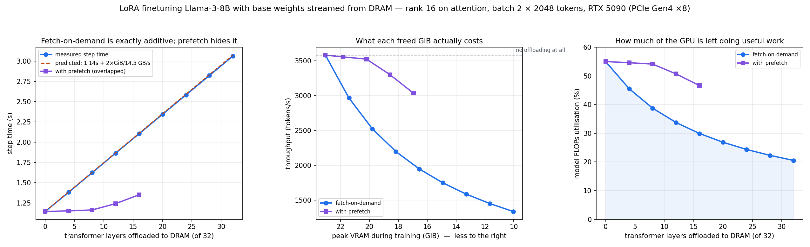

# LoRA finetuning under a shrinking VRAM budget

**Llama-3-8B, LoRA r=16 on attention, base weights streamed from DRAM. RTX 5090, PCIe Gen4 ×8.**

Companion to [RESULTS.md](RESULTS.md), which asked the same question of *inference*. Same
machine, same model, same measured constants — so the two are directly comparable, and they
turn out to fail for opposite reasons.

---

## 1. Setup

### Why LoRA, and why it makes the experiment clean

Full finetuning an 8B model needs ~128 GB of state — 16 weights + 16 gradients + **96 for Adam's
fp32 m, v and master copy** — against 60 GiB of DRAM on this box. It does not fit, and 8-bit
Adam only barely rescues it at 48 GB.

LoRA removes the optimiser from the experiment entirely:

| | |
|---|---|
| frozen base weights (bf16) | **14.96 GiB** ← the whole offloadable quantity |
| trainable params (r=16 on q,k,v,o × 32 layers) | 13.6 M = **0.17%** of the model |
| adapters + gradients + Adam fp32 | **208 MB** |

That leaves a clean two-way split of VRAM between *frozen weights* and *activations*, with the
trainable state below 1% of the footprint. Frozen weights are also read-only, so streaming them
never needs a write-back path.

### Gradient checkpointing is mandatory, not a tuning choice

| | activations at 2048 tokens |
|---|---|
| checkpointing **off** | **8.0 GiB** |
| checkpointing **on** | **1.1 GiB** |

Without it, ~4.0 MB of intermediates are stored *per token* (the three 14336-wide MLP tensors
dominate), so 8192 tokens would need 32 GiB on its own. 7× reduction for ~30% more compute.

### Batch size, found empirically

Descending powers of two, largest that fits: **batch 2 × 2048 = 4096 tokens/step**, peak
23.04 GiB. Batch 4 OOMs even in a fresh process.

The binding constraint is not what the arithmetic suggested. HF's `LlamaForCausalLM` runs
`logits = logits.float()` before the loss, so the logits tensor exists in **both bf16 and fp32**
against a 128,256-token vocabulary. At batch 4 that is **11.7 GiB — larger than all 32 layers of
checkpointed activations combined.** Chunked or fused cross-entropy is the first thing to reach
for if this needs to go higher.

**This matters for interpreting everything below:** 4096 tokens/step is *below* the ~6,900-token
break-even where streaming can fully hide behind compute. The experiment therefore sits in the
regime where transfer is the larger of the two terms.

### The knob

The last *N* of 32 transformer layers have their frozen weights held in pinned DRAM and paged in
around use. Layers are the natural unit: each is ~0.406 GiB, streaming is layer-wise anyway, and
the knob is exactly monotonic. Sweep: **0, 4, 8, 12, 16 layers**.

### Two arms — and why both are needed

| arm | what it does |
|---|---|
| **fetch-on-demand** | the copy is enqueued on the compute stream just before the layer needs it, so transfer and compute serialise |
| **prefetch** | while layer *N* computes, layer *N+1*'s weights copy on a side CUDA stream |

Running only one would make the result uninterpretable. "Offloading costs 46%" and "offloading
costs 46% *because this implementation doesn't overlap*" are different claims, and only the pair
distinguishes them.

### What the harness had to do, and why it isn't off-the-shelf

`accelerate`'s `device_map={"model.layers.N": "cpu"}` is the obvious tool and **does not work for
training**: it leaves parameters on the `meta` device and materialises them per forward, so the
backward pass fails outright with *"expected device meta but got cuda:0"*. It is built for
inference.

[`scripts/layer_offload.py`](scripts/layer_offload.py) manages residency around the *whole* step
instead:

```
initial forward   fetch → compute → release        (checkpointing keeps no graph in the segment)
backward          fetch → recompute → backward → release
```

Each offloaded layer therefore crosses PCIe **exactly twice per step**, which the instrumentation
confirms: `layer_fetches` equals `n_offload × 2 × steps` at every point. Only frozen weights are
streamed — releasing the trainable LoRA adapters would hand the optimiser zero-sized tensors.

---

## 2. Results



| layers offloaded | GiB freed | peak VRAM | on-demand | **prefetch** | on-demand cost | **prefetch cost** |
|---|---|---|---|---|---|---|
| 0 | 0.00 | 23.04 GiB | 3580 tok/s | 3580 tok/s | — | — |
| 4 | 1.63 | 21.82 GiB | 2965 | **3554** | 17% | **0.7%** |
| 8 | 3.25 | 20.20 GiB | 2523 | **3523** | 30% | **1.6%** |
| 12 | 4.88 | 18.57 GiB | 2197 | **3299** | 39% | **7.8%** |
| 16 | 6.50 | 16.94 GiB | 1947 | **3033** | 46% | **15.3%** |

**With overlapped transfers, 3.25 GiB of VRAM can be freed for 1.6% of throughput.** Without
overlap the same 3.25 GiB costs 30% — an 19× difference in price for an identical amount of
memory saved.

### Fetch-on-demand is exactly additive — which is the tell

Extending the on-demand arm to all 32 layers, step time is predicted by
`1.144 s + (GiB × 2 ÷ 14.47 GB/s)` — using **only** the PCIe bandwidth measured in the inference
study's calibration:

| layers | measured | predicted | error |
|---|---|---|---|
| 4 | 1.381 s | 1.386 s | −0.4% |
| 12 | 1.864 s | 1.868 s | −0.2% |
| 20 | 2.343 s | 2.351 s | −0.3% |
| 32 | 3.063 s | 3.074 s | −0.3% |

Nine points, all within 0.4%. Each GiB freed costs **0.1476 s/step** measured against 0.1484
predicted.

A fit this good is satisfying and was, in fact, a **symptom**: a *perfectly additive* cost can
only occur if overlap is exactly zero. The model was right about the physics and the
implementation was leaving a 1.6× speedup on the floor. Agreement with a model is only ever as
good as the model's assumptions.

### Prefetch approaches the theoretical bound but does not reach it

With perfect overlap the step would cost `max(compute, transfer)`:

| layers | transfer | compute | ideal step | measured (prefetch) | gap |
|---|---|---|---|---|---|
| 4 | 0.241 s | 1.144 s | 1.144 s | 1.152 s | +0.7% |
| 8 | 0.482 s | 1.144 s | 1.144 s | 1.163 s | +1.7% |
| 12 | 0.724 s | 1.144 s | 1.144 s | 1.241 s | +8.5% |
| 16 | 0.965 s | 1.144 s | 1.144 s | 1.350 s | +18% |

Up to 8 layers, overlap is nearly ideal. The gap widens as transfer approaches compute, which is
what depth-1 prefetching predicts: with one layer of lookahead, each layer's copy must fit inside
*one* layer's compute (~36 ms), not the whole step. Once per-layer transfer (~60 ms at 16 layers)
exceeds per-layer compute, the pipeline stalls regardless of total headroom. **Deeper prefetch —
staging 2–3 layers ahead — should close most of the remaining gap**, and is the obvious next
change.

### Sanity checks

- **Loss is unchanged** across every point and both arms (12.41–12.47). Streaming alters nothing
  numerically.
- **VRAM saved equals weights offloaded**, exactly: 23.04 → 16.94 GiB for 6.50 GiB of weights,
  the 0.4 GiB difference being the prefetch double-buffer.
- **Transfer count is exact**: `n_offload × 2 × steps`, confirming two crossings per layer.

---

## 3. What this adds up to

**On this hardware, LoRA finetuning an 8B model can give back a quarter of its VRAM almost for
free — but only with overlapped transfers.** 3.25 GiB for 1.6%; 6.5 GiB for 15%.

Put in hardware terms: the job needs 23.0 GiB resident, which wants a 24 GB card. Offloading
8 layers brings it to 20.2 GiB, and 16 layers to 16.9 GiB — **a 16 GB card runs the same job at
85% of the speed.** That is the practical question this answers.

### The two studies fail for opposite reasons

| | inference (KV offload) | finetuning (weight offload) |
|---|---|---|
| binding wall | **concurrency** — no room for running requests | **PCIe bandwidth** |
| curve shape | flat, then collapse over two steps | smooth and monotonic |
| free region | 58% of KV removable for 9% p95 | 25% of VRAM removable for 1.6% |
| failure mode | engine stalls, requests preempted | none — just slower |
| what is reused | KV, once per hit | weights, **every single step** |
| fix that helps | nothing — capacity is capacity | **overlap**, worth 1.6× |

The inference study never touched the PCIe wall (5.7% of the link at its worst); the finetuning
study never touched a capacity wall. Same machine, same offloading idea, opposite limiting
resource — because serving reads KV *per reuse* while training reads weights *per step*.

There is also a difference in kind. Inference degradation ends in a **cliff**: the engine stalls
and stops serving. Finetuning degradation is **graceful** — it just gets slower, monotonically,
with no failure mode. If you must run out of memory somewhere, training is the better place.

---

## 4. Limitations

1. **Batch 2 is below the streaming break-even.** At 4096 tokens/step, transfer (up to 1.93 s at
   full offload) exceeds compute (1.144 s), so even perfect overlap cannot make full offload free.
   A larger micro-batch would change the picture, but the logits tensor blocks it on this GPU.
   Note **gradient accumulation would not help** — weights stream once per *micro-batch*, so
   amortisation is set by the micro-batch, not the effective batch.
2. **Depth-1 prefetch only.** The widening gap at 12–16 layers is a lookahead limitation, not a
   bandwidth one. Untested.
3. **The prefetch arm covers 0–16 layers**, the on-demand arm 0–32. The two overlap on 0–16,
   which is where the comparison is made.
4. **Single run per point**, 8 measured steps after 3 warmup. No error bars, though step-time
   spread within a point was small.
5. **Synthetic data.** Random token IDs, so the loss is meaningless as learning — it is used only
   as a check that offloading changes nothing numerically.
6. **One model, one rank, one sequence length.** Rank barely matters for memory (r=128 is still
   only 1.6 GB) but does shift the compute/transfer ratio slightly.
7. **PCIe Gen4 ×8 (14.47 GB/s).** As with the inference study, every conclusion here is a
   statement about this interconnect. On NVLink-C2C at ~900 GB/s the transfer term nearly
   vanishes and full offload would be free at any batch size.

## 5. Follow-ups

| experiment | what it answers |
|---|---|
| **Deeper prefetch (2–3 layers)** | does the 18% gap at 16 layers close? |
| **Chunked/fused cross-entropy** | removes the 11.7 GiB logits tensor, unlocking batch 4–8 and testing the break-even directly |
| **DeepSpeed ZeRO-3 `offload_param`** | how does a production implementation compare to this harness? |
| **Sequence length vs batch** | B=1×S=4096 and B=2×S=2048 give equal tokens but different attention cost |
| **Rank sweep** | r=8…128, nearly free to test |

## Reproducing

```bash
.venv/bin/python scripts/finetune_sweep.py --find-batch                        # phase 0
.venv/bin/python scripts/finetune_sweep.py --batch 2 --tag ft                  # on-demand
.venv/bin/python scripts/finetune_sweep.py --batch 2 --prefetch --max-offload 16 --tag ft_prefetch
.venv/bin/python scripts/plot_finetune.py
```

Design and predictions made before running: [PLAN_FINETUNE.md](PLAN_FINETUNE.md). Full narrative
including every wrong turn: [PROGRESS.md](PROGRESS.md).
