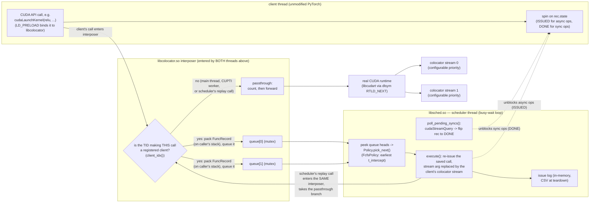

# src/ — colocator C++ core

Three shared libraries built by the top-level [Makefile](../Makefile) into
`build/`:

| Library | Source dir | Role |
|---|---|---|
| `libcolocator.so` | [intercept/](intercept/) | LD_PRELOAD interposition: catches clients' CUDA runtime calls, queues them per client |
| `libsched.so` | [sched/](sched/) | scheduler: one CUDA stream per client, policy picks the next queued op, replays it |
| `libobserver.so` | [observer/](observer/) | CUPTI-based passive observer: records when kernels actually run on the GPU (Phase 4) |

[common/](common/) holds the shared types and the shared-state contract
(`records.h`) both libraries compile against.

## Data flow (managed mode)

Every CUDA runtime API call in the process — no matter which thread makes
it — lands in a libcolocator interposer, because LD_PRELOAD rebinds the
symbol process-wide. The first thing an interposer does is ask **"is the
thread that made this call a registered client?"** (`client_idx()`: compares
the caller's Linux TID against the TIDs that client threads registered via
`col_register_client`). That yields two paths:

- **Client thread** (registered): the call — e.g. PyTorch calling
  `cudaLaunchKernel` for a relu — is *not* executed. It's packed into a
  `FuncRecord` and queued; the client spins until the scheduler handles it.
- **Any other thread** (Python main thread, CUPTI workers, and the
  **scheduler thread itself**): the call passes through to the real runtime.
  This is not a corner case, it's what makes replay work: when the scheduler
  replays a queued record, `execute()` calls the same interposed
  `cudaLaunchKernel` symbol again — from *its* thread. Since the scheduler's
  TID is not registered, that second entry takes the passthrough branch and
  reaches the real runtime. No recursion, no special-casing.

So the full life of one client kernel launch is:

1. client thread calls `cudaLaunchKernel` → interposer → "registered? yes" →
   `FuncRecord` queued, client spins;
2. scheduler picks the record, `execute()` calls `cudaLaunchKernel` with the
   client's colocator stream → interposer again (scheduler's TID) →
   "registered? no" → passthrough → real runtime → kernel is now in stream
   0/1's hardware queue;
3. scheduler sets `rec.state = ISSUED`, client thread resumes.

Key contract (details in `common/records.h` header comment): a client pushes a
`FuncRecord*` pointing into its **own stack** and spins until the scheduler
advances the record's state — so record storage (including a kernel's `args`
array) is valid exactly as long as the scheduler needs it, with no allocation
on the hot path. Queue depth per client is therefore ≤ 1 (Orion-style
lockstep).

## Relations between files

- `common/records.h` — `OpKind`, `FuncRecord`, `ClientSlot`, the extern
  globals. **Defined** in `intercept.cpp`, **referenced** by `scheduler.cpp`;
  the dynamic linker resolves them at load time because libcolocator is
  preloaded into global scope (no dlsym needed, unlike Orion).
- `intercept/intercept.cpp` — interposers + registration API
  (`col_register_client`) + passthrough accounting.
- `sched/policy.h` — `Policy` interface + `FcfsPolicy`. New policies go here
  (or in new files) and get instantiated in `col_setup`.
- `sched/scheduler.cpp` — streams, busy-wait loop, `execute()`, issue log,
  ctypes-facing API (`col_setup` / `col_run` / `col_stop` /
  `col_issued_count` / `col_dump_issue_log`).
- `../python/colocator.py` — loads both libs via ctypes, re-execs the
  interpreter to set LD_PRELOAD, runs scheduler + client threads.
