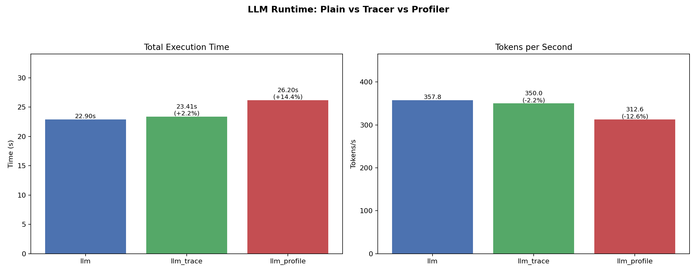

# CUPTI Experiments

A toolkit for measuring GPU kernel activity and performance in CUDA applications using NVIDIA's CUPTI (CUDA Profiling Tools Interface). It provides two injection-based libraries — a **tracer** and an **auto-profiler** — plus an LLM inference workload for realistic testing and plotting scripts for visualization.

No modifications to the target application are needed. Both libraries attach at runtime via `CUDA_INJECTION64_PATH`.

## Directory structure

```
cupti/
├── Makefile                 Top-level build and run orchestration
├── plot_all.py              Visualization: hotspots, overhead, profiling results
├── tracer/                  CUPTI activity tracer (lightweight)
│   ├── activity_tracer.cpp
│   ├── example_workload.cu
│   ├── Makefile
│   └── README.md
├── profiler/                CUPTI auto-profiler (trace → profile → trace cycle)
│   ├── auto_profiler.cpp
│   ├── nvpw_metrics.cpp / .h
│   ├── tracing.cpp / .h
│   ├── profiler_common.h
│   ├── Makefile
│   └── README.md
├── llm_app/                 LLM inference workload (Llama-3-8B)
│   ├── run_llm.py
│   ├── generate_prompts.py
│   └── prompts.jsonl
└── output/                  Collected metrics, CSVs, and plots
    ├── llm_metrics.json
    ├── llm_trace_metrics.json
    ├── llm_profile_metrics.json
    ├── kernel_hotspots_global.csv
    ├── profile_cycle_*.json
    └── plots/
```


# CUPTI API Overview

CUPTI exposes a family of APIs, each targeting a different point on the precision-vs-overhead spectrum. APIs marked with * are used in this project.

| API | Description | Overhead model | Cost |
|-----|-------------|----------------|------|
| **Activity API** * | Asynchronously records kernel timestamps, memory copies, and API calls | % of total runtime | ~1–5% |
| **Callback API** * | Synchronous notifications on CUDA events | Per kernel launch | ~ns per launch (atomic + string compare) |
| **Range / Host Profiling API** * | Exact hardware counter values via **kernel replay** | Per profiled kernel | N× slowdown for that kernel only |
| **PM Sampling API** | Samples hardware PMU (Performance Monitoring Unit) registers at fixed intervals. e.g. SM utilization over time, DRAM bandwidth trend, L2 cache hit rate, Tensor Core activity | % of total runtime | Lower than replay, approximate values |
| **PC Sampling API** | Statistically samples warp program counter and scheduler state. e.g. which source code lines the GPU stalls on most, stall reasons, warp scheduler state distribution | % of total runtime | Medium; instruction-level, probabilistic |
| **SASS Metric API** | Maps counter values to individual GPU assembly (SASS) instructions. e.g. FMA throughput per assembly line, which specific instructions cause L1 cache misses, register bank conflicts per instruction | Per profiled kernel | Highest; exact per-instruction |
| **Checkpoint API** | Saves and restores GPU memory state | Per save/restore | Infrastructure primitive; used internally by kernel replay |
## Quick start

```bash
# Build everything
make                    # builds tracer + profiler libraries

# Run LLM workload in different modes
make llm                # baseline run (no instrumentation)
make llm-trace          # run with tracer attached
make llm-profile        # run with auto-profiler attached (requires sudo)

# Generate all plots
make plot               # hotspots, overhead comparison, profiling cycle charts
```

## Components

### Tracer (`tracer/`)

A lightweight shared library (`libactivity_tracer.so`) that records every kernel's launch count and GPU execution time using the CUPTI Activity API. Overhead is minimal (~1-5%).

Produces two CSV files:
- `kernel_hotspots_global.csv` — all-time per-kernel statistics
- `kernel_hotspots_recent_5s.csv` — rolling 5-second sliding window

See [tracer/README.md](tracer/README.md) for details.

### Auto-Profiler (`profiler/`)

A more advanced shared library (`libauto_profiler.so`) that goes beyond timing. It operates in a continuous cycle:

1. **Trace** — for a configurable window (default 10 s), records all kernel launches and builds a hotspot table (same mechanism as the tracer).
2. **Select** — identifies the kernel with the highest cumulative GPU time.
3. **Profile** — intercepts the next launch of that kernel and collects hardware performance counters using CUPTI's Profiler API. The kernel is transparently replayed across multiple passes to read all requested counters.
4. **Write** — evaluates the raw counter data into metric values, writes a JSON report, and returns to step 1.

The profiling phase uses **AutoRange + KernelReplay** mode: CUPTI saves the kernel's GPU input state, replays it once per counter pass with different hardware counter groups programmed, and restores state between passes. The application sees correct output — only the profiled kernel runs slower (N x for N passes).

Default metrics collected:
- `sm__cycles_elapsed.avg` — total kernel duration in GPU cycles
- `sm__cycles_active.avg` — cycles with at least one active warp
- `sm__warps_active.avg` — average occupancy (warps per SM)
- `dram__bytes_read.sum` — total bytes read from device memory
- `dram__bytes_write.sum` — total bytes written to device memory

See [profiler/README.md](profiler/README.md) for full documentation on metrics, the kernel replay mechanism, and customization.

### LLM workload (`llm_app/`)

Runs batched autoregressive inference with Llama-3-8B using HuggingFace Transformers. One prefill pass followed by a manual token-by-token decode loop (32 new tokens, batch size 8, float16). Outputs JSON with total time, tokens/sec, and requests/sec.

Model: `meta-llama/Meta-Llama-3-8B`. Requires `torch`, `transformers`, `sentencepiece`, and `accelerate`.

### Plotting (`plot_all.py`)

Generates multiple visualizations from the collected data:

**Hotspot charts** — top-10 kernels by total GPU duration and by launch count, for both the global and recent-5s windows. Raw C++ mangled names are mapped to readable labels (Flash Attention, CUTLASS GEMM, LayerNorm, etc.).

**Overhead comparison** — side-by-side bar charts of execution time and tokens/sec. Two variants:
- Two-way: baseline vs tracer
- Three-way: baseline vs tracer vs profiler (generated when all three JSON files exist)

Each bar is annotated with its value and the percentage overhead relative to the baseline:



**Profiling cycle charts** — for each `profile_cycle_N.json`, a multi-panel figure with:
- Collected hardware counter values (horizontal bar chart)
- Kernel identity card (name, launches, avg duration, SM active ratio)
- SM utilization breakdown (active vs idle cycles, warps overlay)
- DRAM traffic breakdown (read vs write, with ratio annotation)
- Automated bottleneck diagnosis (compute-bound / memory-bound / latency-bound / low occupancy)

**Multi-cycle summary** — if 2+ profiling cycles exist, a comparison chart showing how metrics change across cycles (e.g. different hot kernels profiled in each cycle).

## Make targets

| Target | Description |
|--------|-------------|
| `make` / `make all` | Build both tracer and profiler libraries |
| `make tracer` | Build `tracer/libactivity_tracer.so` |
| `make profiler` | Build `profiler/libauto_profiler.so` |
| `make llm` | Run LLM workload without instrumentation |
| `make llm-trace` | Build tracer + run LLM with it injected |
| `make llm-profile` | Build profiler + run LLM with it injected (sudo) |
| `make plot` | Generate all plots from available data in `output/` |
| `make clean` | Remove built libraries and object files |

## Environment variables

| Variable | Default | Used by | Description |
|----------|---------|---------|-------------|
| `CUPTI_TRACE_OUTDIR` | `output` | Both | Output directory for CSVs and JSONs |
| `CUPTI_PROFILER_TRACE_S` | `10` | Profiler | Seconds to trace before profiling |
| `INJECTION_METRICS` | (5 defaults) | Profiler | Comma-separated NVPW metric names |

## Overhead: tracer vs profiler

The tracer and profiler have fundamentally different overhead profiles:

| | Tracer | Profiler |
|---|---|---|
| **What it collects** | Kernel name + GPU timestamps | Hardware performance counter values |
| **How it works** | Listens to activity records (passive) | Replays the target kernel N times (active) |
| **Overhead** | ~1-5% on total runtime | ~20%+ during profiling cycles (kernel replay) |
| **Scope** | All kernels, all the time | One kernel at a time, periodically |
| **Requires sudo** | No | Yes (hardware counter access) |

The tracer is suitable for always-on monitoring. The profiler adds measurable overhead when a kernel is being replayed, but only affects one kernel per cycle and spends most of its time in the low-overhead tracing mode.

## Requirements

- CUDA 12.4+ with CUPTI
- NVPW libraries (`libnvperf_host.so`, `libnvperf_target.so`) — for the profiler
- Python 3 with `matplotlib` — for plotting
- `torch`, `transformers`, `sentencepiece`, `accelerate` — for the LLM workload
- `sudo` access — for the profiler (hardware counter collection)

Edit `CUDA_HOME` in the Makefiles if CUDA is not at `/usr/local/cuda`.
