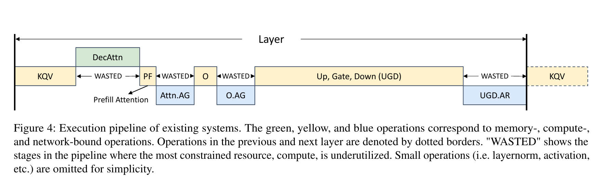
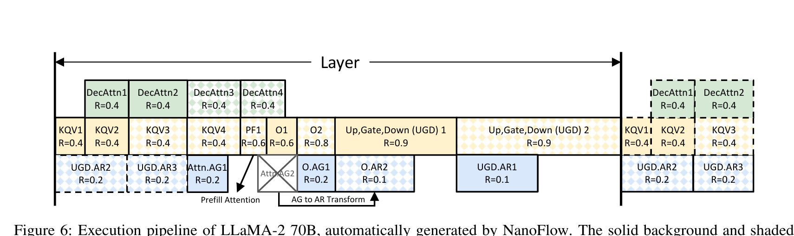
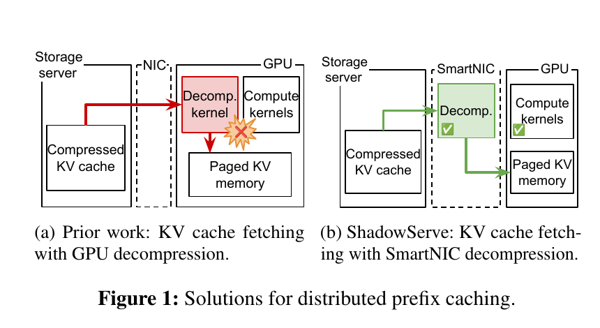
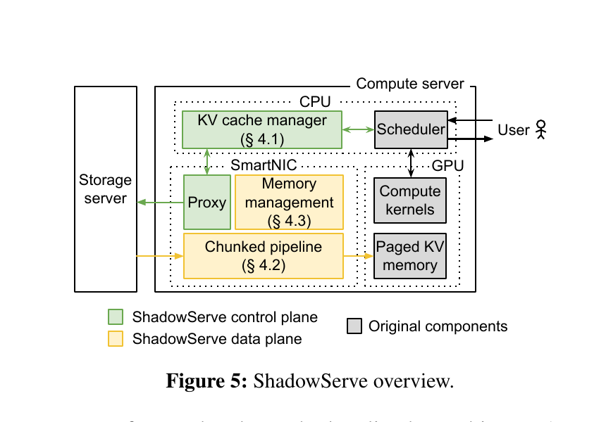
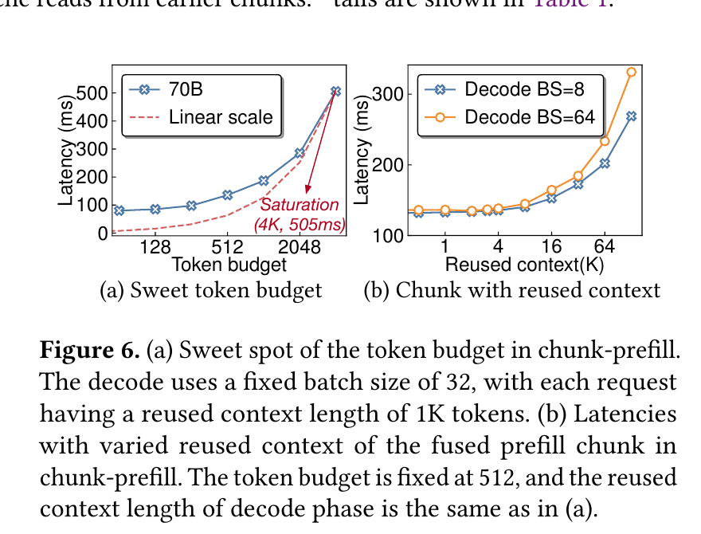
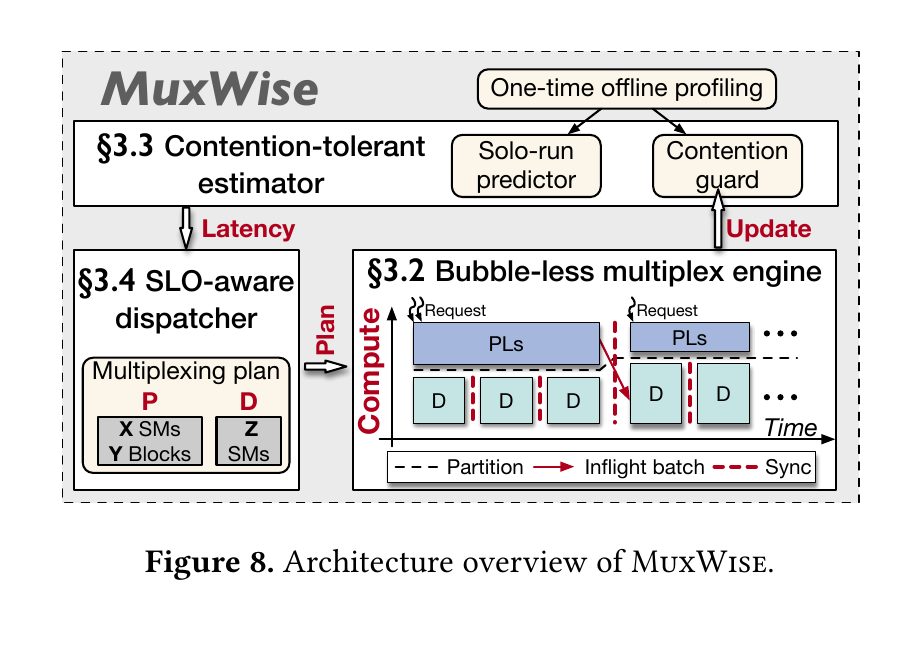
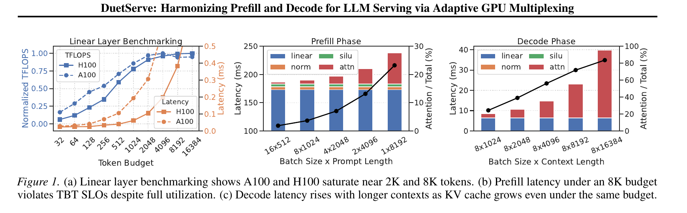
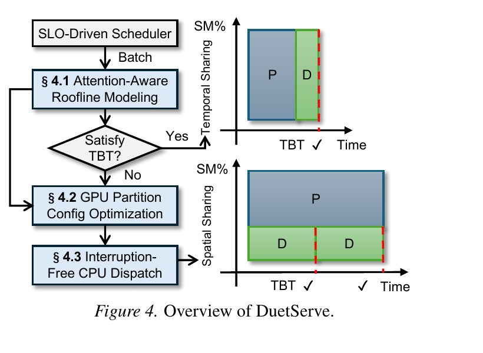

# Literature Review: LLM Serving Optimizations

## Scope and Reading Guide

This review covers the four papers in the `interesting work` directory. Unlike the main kernel-scheduling collection, these systems are specialized for LLM serving. NanoFlow pipelines heterogeneous LLM operations inside a GPU; ShadowServe moves distributed KV-cache retrieval and decompression to a SmartNIC; MuxWise and DuetServe spatially multiplex prefill and decode on the same GPU. The review orders the papers from operation-level execution optimization, through data-plane offloading, to phase-level prefill-decode multiplexing.

For each paper, the review asks:

1. What LLM-serving bottleneck motivates the work?
2. What is the main mechanism and scheduling granularity?
3. How are performance, interference, and SLO constraints modeled?
4. What does the evaluation establish, and what remains limited?
5. How does the work relate to Orion-style transparent kernel scheduling?

## 1. NanoFlow: Towards Optimal Large Language Model Serving Throughput

> **In brief:** NanoFlow splits large LLM batches into nano-batches and overlaps compute-bound, memory-bound, and network-bound operations within each GPU. An automated two-stage optimizer chooses nano-operation sizes, ordering, implementations, and resource allocations, raising serving throughput to a much larger fraction of the hardware-derived optimum.

### Problem and motivation

LLM serving is often described as memory-bound because autoregressive decoding repeatedly loads model weights and reads a growing KV cache. NanoFlow argues that this description is incomplete at the end-to-end level. Attention can be memory-bound, and tensor-parallel collectives are network-bound, but the linear layers that dominate many modern models can make the overall serving workload compute-bound. The real inefficiency is that conventional engines execute these heterogeneous operations largely sequentially. During attention and communication, tensor-core compute capacity is underused; during GEMMs, memory and network resources may be available.

*Motivation (Figure 4): existing systems process compute-, memory-, and network-bound operators in a mostly serial layer pipeline. The regions labeled WASTED are opportunities to overlap work that stresses different resources.*

NanoFlow first develops a cost model that estimates lower bounds from compute, memory, and interconnect demand. For LLaMA-2-70B on eight A100 GPUs, the model estimates an optimal throughput of 1,857 tokens/s/GPU. In the paper's analysis, vLLM, DeepSpeed-FastGen, and TensorRT-LLM reach only 22.0%, 22.9%, and 37.8% of that bound in representative offline-serving configurations. The gap motivates optimizing the execution pipeline inside each device rather than treating the model iteration as an indivisible sequence.

### Nano-batching and intra-device parallelism

NanoFlow divides a dense request batch into smaller, possibly unequal nano-batches. Each model operator is correspondingly expanded into nano-operations that operate on independent portions of the input. Dependencies are tracked at the nano-batch range level: two nano-operations depend on one another only when their parent operators are dependent and their input ranges overlap.

The finer decomposition exposes several forms of concurrency. Decode attention or prefill attention can overlap with GEMMs from another nano-batch; tensor-parallel all-gather or all-reduce can overlap with compute; and operations from adjacent Transformer layers can be interleaved when their data dependencies permit. NanoFlow may also duplicate an operator so that multiple nano-batches advance independently. This duplication can cause weights to be loaded more than once, so splitting too aggressively sacrifices batching efficiency. The system must therefore trade additional concurrency against smaller GEMMs, repeated weight traffic, and interference.

*Main mechanism (Figure 6): the generated LLaMA-2-70B schedule overlaps GEMM, attention, and collective operations from multiple nano-batches and adjacent layers. Each operation is assigned a resource fraction `R`, and the optimizer transforms some collectives to expose a shorter dependency path.*

### Automated pipeline search

The search begins with offline kernel profiling. NanoFlow profiles GEMM, GEMV/attention, and network implementations over relevant batch sizes and implementation parameters such as tile shape, warp count, and thread-block count. It records the best isolated implementation for each operation shape. It then profiles representative pairs of compute-memory and compute-network kernels to model interference. Because NVIDIA GPUs do not expose independent controls for compute, HBM, and interconnect bandwidth, NanoFlow uses normalized GEMM performance as a proxy for allocated resource fraction `R` and measures the performance `P` achieved by the concurrent non-GEMM operation.

The resulting empirical `R -> P` table captures non-linear tradeoffs. For example, sacrificing 20% of isolated GEMM performance may yield more than 20% of a GEMV kernel's peak performance. NanoFlow prunes dominated kernel pairs and assumes that pairwise compute-memory and compute-network profiles approximate three-way overlap. The reported mapping is sufficiently stable across evaluated GEMM shapes to keep profiling tractable, but it remains hardware- and kernel-library-specific.

Auto-search uses two mixed-integer linear programs:

- **Stage I: pipeline structure.** It chooses the number and size of nano-operations and their order while initially ignoring overlap slowdown. Constraints encode operator dependencies, batch ranges, execution times, and legal algebraic transformations such as replacing all-gather with all-reduce under a different weight partition. The objective minimizes the critical path and compute bubbles.
- **Stage II: resource refinement.** It fixes the Stage I structure and assigns resource fractions and concrete kernel implementations using the measured interference table. At every instant, total modeled resource allocation cannot exceed one. Execution duration is adjusted using the profiled isolated time and predicted concurrent performance.

The search is invoked when the model architecture or workload distribution changes substantially. Rather than proving global optimality, it prioritizes finding a strong feasible schedule and reports approximately ten minutes for a practical pipeline.

### Runtime and memory management

The runtime launches nano-operations in the selected order and uses CUDA events to enforce dependencies without serializing independent work. NanoFlow includes custom CUDA implementations and host orchestration rather than operating solely as a wrapper around an existing serving engine. It also integrates tensor parallelism and KV-cache offloading. Dense batches are kept relatively stable, allowing the host and GPU to agree on the amount of on-the-fly KV state. GPU-initiated copies, NUMA-aware memory binding, hierarchical CPU/SSD caching, and copy-then-scatter into paged GPU KV memory reduce offload overhead.

### Evaluation

The primary evaluation uses eight NVLink-connected A100 80 GB GPUs and LLaMA-2-70B, with additional experiments covering LLaMA-3-8B, Mixtral 8x7B, and other models and request distributions. Baselines include vLLM, DeepSpeed-FastGen, TensorRT-LLM, and phase-level systems in relevant configurations.

NanoFlow reports **1.91x average throughput improvement** over state-of-the-art serving systems. Across popular models, it commonly reaches approximately **50%-72% of the modeled optimal throughput**, with some configurations reaching about **78.5%**. Ablation attributes gains to nano-batching, compute-memory overlap, compute-network overlap, collective transformations, and KV offloading. The resource timeline shows that its principal effect is keeping compute active while memory- and network-heavy work progresses concurrently.

### Relation to Orion-style kernel scheduling

NanoFlow and Orion share the insight that complementary GPU kernels should overlap rather than execute serially. Orion observes arbitrary applications at runtime and uses profiles to choose compatible whole kernels from independent queues. NanoFlow specializes this idea to one LLM iteration: it deliberately creates additional kernels through nano-batching, understands the model's dependency graph, selects concrete kernel implementations, and constructs a repeatable pipeline ahead of execution.

This specialization lets NanoFlow exploit dependencies and algebraic transformations unavailable to a transparent scheduler, but it is less general. It requires model-aware integration, offline profiles, custom kernels, and a reasonably stable workload distribution. A useful research direction is to combine NanoFlow's operation graph with an Orion-like online control layer that corrects interference-model errors and adapts the pipeline without repeating a full MILP search.

### Assessment

NanoFlow is the most operation-level paper in this collection. Its strongest contribution is not a single fused kernel, but an automated method for constructing an intra-device pipeline from heterogeneous resource demands. Its limitations are the engineering and profiling burden, reliance on pairwise interference approximations, sensitivity to model/kernel changes, and an objective centered on throughput rather than strict online tail-latency isolation. Splitting batches can also reload weights and reduce GEMM efficiency, particularly when requests are too small or memory-bound to provide useful complementary work.

## 2. ShadowServe: Interference-Free KV Cache Fetching for Distributed Prefix Caching

> **In brief:** ShadowServe moves compressed KV-cache retrieval, lossless decompression, dequantization, and DMA from the host GPU/CPU onto a SmartNIC. This removes decompression interference from model execution and uses a chunked, minimal-copy SmartNIC pipeline to compensate for the NIC's limited compute and memory resources.

### Problem and motivation

Long-context and multi-turn LLM services can avoid recomputing shared prefixes by storing reusable KV-cache entries in a distributed cache. When network bandwidth is limited, transmitting compressed KV caches is faster than transmitting raw tensors, but the serving node must decompress and dequantize them before use. Running decompression kernels on the same GPU as inference creates substantial interference; the paper observes slowdowns often at or above 30%. CPU offload is unattractive because host CPUs already perform scheduling, vector search, preprocessing, and networking, and many decompression algorithms execute inefficiently on general-purpose cores.

*Motivation (Figure 1): prior compressed prefix caching sends data to the GPU for decompression, where it competes with model kernels. ShadowServe performs decompression on a SmartNIC and writes ready KV data into paged GPU memory.*

ShadowServe targets low-cost or cloud serving environments where per-GPU network bandwidth may be only 5-25 Gbps. In this regime, compression is valuable, but the decompression location determines whether cache retrieval damages TPOT. The system's goal is therefore not merely lower fetch latency; it is interference-free background fetching that preserves ongoing decode performance.

### Architecture and asynchronous control plane

ShadowServe separates prefix caching into a CPU control plane and a SmartNIC data plane. The control plane integrates with the LLM scheduler and includes a KV-cache manager. At every scheduling iteration, the manager identifies requests whose prefixes can be fetched, transfers their metadata to a proxy running on the SmartNIC, and temporarily withholds them from GPU prefill. Once the KV data has arrived in GPU memory, the request is returned to the serving scheduler and can begin token generation.

*Main mechanism (Figure 5): green components form the asynchronous control plane; yellow components form the SmartNIC data plane. Network fetch, decompression, dequantization, and DMA bypass the host GPU's compute path and terminate directly in its KV-cache allocation.*

Fetching is asynchronous: the manager starts retrieval before the request reaches the head of the execution queue whenever possible. The SmartNIC proxy communicates with the remote storage service, coordinates pipeline stages, and notifies the host when the data is ready. This overlaps KV-cache movement with unrelated GPU work without launching decompression kernels on that GPU.

### Chunked SmartNIC data plane

Simply moving the entire process to a SmartNIC would create a new bottleneck. The evaluated NVIDIA BlueField-3 has relatively weak Arm cores and a constrained cache/memory hierarchy compared with the host. ShadowServe therefore divides each compressed KV entry into fixed-size chunks and pipelines four stages:

1. network retrieval from the storage server;
2. lossless Deflate decompression using the SmartNIC accelerator;
3. dequantization on SmartNIC cores;
4. peer-to-peer DMA into GPU memory.

Different chunks occupy different stages concurrently. ShadowServe profiles stage throughput and partitions SmartNIC cores and accelerators so that the slowest stage determines pipeline rate with minimal cross-stage contention. The pipeline is ultimately limited by the SmartNIC's network and memory subsystem rather than its Deflate or DMA accelerators.

The minimal-copy memory manager preallocates and pins buffers on both the SmartNIC and GPU. Each in-flight chunk receives a dedicated region, preventing pipeline stages from overwriting one another and avoiding repeated allocation, registration, and copying. The system can DMA into contiguous GPU staging memory and then arrange data for paged KV storage; fully direct writes into fragmented pages are possible but can reduce transfer efficiency.

### Evaluation

The prototype uses an NVIDIA BlueField-3 DPU and evaluates Llama-8B and Mistral-7B with long-context datasets, multiple output lengths, and emulated network bandwidth from 10 to 40 Gbps. The main comparison is CacheGen-Async, which asynchronously fetches compressed KV data but performs decompression on the serving GPU.

ShadowServe achieves up to **2.2x lower loaded TPOT**, up to **1.38x lower unloaded TTFT** below 20 Gbps, and up to **1.35x higher maximum throughput**. The TPOT advantage is robust because GPU decompression interference has been eliminated. The TTFT and throughput advantage depends on the network regime: below roughly 20 Gbps, better compression and overlap dominate; above that point, the BlueField pipeline saturates near 20.6 Gbps, and the GPU-based baseline can fetch faster when output sequences are short. For longer outputs, protecting decode generally makes ShadowServe more favorable.

Microbenchmarks show that the Deflate and DMA hardware have ample isolated throughput, while concurrent pipeline stages contend in the SmartNIC memory subsystem. The network stage falls from a higher standalone rate to approximately 20.6 Gbps under full pipeline load. Ablations confirm contributions from asynchronous fetching, chunking, and minimal-copy memory management.

### Relation to Orion-style kernel scheduling

ShadowServe avoids GPU interference by removing the competing work rather than scheduling it more carefully. An Orion-like scheduler could attempt to overlap decompression with complementary model kernels, but decompression and decode both pressure memory/cache resources, making reliable overlap difficult. ShadowServe creates stronger isolation by moving the entire data path to a separate processor.

The systems are complementary. Orion could still coordinate model kernels on the GPU while ShadowServe supplies ready KV pages. Conversely, ShadowServe's scheduler could expose fetch completion times to an LLM request scheduler so that admission, prefill, and decode decisions anticipate data availability. The broader lesson for kernel-scheduling research is that some interference is best eliminated through architectural offload, particularly when the auxiliary operation has a natural device-local accelerator.

### Assessment

ShadowServe is a systems and data-plane optimization rather than a GPU kernel scheduler. Its design is compelling for long-context serving on bandwidth-limited infrastructure, where compressed prefix fetching is valuable and TPOT matters. Its main limitation is hardware dependence: it assumes a capable SmartNIC, peer-to-peer access to GPU memory, and roughly one data plane per GPU. The BlueField-3 memory/network bottleneck limits benefits at higher bandwidth, and maintaining consistency, security, and fault recovery across distributed KV storage and NIC-resident processing adds operational complexity not fully captured by single-node performance results.

## 3. MuxWise: Towards High-Goodput LLM Serving with Prefill-Decode Multiplexing

> **In brief:** MuxWise runs prefill and decode concurrently on different SM subsets of the same GPU while retaining one shared KV-cache pool. It combines Green Context spatial partitioning, layer-wise prefill execution, worst-case contention estimation, and an SLO-aware dispatcher that reserves just enough compute for decode and assigns the remainder to prefill.

### Problem and motivation

Prefill is generally compute-intensive and determines TTFT, whereas decode is iterative, frequently memory-bound, and determines TBT. Existing systems make two common compromises. Disaggregated serving assigns the phases to different GPUs, isolating latency but risking phase imbalance, duplicated model state, reduced KV-cache capacity, KV migration, or recomputation. Chunked-prefill systems share GPUs and KV memory, but synchronously fuse a prefill chunk into each decode iteration. Their token budget simultaneously controls GPU saturation and decode latency.

*Motivation (Figure 6): a large chunk is required to reach the compute saturation point, but its latency far exceeds a typical TBT target. Even with a fixed small token budget, long reused context increases attention cost and inflates TBT.*

The paper shows that this budget has no robust sweet spot. For a 70B model on eight A100s, saturation occurs around a 4K token budget with roughly 505 ms latency, far above a representative 100 ms TBT SLO. Long reused context further raises attention and KV-read cost even when the number of new tokens is fixed. MuxWise proposes separating the phases spatially inside each GPU: decode receives enough SMs to satisfy TBT, while prefill uses the remaining SMs asynchronously. Both phases remain in one process and one memory space, preserving a unified KV-cache pool.

### Architecture and spatial multiplexing

MuxWise has three components: a bubble-less multiplex engine, a contention-tolerant estimator, and an SLO-aware dispatcher.

*Main mechanism (Figure 8): the estimator predicts phase latency under candidate partitions, the dispatcher chooses a prefill/decode SM plan, and the engine overlaps prefill layers with graph-executed decode iterations while coordinating inflight-batch updates.*

For spatial partitioning, MuxWise uses CUDA Green Contexts. Streams associated with different green contexts execute on different SM resource sets while sharing the same process address space. Compared with MIG or MPS, this avoids cross-process KV movement and permits lower-overhead changes in the effective prefill/decode split. The evaluated scheduler chooses partitions at a 16-SM granularity, reflecting thread-block-cluster constraints on newer GPUs and the diminishing value of finer search points.

### Bubble-less multiplex engine

Naively launching a whole prefill beside decode still creates bubbles. Prefill launch can take tens of milliseconds, so the CPU may fail to submit the next decode iteration in time. Decode batches can also terminate unpredictably while a non-preemptive prefill occupies their SMs. Finally, a long prefill can block short requests with little TTFT slack.

MuxWise exploits the repeated Transformer structure and makes a **prefill layer** the schedulable unit. Layer-wise execution provides natural boundaries without slicing arbitrary kernels. The system launches enough prefill layers to keep the prefill partition busy but can stop between layers, switch later layers to a new partition, or prioritize a shorter prefill batch. Decode uses graph-level execution to reduce launch overhead. Query-based synchronization polls CUDA events and merges newly prefetched requests into inflight decode batches when their final prefill layer completes, avoiding a blocking synchronization between the two timelines.

### Contention-tolerant estimator

SM partitioning does not partition HBM bandwidth, L2 cache, or interconnect traffic. MuxWise measures decode slowdown from nearly zero to approximately 30% depending on model, context, batch, GPU, and partition. Instead of trying to predict every interaction precisely, it estimates a conservative upper bound.

A solo-run predictor models prefill from new-token quadratic work, new-by-reused attention work, and total tokens; decode is modeled from total reused tokens and batch size. The reported maximum prediction deviations are about 8.16% for prefill and 8.84% for decode. A contention guard then applies the maximum observed slowdown for the request/partition region. Initial grid-sampled profiling covers new and reused prefill lengths, decode batch size and context, and partition configuration. At 16-SM granularity it requires roughly 7,000 samples and about twelve hours per LLM-machine pair; online observations update the guard.

### SLO-aware dispatcher

MuxWise gives decode priority because missed TBT deadlines directly disrupt streaming. At the end of each decode iteration or prefill batch, the dispatcher selects the smallest decode partition whose worst-case predicted latency meets the TBT target. Remaining SMs go to prefill. It chooses prefill layers from the current long request or a waiting batch, allowing short work to preempt at layer boundaries. Prefill SLO is not guaranteed independently under overload; the argument is that once no feasible residual capacity can serve prefill on time, the instance has exceeded its peak admissible load and should scale out or reject work.

### Evaluation

MuxWise evaluates Llama-8B and Llama-70B on A100 and H100 systems and Qwen-235B on H200, using real Tool-and-Agent and Conversation traces plus ShareGPT, OpenThoughts, and LooGLE-derived workloads. Baselines include chunked prefill, NanoFlow, LoongServe, and SGLang-PD.

Under 99th-percentile SLO constraints, MuxWise reports an **average 2.20x improvement in peak goodput** and up to **3.06x** over state-of-the-art baselines. For the Tool-and-Agent trace with Llama-8B, it improves goodput by 2.6x over chunked prefill, 5.2x over NanoFlow, 2.0x over LoongServe, and 1.3x over SGLang-PD. With Llama-70B, the corresponding reported gains are 3.06x, 2.62x, and 1.62x over the applicable baselines. It also improves GPU utilization and avoids recomputation or KV migration in multi-turn workloads.

### Relation to Orion-style kernel scheduling

MuxWise uses spatial resource control, but its primary scheduling units are prefill layers and decode iterations rather than arbitrary kernels. Orion could colocate complementary kernels dynamically, whereas MuxWise reserves disjoint SM sets through Green Contexts and treats shared bandwidth interference conservatively. The phase-aware design understands TTFT, TBT, KV reuse, and inflight batching, which a generic kernel scheduler does not.

An interesting hybrid would place an Orion-like scheduler inside each MuxWise partition or use kernel telemetry to refine the contention guard. This could reclaim bubbles within a prefill layer and distinguish compute-heavy FFN kernels from attention/collective kernels. The risk is that uncontrolled cross-partition kernel overlap would weaken MuxWise's worst-case TBT argument. Any hybrid must preserve its decode budget before optimizing residual throughput.

### Assessment

MuxWise directly addresses the LLM-specific weakness of chunked prefill: new-token count is not a sufficient latency proxy when reused context and attention dominate. Its strengths are unified KV memory, dynamic compute partitioning, layer-level preemption, and conservative SLO modeling. Its costs are substantial per-model/per-machine profiling, dependence on Green Context behavior and granularity, and incomplete isolation of HBM/L2/network resources. The dispatcher protects decode more explicitly than prefill, so admission control or cluster-level scaling remains necessary for TTFT guarantees under overload.

## 4. DuetServe: Harmonizing Prefill and Decode via Adaptive GPU Multiplexing

> **In brief:** DuetServe retains conventional aggregated chunked-prefill execution when a mixed batch is predicted to satisfy TBT, but adaptively switches to disjoint prefill/decode SM regions when interference threatens the SLO. Its attention-aware roofline model and look-ahead dispatch engine seek disaggregation-like isolation without permanently paying disaggregation's imbalance and KV-transfer costs.

### Problem and motivation

DuetServe begins from the same prefill/decode asymmetry as MuxWise but emphasizes that neither permanent aggregation nor permanent disaggregation is uniformly best. Aggregated continuous batching shares model and KV memory efficiently and lets all GPUs help with both phases, but a large prefill can synchronously delay every decode request. Disaggregation stabilizes TBT but dedicates whole GPUs to phases whose load ratios vary over time, duplicates model state, and introduces KV movement.

*Motivation (Figure 1): hardware generations have different GEMM saturation points; an 8K budget can fully utilize H100 linear layers yet produce prefill iterations above 180 ms. Decode latency also rises sharply with context length because the token budget ignores KV-cache traffic.*

The token budget used by chunked-prefill schedulers is derived mainly from linear-layer saturation. DuetServe shows that this proxy misses attention. A batch with the same number of tokens can have very different latency depending on batch shape, prompt length, and reused context. It also observes complementary scaling: prefill tends to consume SM compute while leaving HBM headroom, whereas decode can achieve a large fraction of HBM bandwidth with a relatively small SM subset. This creates an opportunity to isolate the two phases spatially only during dangerous iterations.

### Adaptive architecture

At each iteration, DuetServe first constructs the same decode-first mixed batch as a conventional chunked-prefill scheduler. It then predicts whether this batch can satisfy the TBT target. If so, it uses temporal/aggregated execution on all SMs, retaining large-batch efficiency. If not, it separates the requests into prefill-only and decode-only batches, searches for a feasible spatial split, and launches the two batches concurrently on non-overlapping SM regions.

*Main mechanism (Figure 4): the roofline model tests the mixed batch. Safe batches use ordinary temporal sharing; unsafe batches enter a partition optimizer and interruption-free dual-stream execution, where decode progresses independently of prefill.*

Unlike MuxWise's Green Context mechanism, DuetServe uses `libsmctrl` to apply low-level TPC/SM masks to dedicated prefill and decode streams. A mask limits the TPCs on which a stream's kernels may place thread blocks. This enables fine-grained per-stream resource changes without creating every possible context in advance, although it depends on low-level, version-sensitive driver behavior rather than a fully portable CUDA abstraction.

### Attention-aware roofline model

DuetServe groups operators into token-level, sequence-level, and communication categories. Linear projections, normalization, and activations depend mainly on total scheduled tokens. Attention depends on the query length and existing KV context of each request, so the model separately estimates its FLOPs and memory bytes. Communication cost is included for tensor-parallel configurations.

For a candidate active-SM count, latency is estimated using roofline-style maxima between compute demand and achievable bandwidth, with hardware throughput curves measured across TPC counts. Summing the appropriate operator terms yields mixed, prefill-only, and decode-only iteration estimates. This directly addresses the failure mode where equal token budgets have unequal attention cost.

### Partition optimization and execution engine

When the mixed batch is unsafe, DuetServe enumerates candidate decode SM allocations in TPC-size increments. A candidate is discarded if predicted decode time exceeds the TBT bound. The remaining SMs go to prefill. Because prefill is generally longer, the optimizer also chooses a look-ahead factor `k`: one prefill batch overlaps several consecutive decode iterations. The objective maximizes useful throughput over the overlap interval while satisfying decode latency.

The execution engine creates separate CUDA streams and applies the selected masks. Decode is dispatched first because prefill can require tens of milliseconds of CPU launch activity. To avoid a CPU synchronization point after every generated token, DuetServe preallocates multiple KV-cache slots per request, prepares metadata for several future iterations, and launches `k` pre-recorded decode CUDA graphs without waiting for intermediate sampling/filtering updates. This look-ahead execution keeps decode kernels flowing while the CPU dispatches prefill kernels.

### Evaluation

The prototype evaluates Qwen3-8B and Qwen3-14B on two H100 80 GB GPUs using realistic Azure-Code, Azure-Conversation, and Mooncake-style workloads. Comparisons include vLLM, SGLang default and chunked modes, and Dynamo disaggregation, with tensor-parallel configurations where applicable.

DuetServe reports up to **1.3x higher throughput** while maintaining lower and more stable TBT. In a Mooncake peak-load case it sustains 2.72 requests/s compared with 2.14 for vLLM. In heavier code and conversation traces, aggregated baselines suffer rising TBT from inserted prefills, while disaggregation preserves decode latency but bottlenecks at the dedicated prefill worker. DuetServe's adaptive policy retains full-GPU mixed execution when safe and pays spatial-partition overhead only when necessary. Ablations evaluate roofline accuracy, static versus adaptive partitions, and concurrent CPU/GPU timelines.

### Comparison with MuxWise

Both systems colocate prefill and decode within the same GPU memory space and protect decode by allocating dedicated compute capacity. MuxWise treats intra-GPU PD multiplexing as the default paradigm and schedules prefill at layer granularity around decode iterations. Its Green Context partitions and worst-case contention guard emphasize conservative goodput under P99 SLOs. DuetServe begins from an aggregated mixed batch and activates spatial isolation only when its analytical model predicts danger. It uses stream-level TPC masks, searches a split for that iteration, and looks ahead across multiple decode graphs.

The policies therefore differ in when they accept interference. DuetServe prefers large-batch efficiency whenever aggregation is safe; MuxWise prefers independent phase progress and uses layer boundaries to remove bubbles. DuetServe's analytical model is lighter and more operator-derived, while MuxWise's contention guard requires more extensive pairwise profiling but explicitly budgets worst-case shared-resource slowdown. DuetServe's low-level masking is more flexible but less portable than official Green Contexts. These are not merely implementation differences: they represent **adaptive isolation** versus **persistent phase separation with dynamic sizing**.

### Relation to Orion-style kernel scheduling

DuetServe is the closest paper in this directory to Orion's spatial-temporal intuition. Both classify resource behavior, predict interference, and choose whether workloads should overlap. However, DuetServe's objects are LLM phases and batches, and its objective is a TBT-constrained prefill/decode allocation. Orion makes decisions for arbitrary application kernels without understanding attention context, token scheduling, or KV semantics.

DuetServe also uses hard non-overlapping TPC masks when isolation is needed rather than relying on complementary whole-kernel overlap. A potential extension is to use Orion-style kernel pairing within the otherwise idle portions of each masked region or during aggregated mode, but shared HBM behavior must remain visible to the TBT predictor. DuetServe demonstrates why an LLM-aware layer above kernel scheduling is valuable: token count alone cannot represent attention and KV-cache cost.

### Assessment

DuetServe provides a clean middle ground between aggregated and disaggregated serving. Its strongest ideas are the attention-aware iteration model, conditional activation of isolation, and look-ahead decode execution that reduces CPU-induced stalls. Limitations include dependence on `libsmctrl` and GPU-specific TPC mappings, analytical-model error under changing kernel libraries or attention implementations, and evaluation on a relatively small two-H100 testbed. Look-ahead allocation also reserves extra KV slots and assumes enough predictability to prepare future decode steps safely.

## 5. Cross-Paper Comparison

| Paper | Primary optimization unit | Main resource technique | SLO focus | Profiling/modeling | Main reported gain | Relationship to kernel scheduling |
|---|---|---|---|---|---|---|
| NanoFlow | Nano-operations within Transformer layers | Overlap compute, HBM, and collectives using custom kernels and streams | Throughput-first; latency evaluated but not the core guarantee | Kernel implementation profiles, pairwise interference table, two-stage MILP | 1.91x average throughput; commonly 50%-72% of modeled optimum | Model-specific realization of complementary kernel overlap |
| ShadowServe | KV-cache chunks and data-plane stages | Offload fetch/decompress/dequantize/DMA to SmartNIC | Protect TPOT and reduce TTFT in bandwidth-limited settings | Stage microbenchmarks and resource partitioning | Up to 2.2x lower loaded TPOT and 1.35x higher throughput | Eliminates auxiliary GPU interference instead of scheduling it |
| MuxWise | Prefill layers and decode iterations | Green Context SM partitions with shared KV memory | P99 TBT/goodput; decode receives priority | Solo-run predictor plus worst-case contention guard | 2.20x average and up to 3.06x peak goodput | Phase-aware spatial scheduler above the kernel layer |
| DuetServe | Mixed batches or separated prefill/decode batches | Adaptive stream-level TPC masking via `libsmctrl` | TBT-constrained adaptive isolation | Attention-aware roofline model and SM-split enumeration | Up to 1.3x throughput | LLM-aware spatial-temporal sharing, closest to Orion's overlap decision |

## 6. Synthesis and Research Opportunities

### From generic GPU utilization to semantic LLM scheduling

All four systems exploit complementary resource behavior, but at different semantic levels. NanoFlow reasons about GEMM, attention, and collectives; ShadowServe separates model execution from KV-cache data preparation; MuxWise and DuetServe reason about prefill and decode. This hierarchy suggests that kernel-level telemetry is necessary but insufficient. An LLM scheduler needs to know why a kernel exists, which request phase it belongs to, and which SLO it affects.

### Compute partitioning does not partition bandwidth

MuxWise and DuetServe can assign disjoint SM/TPC sets, but prefill and decode still share HBM, L2, and interconnect resources. MuxWise handles this with a worst-case guard; DuetServe embeds bandwidth curves in a roofline model; NanoFlow intentionally exploits shared resources and measures the resulting interference. A stronger design would combine per-phase bandwidth accounting with online hardware-counter feedback, allowing the scheduler to distinguish safe complementarity from destructive contention without exhaustive pairwise profiling.

### Adaptive isolation versus optimized overlap

The collection exposes three policies:

- NanoFlow aggressively creates overlap and optimizes its structure.
- MuxWise spatially separates phases but dynamically sizes their partitions.
- DuetServe overlaps phases in one mixed batch when safe and activates isolation only when needed.

The best policy likely changes across prefill shapes, decode batch sizes, context lengths, and GPU generations. A unified controller could choose among fused/chunked execution, NanoFlow-style pipelining, disjoint Green Contexts, or whole-GPU disaggregation. The decision must include switching cost, KV movement, model duplication, and SLO slack rather than treating any one mechanism as universally optimal.

### Data movement should be scheduled with computation

ShadowServe shows that distributed prefix caching can dominate TTFT and interfere with TPOT even though it is outside the Transformer graph. NanoFlow similarly treats KV offload and collectives as first-class pipeline stages. Future serving schedulers should unify request admission with KV-cache location, network availability, decompression placement, and GPU execution. In particular, a scheduler could choose among recomputation, compressed network fetch, SmartNIC decompression, or GPU decompression based on expected queueing and interference, not only raw transfer time.

### Portability and control interfaces remain open problems

NanoFlow depends on custom kernel implementations; MuxWise depends on Green Context support and alignment constraints; DuetServe uses a low-level masking library; ShadowServe assumes SmartNIC capabilities and peer-to-peer DMA. These mechanisms illustrate a recurring problem in systems for ML: the most useful control points are often architecture-specific or incompletely exposed. A portable GPU resource API should support dynamic compute sets, bandwidth telemetry or reservation, low-overhead phase switching, and safe sub-kernel yield points. Until then, systems must trade portability for stronger control.

## 7. Overall Classification

These papers are genuinely LLM-specific optimization work rather than generic GPU co-location systems. NanoFlow is an operation-pipeline optimizer; ShadowServe is a distributed KV-cache and SmartNIC data-plane system; MuxWise is a Green Context based prefill-decode multiplexer; and DuetServe is an adaptive TPC-masked prefill-decode scheduler.

For a research agenda centered on Orion-style kernel scheduling, NanoFlow and DuetServe are the closest conceptual neighbors. NanoFlow demonstrates the benefit of deliberately constructing complementary kernel overlap, while DuetServe demonstrates when phase-level semantics should override generic overlap and activate spatial isolation. MuxWise contributes a stronger SLO-oriented phase scheduler and conservative contention model. ShadowServe is complementary infrastructure: it removes a source of GPU interference that a kernel scheduler would otherwise need to manage.
