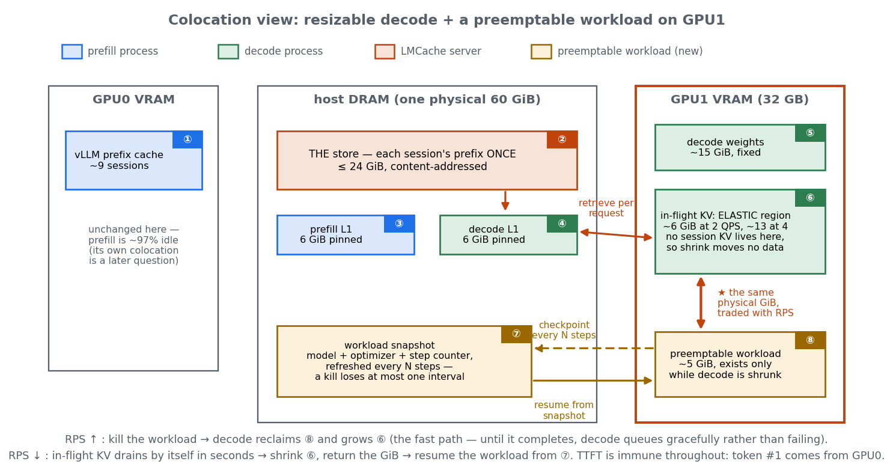
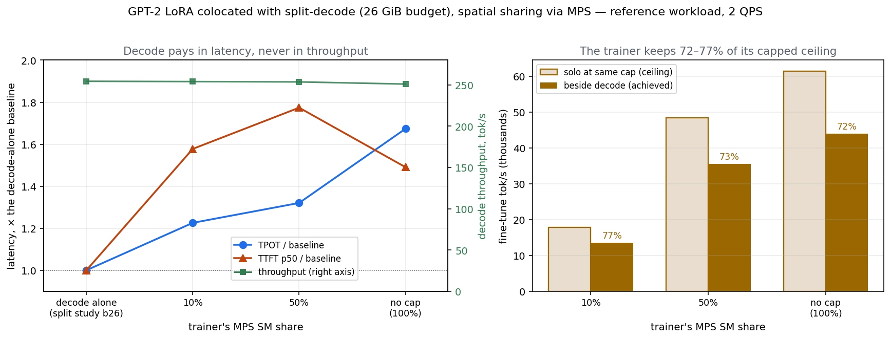
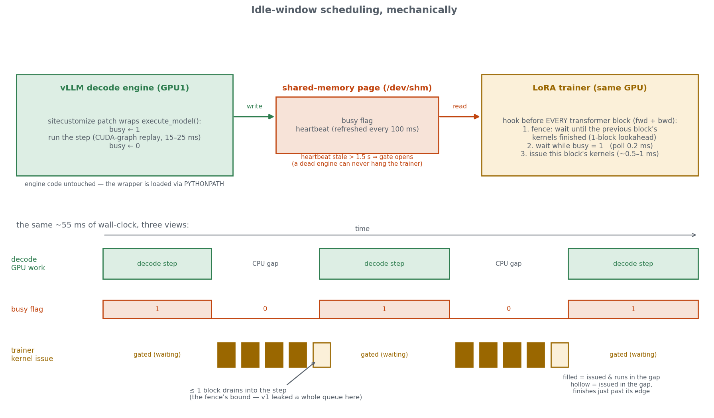
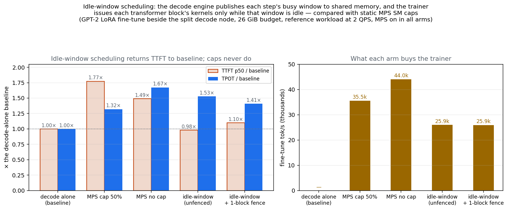
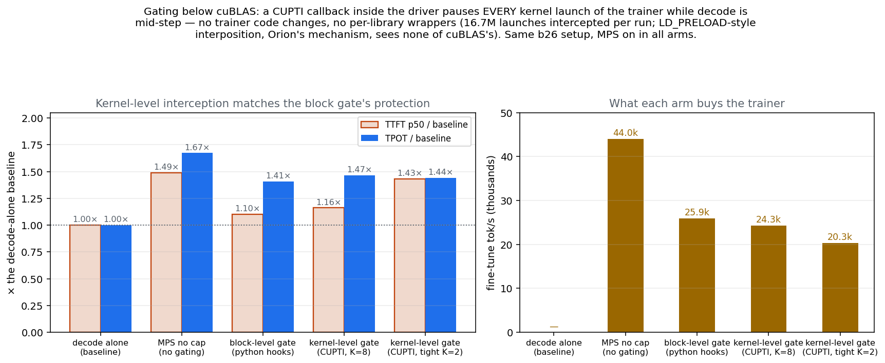

# Colocation on the decode GPU: lend the memory decode isn't using, take it back when RPS rises

Fifth study on this machine — **proposal stage: this report states the goal, the two
challenges, and the candidate mechanisms. No measurements yet**; every number quoted is
from the four completed studies, chiefly
[report_split_inference.md](report_split_inference.md).

## 1. The goal

The split study ended on two numbers: the decode GPU runs **SM occupancy under 5%** with
**DRAM active 45–62%** (memory-bound, compute nearly empty), and at 2 QPS it needs only
~22 GiB of its 30 GiB budget. The goal is to stop wasting the difference:

**Run a small workload colocated beside decode in the VRAM decode isn't using. When RPS
rises and decode needs the memory back, kill the workload and let decode reclaim its
VRAM. When RPS falls, shrink decode back down — its state can spill to DRAM — and resume
the workload.** The workload must therefore be *preemptable*: killable at any moment
without losing its progress, which means its state is snapshotted to DRAM as it runs.

How much memory is in play at each load level, from the measured sweep (budget ≈
16.2 GiB of weights + overhead, plus ~0.78 GiB of KV per in-flight request, with
in-flight ≈ RPS × ~4 s residence):

| RPS | in-flight KV | decode budget needed | lendable |
|---|---|---|---|
| 1 | ~3 GiB | ~20 GiB | ~11 GiB |
| 2 | ~6 GiB | ~22 GiB *(matches the measured knee: 22 held, 20 did not)* | ~9 GiB |
| 3 | ~9.5 GiB | ~26 GiB | ~5 GiB |
| 4 | ~12.5 GiB | ~29–30 GiB | ~0 |

Two measured properties of the split make the loop safer than it sounds:

- **Shrinking moves no data.** The decode node keeps no session KV — every prefix
  already lives in the LMCache DRAM store and is re-retrieved per request. Decode's VRAM
  holds only weights and in-flight KV, and the in-flight set drains by itself in seconds
  when load falls. "Offload to DRAM" is already the architecture; shrink is purely an
  allocator operation.
- **Under-provisioned decode queues, it does not fail.** The sweep showed TTFT flat down
  to 18 GiB, with backlog absorbed into the token-1→2 gap. If RPS spikes before the
  workload is killed, decode degrades gracefully for the seconds the controller needs to
  react — and TTFT is immune throughout, because token #1 comes from the prefill leg.

## 2. The view



The direct successor of the Act II memory-layout figure. GPU1 is now a memory map with
an **elastic region**: in-flight KV (⑥) grows and shrinks with RPS, and the preemptable
workload (⑧) exists exactly when ⑥ is small — the same physical GiB, traded back and
forth. The new resident in DRAM is the **workload snapshot (⑦)**: the workload's model,
optimizer state and step counter, refreshed every N steps while it runs, so that a kill
— which arrives with no warning, on the RPS-up path — loses at most one snapshot
interval of progress. Resume is the reverse copy: snapshot → VRAM over PCIe, ~1 s for a
few GiB. GPU0 is deliberately unchanged; its ~97% idle compute is a bigger prize but a
separate question.

## 3. The two challenges

### 3.1 vLLM cannot resize its VRAM budget at runtime

`gpu_memory_utilization` (and the exact-bytes `kv_cache_memory_bytes`) is consumed once
at engine init: vLLM profiles, **eagerly allocates the entire KV pool**, and sizes its
scheduler's admission control to that pool. There is no resize API in 0.15.1 — and the
eager allocation is why no thin trick fixes it: a layer that merely lies about free
memory (quota-shim style) makes the init-time allocation fail; a layer that lies about
totals leaves the scheduler admitting work the physical card cannot hold. Whatever
mechanism resizes decode must either *back* the illusion with real paging (§4.1) or
change the allocation honestly (§4.2).

### 3.2 What workload actually complements decode

Colocation only pays if the neighbor consumes what decode leaves idle and not what it
depends on. Decode's measured profile is specific: it starves for **VRAM bandwidth**
(DRAM active 45–62% — the binding resource) while leaving **~95% of SM occupancy**
unused, 30–50% of wall-clock fully idle, and — at low RPS — several GiB of VRAM. It is
also latency-sensitive in exactly one place: the per-gap ITL p95 sits near 12 ms, so a neighbor
that hogs the SMs in long kernels shows up directly in the token stream. The complement
must be compute-dense, bandwidth-light, small, and deadline-free — and no memory
mechanism helps with bandwidth, which is shared unconditionally. §5 argues this
workload already exists: DeltaServe-vLLM.

## 4. Candidate mechanisms for the resize

### 4.1 Trick vLLM: tell it the VRAM is all there, and let UVM make it true

UVM (CUDA Unified Memory) is the GPU's version of ordinary virtual memory with swap:
allocations made through it are pages the driver migrates between VRAM and host DRAM
automatically — a kernel touching a non-resident page triggers a hardware page fault
and the driver fetches it; when any process needs physical VRAM, the driver evicts the
least-recently-used managed pages to make room. So a process may allocate *more* than
the card has, it just can't have it all resident at once.

That is exactly the layer the trick needs. Route vLLM's allocations through UVM (a
small allocator shim under PyTorch — vLLM itself is untouched) and the fictional
30 GiB init succeeds; the driver then adjusts residency by itself. The fit is good
because decode's *hot* memory — weights and in-flight KV, touched every step — will
never be evicted, while the cold free blocks are evicted first: **the driver's LRU
policy and our lending policy coincide.** Shrink becomes automatic (the neighbor's
allocations create the pressure) and grow is lazy (kill the neighbor, pages fault back
in as blocks are reused).

**Limitations — what this can fail as:**

- **Scheduling problem.** The scheduler still believes 30 GiB, so if RPS
  spikes while the neighbor is resident, decode's hot set exceeds physical VRAM and
  every step page-faults — TPOT explodes. The graceful floor the sweep measured existed
  *because* admission matched reality; this trick severs that link, putting a hard
  deadline on killing the neighbor.
- **A permanent per-request tax while sharing.** Reused KV blocks fault back in over
  PCIe on every request's retrieval write — an estimated ~60–80 ms in the token-1→2
  gap, worse if the driver migrates page-by-page.
- **Host DRAM absorbs the evictions** on a box already running ~49 of 60 GiB — the
  repo's overcommit-freeze arithmetic in a new costume; `mem_guard.sh` must count it.
- **Failures are silent.** Residency can't be pinned or even directly observed, and
  anything the shim doesn't cover is quietly non-evictable — a perf cliff here has no
  log line, only a signature in the per-second GPU traces.

### 4.2 Explicit VMM resize: change the allocation honestly

vLLM 0.15.1 already contains the right allocator, used today only for sleep mode: with
`--enable-sleep-mode`, KV tensors are placed in a CUDA VMM pool (`cuMemMap` under fixed
virtual addresses, physical backing in 2 MiB granules). Fixed VA is the load-bearing
property: physical granules can be unmapped and remapped *piecewise* while every
pointer, and every captured CUDA graph, stays valid. What the patch looks like:

- **Launch** decode sized for the maximum (30 GiB), KV in the VMM pool.
- **Shrink**: pull the tail block-IDs out of the scheduler's free list (the block pool's
  `FreeKVCacheBlockQueue` already supports removing specific blocks), wait the few
  seconds for in-use tail blocks to drain — cheap precisely because decode holds blocks
  only for a request's lifetime — then `cuMemUnmap` the corresponding tail granules of
  each layer's KV tensor. The pages genuinely return to the OS for the neighbor to use.
  Alignment detail: at 128 KiB per block per layer, one 2 MiB granule spans 16 blocks,
  so the fence works on 16-block tail runs.
- **Grow**: remap the granules and reinsert the blocks — sub-second, since the neighbor
  has already exited and the physical pages are free.
- **Delivery** needs no fork: a sitecustomize-injected worker method (the same
  `PYTHONPATH` pattern as `split_simple/p2p_patch/`) invoked through the
  `/collective_rpc` endpoint (`VLLM_SERVER_DEV_MODE=1`).

Unlike §4.1 the scheduler is never lied to — admission always matches physical memory,
so a spike during shared operation *queues* (the measured, graceful behavior) instead of
thrashing. The price is the patch and an explicitly ordered controller: grow must be
sequenced kill-workload → confirm-freed → remap; resume only after the unmap is
confirmed — the same never-overcommit discipline as `mem_guard.sh`, extended to VRAM.

*(Baseline worth keeping: restart-based resize. Decode is stateless, so restarting it at
a new budget loses only in-flight token-2+ streams, and TTFT survives the whole ~30–60 s
restart because token #1 is prefill's. It is the do-nothing-clever control arm that both
mechanisms above must beat.)*

The experiment that decides between 4.1 and 4.2: the same 2 → 4 QPS step against both,
TPOT excursion vs. time. If UVM survives the spike better than predicted, it is the more
deployable answer (no patch); if it thrashes, that measurement is the justification for
the explicit layer.

## 5. The complementary workload: DeltaServe-vLLM

The complement §3.2 asks for — compute-dense, small, deadline-free, preemptable — does
not have to be found: it already exists as **DeltaServe-vLLM** (the co-serving system in
`~/Documents/Projects/DeltaServe-vLLM`, a vendored vLLM fork). DeltaServe interleaves a
**LoRA-SFT backward pass with ongoing inference inside the same vLLM engine**: it
injects fine-tuning samples into inference batches, captures their activations during
the forward, hands them to a decoupled backward subprocess (under MPS) that trains a
LoRA adapter, and an **SLO-aware admission scheduler decides at every engine step how
much fine-tuning work to admit** — a fitted step-time model predicts each mixed batch's
cost, and FT tokens are admitted only up to the inference latency slack.

This answers both halves of the colocation goal at once, and better than the
kill/resume loop of §1:

- **The workload is the ideal complement by construction.** FT samples are
  prefill-shaped compute — large GEMMs, exactly what the decode GPU's ~95%-idle compute
  units are starving for — and the fine-tuned model is the *served* model, so the
  neighbor's largest cost, its weights, is already resident and shared. No separate
  ~5 GiB tenant; the FT footprint shrinks to activation buffers and adapter state.
- **The "resize" happens inside the engine, in time instead of space.** What §1 does
  with a controller killing a process and a VRAM handoff, DeltaServe does per engine
  step: RPS rises → the SLO gate admits zero FT tokens and a three-tier preemption
  pipeline yields even mid-forward (pre-schedule poll, post-schedule rollback,
  per-layer abort hooks); RPS falls → FT work flows back into the idle steps. The
  transition granularity is milliseconds, not the seconds-to-minutes of §4's
  mechanisms, and there is no cross-process memory handoff to sequence at all.
- **The snapshot problem of the figure (⑦) largely dissolves.** FT state is a LoRA
  adapter plus a sample store with claim/commit bookkeeping — aborted work is released,
  not lost, and nothing bigger than adapter checkpoints needs to persist.

What remains genuinely open, and would be the study:

1. **Decode-node fit.** DeltaServe's default admission gate rides prefill-carrying
   steps; a split decode node runs decode-heavy batches, so the opt-in *unified-phase*
   mode (FT riding decode-only steps under the estimator's gate) is the relevant one —
   on this node it changes from an option to the whole mechanism, and its interference
   with the token stream (TPOT and the per-gap ITL p95, the sensitive metrics) is exactly what the reference
   workload would measure.
2. **The stacks must be reconciled.** DeltaServe-vLLM is a fork of a much newer vLLM
   (~0.21) than the split stack's pinned 0.15.1 + LMCache 0.4.4. Making DeltaServe *be*
   the decode node of the split means porting the LMCache pairing forward or the
   co-serving layer back — a real integration cost, and the first thing to scope.
3. **Bandwidth is still shared.** Co-serving removes the VRAM-capacity contest, not the
   DRAM-bandwidth one (decode's binding resource at 45–62%); whether the estimator's
   step-time model already prices that contention on a decode-heavy node is a
   measurable question.

§4's resize mechanisms don't become irrelevant — they become the fallback tier: if the
decode node must *also* shed KV capacity (RPS collapse, or a second tenant that isn't
DeltaServe-shaped), space-multiplexing is still the only lever. But the primary bet
should be the co-serving one: the complement, the scheduler, and the preemption are
already built, by us, on the same engine family and the same GPU.

## 6. First measurements: plain colocation, then spatial sharing

The study is no longer purely a proposal: challenge §3.2 has first numbers. The setup
is the reference workload through the split-LMCache stack (all code copied into
`scripts/coloc/` — same `workload.py`/`client.py` imported, so the request stream is
identical), with a LoRA trainer (`scripts/coloc/ft_train.py`, r=16 on attention,
deterministic synthetic batches, per-step trace) started on the decode GPU once the
engine has claimed its budget. DeltaServe (§5) is the endgame; these arms establish
what the naive mechanisms do first.

### 6.1 Time-slicing: the neighbor wins, decode dies

First arms, at a 25 GiB decode budget with Qwen2.5-0.5B (batch 2×512, 4.9 GiB
process footprint) as the trainer:

| arm | TTFT p50/p95 | TPOT | e2e p50 | decode tok/s | failed | FT progress |
|---|---|---|---|---|---|---|
| decode alone | 112 / 552 ms | 28.1 ms | 3.9 s | 254.3 | 0 | — |
| + FT, flat out | 189 / 875 ms | **1193 ms** | **152.8 s** | **56.3** | **102** | ~100% of solo |
| + FT, 25% duty cycle | 126 / 597 ms | 44.5 ms | 5.6 s | 250.2 | 0 | ~16% of solo |

Unthrottled, the default CUDA time-slicing serializes the two processes' work: decode's
per-gap ITL p50 locks to the FT step time (39 ≈ 40 ms), capacity falls below the 2 QPS
arrival rate, and the open loop queues without bound until 102 requests hit the 300 s
client timeout — while the trainer loses only 11%. The failure is pure compute
contention: zero preemptions, zero KV-transfer errors, per-gap ITL p95 still 40 ms; the
102 "failures" are requests that were still waiting, healthy, when the clock ran out.
A 25% duty cycle (sleep 3×dt after each step) rescues decode almost entirely — but pays
6× of the trainer's throughput for it, sleeping blind whether decode needs the gap or
not.

### 6.2 MPS spatial sharing: both sides fit

Second ladder, at a **26 GiB budget** (so the split study's own b26 row is the
decode-alone reference) with **GPT-2 124M** as the trainer — 1.5 GiB of torch
allocations (~2.4 GiB process footprint; the 50k vocab shrinks the dominant logits
tensor 3× vs Qwen's 152k) and 14 ms solo steps. The trainer runs **flat out** in every
arm; the knob is `CUDA_MPS_ACTIVE_THREAD_PERCENTAGE`, which caps the fraction of SMs
its kernels may occupy while MPS lets the two processes' kernels co-reside instead of
time-slice:

| arm | TTFT p50/p95 | per-gap ITL p50 | TPOT | e2e p50 | decode tok/s | failed | FT tok/s (vs capped solo ceiling) |
|---|---|---|---|---|---|---|---|
| decode alone (b26, split study) | 93 / 544 ms | 15.1 ms | 27.9 ms | 3.8 s | 254.4 | 0 | — |
| MPS, FT capped 10% | 146 / 537 ms | 17.4 ms | 34.2 ms (+23%) | 4.7 s | 254.0 | 0 | 13.6k (77% of 17.8k) |
| MPS, FT capped 50% | 164 / 628 ms | 19.0 ms | 36.8 ms (+32%) | 5.0 s | 253.7 | 0 | 35.5k (73% of 48.4k) |
| MPS, FT uncapped | 138 / 616 ms | 21.8 ms | 46.6 ms (+67%) | 6.1 s | 251.0 | 0 | 44.0k (72% of 61.4k) |



*Left: TTFT and TPOT relative to the decode-alone baseline (dotted line), with
throughput on the right axis — flat at the offered rate in every arm. The TTFT curve's
non-monotonic shape (1.6× → 1.8× → 1.5×) is the §6.2 "unattributed residue": an offset,
not a dose-response to the cap. Right: the trainer against its own capped solo
ceiling.*

What the ladder shows:

- **Spatial sharing changes the failure mode, not just the numbers.** The same
  flat-out trainer that collapsed decode under time-slicing leaves it above the
  waterline *uncapped*: per-gap ITL creeps 15 → 22 ms (co-residency contention for
  DRAM bandwidth and L2 — graceful, per-step) instead of locking to the neighbor's
  step time (serialization). Zero failed requests anywhere on the ladder.
- **The frontier is smooth and generous.** A 10% cap costs decode +23% TPOT and buys
  the trainer 13.6k tok/s — ~3× what the duty-cycle knob delivered at similar decode
  cost. Even uncapped costs only +67% TPOT at this load.
- **Interference is mutual and roughly share-proportional.** The trainer never reaches
  its capped solo ceiling (72–77% of it): decode's kernels contend back.
- **Throughput is the wrong victim metric — TPOT is the honest one.** Every arm holds
  ~254 tok/s because the open loop pins throughput at the offered rate while capacity
  exceeds it; the entire cost surfaces as latency (TPOT, e2e). The uncapped arm's real
  price is capacity headroom: it would hit its knee at a lower QPS. Pricing that
  requires a QPS sweep per arm, not this single point.
- **One unattributed residue:** TTFT p50 sits 45–70 ms above the reference in all MPS
  arms — beyond the ±15 ms noise band — without any backlog to blame. Candidates: MPS
  client overhead on the (untouched) prefill engine, or host-side contention. The
  decode-alone-under-MPS control that would split these was deliberately skipped;
  flagged as the first thing to run if TTFT matters at this granularity.

### 6.3 Idle-window scheduling: the trainer issues kernels only while the decode step window is idle

What is actually built: the decode engine **publishes a busy/idle signal** — a
shared-memory page whose busy flag is set for exactly the wall-clock window of each
engine step's GPU work — and the trainer **checks that flag before issuing each
transformer block's kernels** (forward and backward), pausing while decode is busy and
resuming the moment the window closes. Scheduling happens at kernel-issue time, with
no admission control, no static share, and no change to what either side computes.
The policy is Orion's (the best-effort job runs only when the latency-critical job
has nothing on the GPU), rebuilt for two processes that can't share a scheduler
(`scripts/coloc/orion_gate/`). A feasibility lesson paid for in code first: a
runtime-API `LD_PRELOAD` shim sees essentially none of a torch process's launches
(cuBLAS/Triton fetch driver-API entry points via `cuGetProcAddress`), and decode's
CUDA-graph replay makes launch *timestamps* meaningless anyway — one API call per
~20 ms step. So neither side intercepts kernels: the decode engine publishes its busy
window by wrapping `execute_model` (wall-clock synchronous ⇒ completion-aware for
free; a sitecustomize patch in the p2p_patch mold, `orion_gate/hp_patch/`) into a
`/dev/shm` page, and the trainer gates at transformer-block granularity (~0.5–1 ms of
kernels per gate point) with a heartbeat-staleness escape so a dead engine can never
hang it. v1.1 adds a one-block event fence after each gate: CUDA issue is
asynchronous, and without the fence a whole idle-gap's worth of enqueued blocks
drains *during* the next decode step — measured as 3.4 ms of TPOT for zero FT gain.



*Top: the three pieces — the engine-side wrapper (loaded via PYTHONPATH, engine code
untouched), the shared-memory page, and the trainer's per-block hook. Bottom: the
same stretch of wall-clock in three synchronized views — decode's GPU steps, the
busy flag tracking them, and the trainer issuing block kernels only in the gaps,
with the fence bounding what can drain into the next step to a single block.*

Same setup as §6.2 (b26, GPT-2 flat out, MPS on, uncapped):

| arm | TTFT p50/p95 | TPOT | e2e p50 | decode tok/s | failed | FT tok/s |
|---|---|---|---|---|---|---|
| decode alone (b26) | 93 / 544 ms | 27.9 ms | 3.8 s | 254.4 | 0 | — |
| gate v1 (unbounded issue) | 91 / 548 ms | 42.6 ms (+53%) | 5.6 s | 252.9 | 0 | 25.9k |
| **gate v1.1 (1-block fence)** | 102 / 557 ms | 39.2 ms (+41%) | 5.3 s | 253.3 | 0 | 25.9k |



*Left: decode's TTFT p50 and TPOT relative to the decode-alone baseline (dotted).
The static caps inflate TTFT ~1.5–1.8× no matter the cap; both idle-window arms
return it to ~1×, and the 1-block fence buys TPOT down from 1.53× to 1.41× at zero
trainer cost. Right: trainer progress under each arm.*

Against the static caps, the gate trades a knob for knowledge: at its ~26k tok/s of
FT progress an interpolated static cap (~30%) would cost decode roughly +30% TPOT —
ten points better than the gate's +41% — **but both gate arms return TTFT to the
decode-alone baseline**, where every static-cap arm pays the unattributed +45–70 ms of
§6.2. That localization is itself the diagnosis: the offset comes from FT kernels
overlapping decode-node work, and yielding during busy windows removes it. The
gate's residual TPOT cost has a named suspect too — the busy page covers
`execute_model` only, so the trainer floods exactly when the LMCache retrieval
copies (0.78 GiB per request, outside `execute_model`) land on GPU1, and that
contention prices itself into the token-1→2 gap. Wrapping the connector's retrieve
path into the busy signal is the identified next refinement.

The measured arc: time-slicing (catastrophic) → duty throttle (safe, wasteful) →
MPS caps (safe, ~3× more efficient, TTFT-taxed) → idle-window scheduling (TTFT clean,
TPOT mid-frontier, no tuning knob). The next rungs — a busy signal that covers the
retrieval path, and ultimately DeltaServe's in-engine SLO-gated admission (§5) —
have this frontier to beat.

### 6.4 Gating below cuBLAS: kernel-level interception via CUPTI callbacks

§6.3's gate has one structural limitation: it lives in the trainer's *Python* code
(hooks on transformer blocks), so it only works because the trainer is ours. To gate
an arbitrary best-effort process, the gate must intercept **every kernel launch** —
and that is exactly where Orion's mechanism breaks. Orion (and our reproduction of
it in `~/Documents/Projects/colocation/colocator`) interposes the CUDA *runtime* API
via `LD_PRELOAD`: `cudaLaunchKernel` and friends. But cuBLAS, cuDNN and Triton do
not call those symbols — they fetch *driver*-API entry points directly from the
driver through `cuGetProcAddress`, so their launches never cross anything an
`LD_PRELOAD` can interpose. Measured here before building anything: a runtime-API
shim under this GPT-2 trainer intercepted **~0** of its launches (the matmuls are
all cuBLAS). The colocator's workaround — hand-wrapping individual cuBLAS functions
(`cublasGemmEx`, …) — is a treadmill: every library, every version, every entry
point.

**The new mechanism.** Instead of interposing symbols *in front of* the driver, hook
the instrumentation interface *inside* it: **CUPTI**, the CUDA Profiling Tools
Interface that ships with every CUDA install (it is what Nsight uses). CUPTI's
callback API invokes a registered function **synchronously, on the launching
thread, at the entry of every driver-level API call** — no matter who made it or
how they obtained the entry point. Two properties make it a scheduler rather than
just a profiler:

1. **Coverage is total by construction.** aten kernels, cuBLAS's internal
   launches, CUDA-graph replays — all become `cuLaunch*`/`cuGraphLaunch` calls
   inside the driver, and every one fires the callback. Measured: **16.7 million
   launches intercepted** in one colocated run.
2. **Blocking the callback delays the launch.** The callback runs before the
   driver processes the call, on the caller's own thread — so sleeping there until
   the decode engine's busy flag clears is a per-kernel gate, with zero changes to
   the gated process. The trainer runs *unmodified* (no `--gate`, no hooks): one
   `.so` in `LD_PRELOAD` (`orion_gate/cupti_gate.c`, ~180 lines).

The rest of the design carries over from §6.3 unchanged: the decode engine's
`execute_model` wrapper publishes the busy window, the heartbeat-staleness escape
protects the trainer from a dead engine. The async-backlog problem returns in
per-kernel form and is solved with a **credit scheme**: every K-th launch records a
CUDA event on the trainer's stream, and if more than `maxpend` events are
unretired, the gate first waits for the oldest — bounding how much already-issued
work can drain into a decode step (defaults K=8, maxpend=3 ≈ a couple dozen
kernels; both are env knobs, `COLOC_K` / `COLOC_MAXPEND`).

**Validation before measurement:** solo, the attached gate intercepted 157k
launches over 60 steps at **zero overhead** (14 ms/step, identical to ungated);
against a synthetic 20 ms-busy/30 ms-idle square wave it stretched steps 14 → 34 ms
and released back to 14 ms the instant the publisher exited.

**Results** (same b26 setup as §6.2–6.3, trainer flat out, MPS on):

| arm | TTFT p50 | TPOT | decode tok/s | failed | FT tok/s |
|---|---|---|---|---|---|
| decode alone (b26) | 93 ms | 27.9 ms | 254.4 | 0 | — |
| block-level gate (§6.3, python hooks) | 102 ms | 39.2 ms (+41%) | 253.3 | 0 | 25.9k |
| **kernel-level gate (CUPTI, K=8)** | 108 ms | 40.9 ms (+46%) | 253.2 | 0 | 24.3k |
| kernel-level gate (CUPTI, tight K=2) | 133 ms | 40.2 ms (+44%) | 253.1 | 0 | 20.3k |



Three conclusions:

- **Kernel-level interception reproduces the block gate's protection without any
  cooperation from the gated process.** At default credits the two are within
  run-to-run noise of each other on every decode metric and within 6% on trainer
  throughput. The difference is generality: the python-hook gate needs the
  workload to be instrumentable; the CUPTI gate works on any CUDA process you can
  set an environment variable for.
- **Tightening the lookahead is not worth it** — K=2/maxpend=1 spent 4k tok/s of
  trainer progress to buy 0.7 ms of TPOT, and its TTFT drifted up (the busier
  gate polling is itself CPU load). The defaults are the right setting.
- **The ~1.4× TPOT floor is not the gate's placement.** Block-level and
  kernel-level gates, with very different overshoot bounds, land on the same
  TPOT — so the residual cost is not late-draining trainer kernels. This
  strengthens §6.3's suspect: the contention lives *outside* the published busy
  window, where the LMCache retrieval copies land on GPU1 exactly while the
  trainer floods the "idle" gaps. Extending the busy signal over the connector's
  retrieve path is the remaining lever, and it now benefits both gate variants
  equally.

One operational limit, stated for the record: CUPTI allows a single subscriber per
process, so the gate cannot coexist with a profiler attached to the trainer (it
detects the conflict and runs ungated, loudly).

## Reproducing

```bash
# figures (run from repo root)
.venv/bin/python scripts/plots/plot_colocation_view.py
.venv/bin/python scripts/plots/plot_coloc_arms.py
.venv/bin/python scripts/plots/plot_coloc_gate.py

# solo trainer calibration (per MPS cap; also runs without MPS)
CUDA_VISIBLE_DEVICES=1 .venv/bin/python scripts/coloc/ft_train.py \
    --model gpt2 --out output/coloc/ft_solo.csv --steps 60

# one colocated arm (MPS daemon first; stack + trainer + teardown are handled)
nvidia-cuda-mps-control -d   # with CUDA_MPS_PIPE_DIRECTORY/_LOG_DIRECTORY set
CUDA_MPS_PIPE_DIRECTORY=/tmp/mps-pipe .venv/bin/python scripts/coloc/coloc_sweep.py \
    --budgets 26 --warmup-qps 0.5 --forward-first-token --max-inflight 999 \
    --ft --ft-model gpt2 --ft-mps-pct 10 --name-suffix _g2mps10 --tag coloc_g2mps10

# the idle-window scheduling arm (§6.3): same, with the gate instead of a cap
CUDA_MPS_PIPE_DIRECTORY=/tmp/mps-pipe .venv/bin/python scripts/coloc/coloc_sweep.py \
    --budgets 26 --warmup-qps 0.5 --forward-first-token --max-inflight 999 \
    --ft --ft-model gpt2 --ft-gate --name-suffix _g2gate2 --tag coloc_g2gate2

# the kernel-level (CUPTI) gate arm (§6.4): build the .so once, then --ft-kgate
CUPTI=~/.triton/nvidia/cupti/cuda_cupti-linux-x86_64-12.8.90-archive
gcc -O2 -shared -fPIC -I$CUPTI/include -I/usr/local/cuda/include \
    scripts/coloc/orion_gate/cupti_gate.c -o scripts/coloc/orion_gate/cupti_gate.so \
    -L$CUPTI/lib -lcupti -ldl -lpthread -Wl,-rpath,$CUPTI/lib
CUDA_MPS_PIPE_DIRECTORY=/tmp/mps-pipe .venv/bin/python scripts/coloc/coloc_sweep.py \
    --budgets 26 --warmup-qps 0.5 --forward-first-token --max-inflight 999 \
    --ft --ft-model gpt2 --ft-kgate --name-suffix _g2kgate --tag coloc_g2kgate
```

Data: `output/summary_coloc_*.csv`, raw per-request records in
`output/raw/coloc_lmcache_zipf_b*.json` (with per-arm FT step traces in
`output/coloc/`), per-second GPU telemetry in `output/gpumon/`, engine logs in
`output/logs/`. `scripts/coloc/` is self-contained: the lmcache stack scripts are
local copies of `scripts/inference/split_lmcache/` + `split_simple/`, and the driver
is an adapted `disagg_sweep.py` that additionally manages the trainer's lifecycle.
