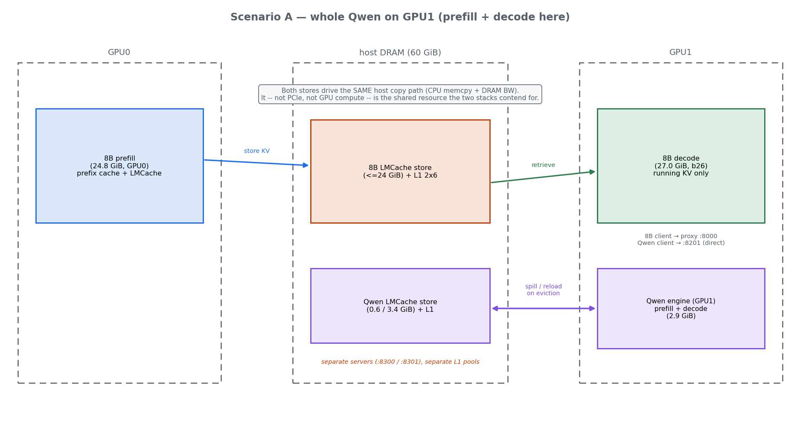
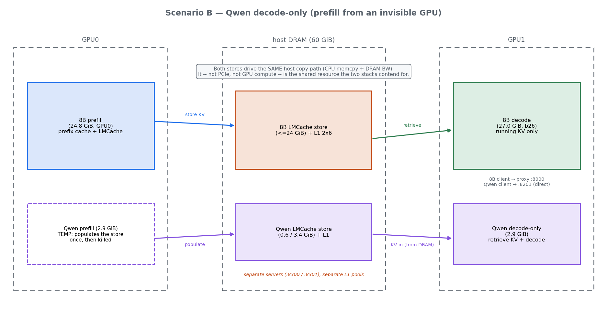
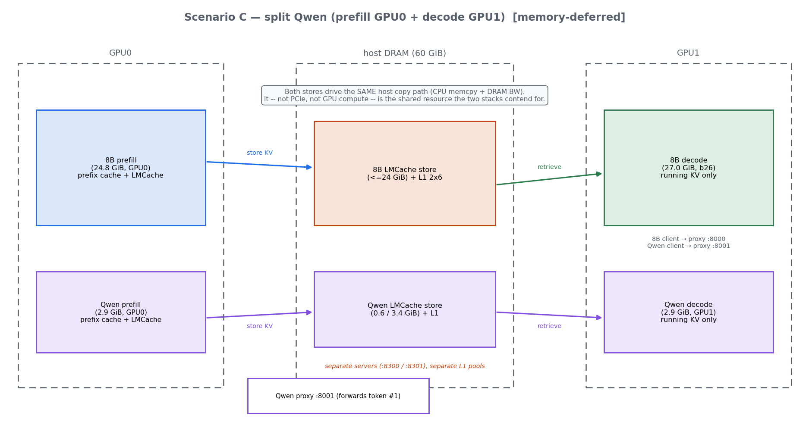
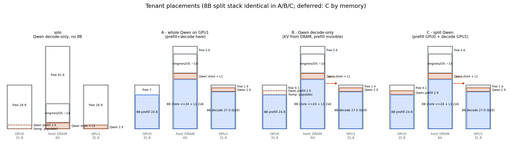
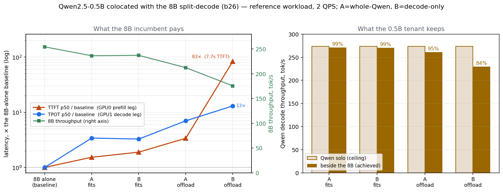
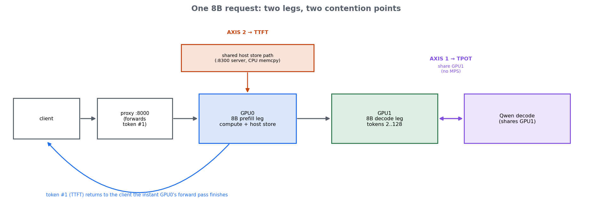
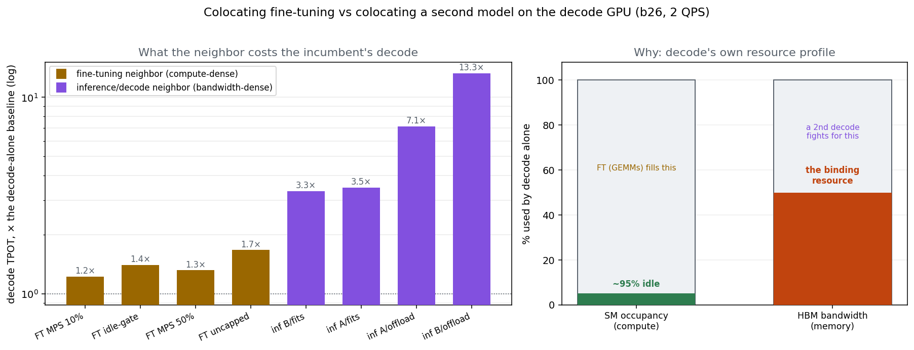

# A second tenant in the margins: colocating a 0.5B model with the 8B decode GPU

Sixth study. The [split-inference study](report_split_inference.md) left GPU1 with
≥1.9 GiB free beside the 8B decode at the 26 GiB budget (`split_lmcache_zipf_b26_fwd_ng`:
TTFT p50 92.67 ms, 254.41 tok/s). The [inf+ft study](report_colocation_ft.md) filled
that margin with a fine-tune neighbor. This study fills it with **a second inference
model** — a Qwen2.5‑0.5B tenant — and asks what the incumbent pays and what the tenant
gets, across three ways of placing the tenant's prefill.

## 1. The goal

The 8B split stack is the fixed incumbent; every scenario keeps its configuration
bit‑identical (same budget, router, workload, seeds), and the driver asserts the
engine‑reported 8B KV grants match the baseline (9.77 GiB decode, 6.66 GiB prefill) on
every launch — so any movement in the 8B's numbers is the tenant's doing, not drift.

Two questions:
1. **Incumbent cost** — how far does the 8B's TTFT/throughput move when the tenant
   shares GPU1?
2. **Tenant service** — what does the 0.5B get, versus running alone (solo) and across
   prefill placements?

## 2. The view

The successor to the split study's Act II layout, now with a second tenant. The 8B split
is unchanged in every scenario — prefill on GPU0 writes each session's KV to its own
LMCache DRAM store (:8300); decode on GPU1 retrieves it and runs. The Qwen tenant is
dropped into the **margin GPU1 leaves free** (≥1.9 GiB beside the 27 GiB decode), with
its **own** store (:8301) so the two models share no cache state. The single most
important object in each panel is the callout in the middle: the two stores are separate
*processes*, but they drive the **same host copy engine** (CPU memcpy + host DRAM
bandwidth), and that shared path — not PCIe, not GPU compute — is where the incumbent and
the tenant actually collide (§7). What changes between scenarios is only *where the
tenant's prefill runs and how its KV reaches GPU1*:

**A — whole Qwen on GPU1.** One Qwen engine does prefill *and* decode on GPU1; on
oversubscription it spills to / reloads from its own store. GPU0 carries only the 8B.



**B — Qwen decode-only ("prefill from an invisible GPU").** The dashed GPU0 box is a
*temporary* Qwen prefill that populates the store once and is then killed; during
measurement the GPU1 engine only retrieves KV from DRAM and decodes — it never prefills.



**C — split Qwen (memory-deferred).** A second full split beside the 8B's: Qwen prefill
on GPU0, decode on GPU1, its own forwarding proxy (:8001). Two complete stacks — the
configuration that trips the pinned-memory guard (§7).



## 3. The four placements



| | 8B stack | Qwen prefill | Qwen decode | Qwen KV source | client → |
|---|---|---|---|---|---|
| **solo** | absent | temp GPU0 (populate, killed) | GPU1 | DRAM store (:8301) | :8201 |
| **A** | present | **GPU1 (live)** | GPU1 | own VRAM prefix cache + DRAM spill | :8201 |
| **B** | present | temp GPU0 (populate, killed) | GPU1 | DRAM store (:8301) | :8201 |
| **C** | present | GPU0 (live) | GPU1 | forwarded + DRAM store | :8001 (proxy) |

- **solo** — tenant alone on GPU1, decode‑only. The baseline for B.
- **A — whole Qwen on GPU1.** One engine does prefill *and* decode on GPU1, with a DRAM
  offload tier so oversubscription spills to DRAM instead of recomputing. The tenant's
  prefill compute lands on the shared GPU.
- **B — Qwen decode‑only, "simulated prefill."** The tenant's prefixes are computed once
  by a *temporary* GPU0 engine that writes their KV to the DRAM store and is then killed
  ("prefill from an invisible GPU"). During measurement the GPU1 engine only *retrieves*
  KV from DRAM and decodes — it never prefills. This is the disaggregated‑decode case.
- **C — split Qwen.** A second full split (prefill GPU0 + decode GPU1 + own proxy) beside
  the 8B's. Two complete stacks. **Deferred on this box** — it doubles the host‑DRAM
  infrastructure and trips the pinned‑memory guard (§7).

**Measured: solo + A + B** (both workloads). C is defined here for completeness but is
memory‑infeasible on this box (§7) — it needs a second full split beside the 8B's.

### Why B's TTFT is reported as N/A

In B (and solo) there is **no prefill compute in the measured window** — the prefix KV
already exists in DRAM, put there by the invisible‑GPU populate step. A request sends a
whole preloaded prefix (no unique suffix), which is a 100% prefix‑cache hit, so the
engine skips prefill entirely and only decodes. There is therefore no
prompt→first‑token transition to time; a "TTFT" would be nothing but queue + KV copy.
The tenant's metric in B is **decode throughput / TPOT**, and its TTFT column is N/A.

## 4. The workloads

Both models share the reference session template; only counts and (for the decode‑only
tenant) the request shape differ.

| | 8B (incumbent) | Qwen W‑fits | Qwen W‑offload |
|---|---|---|---|
| distinct prefixes / sessions | 32 | 8 | 48 |
| prefix (fixed) | 6,144 tok | 6,144 tok | 6,144 tok |
| unique suffix | 128 | **0 (decode‑only)** | **0 (decode‑only)** |
| output (forced) | 128 | 128 | 128 |
| requests | 300 | 300 | 300 |
| arrival | 2 QPS open‑loop, Poisson | 2 QPS | 2 QPS |
| KV / token | 128 KiB | 12 KiB | 12 KiB |
| working set | 24.0 GiB | 0.56 GiB | 3.38 GiB |
| vs ~1.04 GiB VRAM KV grant | — | resident | 3.2× over → DRAM spill |

For the decode‑only tenant (solo, B) each request reuses one of the N distinct prefixes
verbatim (uniform pick, no suffix), so after a one‑time warm the prefix is resident and
every request is a pure decode. **W‑fits** (8 prefixes, 0.56 GiB) fits the VRAM grant
entirely → zero DRAM traffic during measurement. **W‑offload** (48 prefixes, 3.38 GiB)
overflows the grant → the engine keeps evicting and reloading prefixes from the DRAM
store, which is the transfer load C's/B's mechanism is meant to expose. The 8B uses seed
0 (the reference stream); Qwen uses seed 1000 so their arrivals are uncorrelated. Both
clients run concurrently over aligned windows.

## 5. Run structure

Every run: one GPU monitor (DCGM, both GPUs) → launch → assert 8B KV grants →
[decode‑only: populate + kill temp prefill] → 8B warmup (0.5 QPS) → Qwen warmup (resident
the prefixes) → scrape before‑counters (per‑engine /metrics, log markers, /proc/vmstat
swap) → **measure both clients concurrently** (8B in‑process on the exact baseline path;
Qwen as a separate process so it cannot contend for the GIL) under a combined stall
watchdog → after‑scrapes → per‑GPU telemetry over the overlap window → raw JSON + summary
row → teardown.

**Populate (B, solo):** POST each distinct prefix once to the temporary GPU0 engine
(6,144 tok = 24 full 256‑tok chunks, `save_unfull_chunk:false`), verify via its
`prompt_tokens_total` and a retrieval probe against the decode engine (must return fast),
then a PGID‑targeted kill of only that engine (heartbeat is pidfile‑gated so it does not
false‑trip). A failed verify aborts the run rather than measuring a lie.

**Isolation guarantees:** the two models get **separate LMCache servers** (8B :8300,
Qwen :8301 — content‑hash keys would otherwise collide) and separate L1 pools;
`PYTHONHASHSEED=0` everywhere; a single GPU monitor (never two DCGM openers); the 8B's
launch flags are copied byte‑for‑byte from the split study.

## 6. Results

Baseline (8B alone, b26): TTFT p50 **92 ms**, TPOT p50 **28 ms**, **254 tok/s** —
reproduced on the current box by a fresh 8B‑alone control (92.4 ms / 254.4 tok/s), so
nothing below is box drift. Qwen solo (decode‑only, alone on GPU1): **274 tok/s** at both
W‑fits and W‑offload — the tenant's own throughput is unharmed by 3.2× oversubscription
because its DRAM reloads overlap with decode.



*Left: the incumbent pays on both axes — TTFT p50 (orange, the GPU0 prefill leg) and TPOT
p50 (blue, the GPU1 decode leg) as ratios to the 8B‑alone baseline (log), with absolute
8B throughput falling on the right axis. Right: the 0.5B tenant keeps 84–99% of its solo
decode throughput.* The measured points, per cell (8B TTFT / 8B TPOT / 8B tok/s ·
Qwen tok/s · Qwen KV streamed from DRAM):

- **A/fits** (whole Qwen) — 141 ms / 97 ms / 236 · 271 (99%) · 0.00 GiB
- **B/fits** (decode‑only) — 175 ms / 93 ms / 237 · 271 (99%) · 0.05 GiB
- **A/offload** — 312 ms / 199 ms / 212 · 261 (95%) · 8.26 GiB
- **B/offload** — 7.7 s / 370 ms / 175 · 230 (84%) · 14.6 GiB

TPOT (time‑per‑output‑token) is each request's mean inter‑token gap *including* the waits
when it is time‑shared out — the honest decode latency. The raw single‑gap ITL median
barely moves (~17 ms) because most gaps stay short; it is the per‑request average that
triples (fits) to ×13 (offload) as the incumbent's decode waits behind the tenant's.

## 7. Where the bottleneck is — two independent axes

The tenant hits the incumbent on **two separate resources**, and which one dominates
depends on whether the tenant's KV is resident or streaming. Keeping them separate is the
key to reading the results (and corrects an earlier draft that wrongly blamed GPU1 for the
8B's TTFT).



*Top: one 8B request has two legs. Token #1 (TTFT) is emitted by the prefill leg on GPU0
the instant its forward pass finishes and is forwarded by the proxy — so TTFT is a GPU0
quantity, and the only way the tenant touches it is through the shared host store path
(axis 2). Tokens 2–128 come from the decode leg on GPU1, which time‑shares the GPU with
the Qwen decode (axis 1). Bottom: without MPS the two processes' decode kernels serialize,
so the 8B's per‑token gap stretches from ~28 ms to ~93 ms — that is TPOT, and it never
touches TTFT.*

**Axis 1 — the decode leg (GPU1): TPOT + throughput.** With `--forward-first-token`,
token #1 comes from the prefill GPU; GPU1 only produces token #2 onward. So GPU1 sharing
shows up in the 8B's **TPOT and throughput, not its TTFT**. Wherever the Qwen decode is
active (A/fits, B/fits, A/offload) the 8B TPOT rises from **28 ms to ~93–97 ms** (3.3×)
and throughput drops ~6–16%; in B/offload TPOT reaches **370 ms** (13×). The tell: GPU1's
*mean* utilization *falls* when the tenant is added (sm 0.52→0.48, dram 0.46→0.39) — the
8B decode is **stalling/waiting**, not the GPU saturating. Two decode processes on one GPU
without spatial partitioning (MPS) time‑share execution slots, so the incumbent's decode
periodically waits behind the tenant's. This is the **fundamental, unavoidable** cost of
decode‑with‑decode colocation, and it is why TPOT (which counts the waits) moves sharply
while the raw single‑gap ITL median does not.

**Axis 2 — the prefill leg (GPU0) via the host store path: TTFT.** The 8B TTFT is the
prefill leg alone (verified: the proxy sends token #1 the instant GPU0 finishes its
forward pass). It moves with the tenant's **DRAM streaming volume** (0→0.05→8.3→14.6 GiB
gives 92→175→312→7700 ms), because the prefill leg's host‑side store step (retrieve on a
prefix‑cache miss, store the computed KV back) contends on the shared host copy machinery.
Two clarifications settle the *fits* case (~+60–80 ms with ~zero streaming):
- **Not GPU0 compute.** The 8B‑alone control reproduces 92 ms with the identical model, so
  the prefill compute is untouched — the extra time is entirely the host‑side store step.
- **Not host‑DRAM bandwidth.** The 8B decode already streams ~225 GB from the store in the
  baseline at 92 ms; W‑fits adds ~0 host traffic (Qwen KV is VRAM‑resident). No new
  bandwidth wall is introduced. By elimination the residual +60–80 ms is a **host‑side
  effect** of the tenant's extra processes on the GIL‑bound Python‑fallback LMCache path
  (server + proxy) — CPU/scheduling contention (the box was seen bursting to 99% user CPU
  during the run), a *measurement‑stack artifact* rather than a fundamental GPU or memory
  limit. The identified fix — `taskset`‑isolating the store server and proxy onto reserved
  cores — is not yet run; it is the one open confirmation.

In the offload cells the same host path is genuinely saturated: the tenant streams
8–15 GiB, halving the 8B prefill leg's effective throughput and queueing its TTFT into
seconds (B/offload worst, streaming the most). That is a real capacity limit of the
Python‑fallback copy path, not an artifact.

**Earlier faulty B (for the record).** A first version ran the decode engine with prefix
caching *off*, re‑fetching the full 72 MiB prefix every request even in fits (21 GiB of
needless copies) and collapsing the 8B. The fix — prefix caching on + whole‑prefix reuse —
keeps the fits set VRAM‑resident (axis‑2 traffic ~0) and lets only the offload overflow
stream. Nothing is ever recomputed (counters: 300 of 1.84 M Qwen prompt tokens computed;
the rest cached), and it is not a PCIe limit (independent x8 links; ~5 GB/s copies under a
~16 GB/s link).

**Telemetry attribution caveat.** DCGM is per‑GPU, not per‑process: on GPU1 the SM‑active,
occupancy, and DRAM‑active counters blend the 8B decode and the Qwen tenant. Every
per‑model claim rests on client‑side latencies and per‑engine /metrics deltas; the
per‑GPU numbers bound the *combined* load. Swap counters (pswpin/pswpout) are recorded
per run to rule host‑DRAM thrash in or out before attributing an 8B slowdown to GPU
contention.

**Why C is deferred.** C stands up a *second* full split — another prefill engine, another
store, more pinned L1s — pushing the host into the kernel's reclaim zone; in the first
pass its offload cell drove available RAM below the 4 GiB mem‑guard floor and the guard
killed the engines (as designed — pinned overcommit has frozen this box before). The
pinned total that governs the freeze (8B 2×6 + Qwen 2×1 = 13 GiB) is safe; it is the
swappable store growth that is not, so C is left for hardware with more host RAM.

## 8. Colocating inference vs colocating fine-tuning

This is the sixth study; the [fifth](report_colocation_ft.md) put a **fine-tune** neighbor
in the same GPU1 margin, at the same b26 budget, against the same reference workload. Side
by side, the two studies answer one question: *what kind of neighbor can the decode GPU
actually afford?*



*Left: what each neighbor costs the incumbent's decode, as TPOT × the decode-alone
baseline (log). The fine-tuning arms sit at 1.2–1.7×; the second-inference arms at
3.3–13×. Right: why — decode leaves ~95% of its SM occupancy idle but runs at ~50% HBM
bandwidth, which is its binding resource.*

The gap is not about model size — the Qwen tenant (0.5 B) is far smaller than nothing the
FT arms ran — it is about **which resource the neighbor consumes**:

- **The decode GPU's idle resource is compute, not bandwidth.** The split study measured
  decode at **SM occupancy under 5%** while **DRAM-active sits at 45–62%** — memory-bound,
  compute nearly empty. The spare capacity a neighbor can take for free is SM cycles; the
  scarce one it must not touch is memory bandwidth.
- **A fine-tune neighbor is compute-dense — it fills the idle resource.** LoRA-SFT is
  prefill-shaped GEMMs that live on the idle SMs, and (in DeltaServe's design) it even
  shares the served model's weights. Under MPS spatial sharing it costs the incumbent only
  **+23% TPOT** at a 10% SM cap (34.2 vs 27.9 ms) and just **+67%** uncapped, with **zero**
  failed requests and the trainer keeping 72–77% of its solo throughput. An idle-window
  gate returns even TTFT to baseline.
- **A second inference tenant is bandwidth-dense — it fights for the binding resource.**
  Qwen's decode, however small, reads KV from HBM every step, exactly what the 8B decode is
  already bottlenecked on, and (without MPS) their kernels serialize. The cheapest inference
  cell (B/fits) already costs **+232% TPOT** (28 → 93 ms) — 3× worse than the *uncapped*
  fine-tune arm — and the offload cells reach ×7–13 or collapse the prefill leg's TTFT
  through the shared host path.

The lesson generalizes the fifth study's §3.2 thesis: colocation on a decode GPU pays only
when the neighbor consumes what decode leaves idle (SM cycles) and avoids what it depends
on (memory bandwidth). Fine-tuning is close to the ideal complement; a second latency-
sensitive decode is close to the worst case — it wants precisely the resource decode is
starved for, and brings a second latency SLO of its own. If a second *model* must be
colocated, the tenant that behaves like the fine-tune neighbor — compute-dense, bandwidth-
light, deadline-free — is the one to pick; a decode-heavy tenant belongs on its own GPU.

## Reproducing

```bash
# this study: solo baseline + A (whole Qwen) + B (decode-only from DRAM), both workloads
.venv/bin/python scripts/inf_inf_coloc/coloc2_sweep.py --scenarios solo A B --wls fits offload
# 8B-alone control (current-box baseline, via the split harness)
.venv/bin/python scripts/inference/split_simple/disagg_sweep.py --stack lmcache \
    --skew zipf --budgets 26 --warmup-qps 0.5 --forward-first-token --max-inflight 999 \
    --name-suffix _ctrl --tag split_ctrl

# figures (run from the repo root; view them before believing them)
.venv/bin/python scripts/plots/plot_inf_coloc_view.py         # §2 system view
.venv/bin/python scripts/plots/plot_inf_coloc_layout.py       # §3 memory placement
.venv/bin/python scripts/plots/plot_inf_coloc_mechanism.py    # §7 two-axis mechanism
.venv/bin/python scripts/plots/plot_inf_inf_coloc.py          # §6 results
.venv/bin/python scripts/plots/plot_inf_vs_ft.py              # §8 inf-vs-ft comparison
```

Data: `output/summary_inf_coloc*.csv` (main solo+B, plus `_A`, and the `_iso`/`_cpu`/`_legs`
diagnostic re-runs), raw per-request records in `output/raw/infc_*.json`, per-second GPU
telemetry in `output/gpumon/`, engine logs in `output/logs/`. The 8B-alone control is
`output/raw/split_lmcache_zipf_b26_ctrl.json`. `scripts/inf_inf_coloc/` is self-contained:
`workload.py`/`client.py`/`lmc_proxy.py`/`lmc_server_main.py` are copies, and `coloc2_*.sh`
launch/stop/heartbeat drive both stacks with a single teardown.
