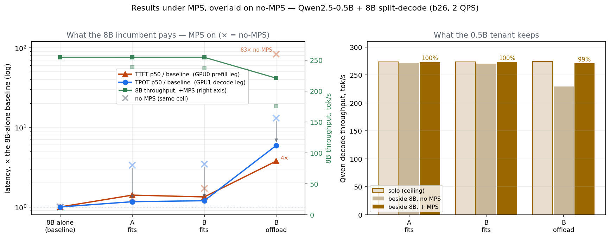
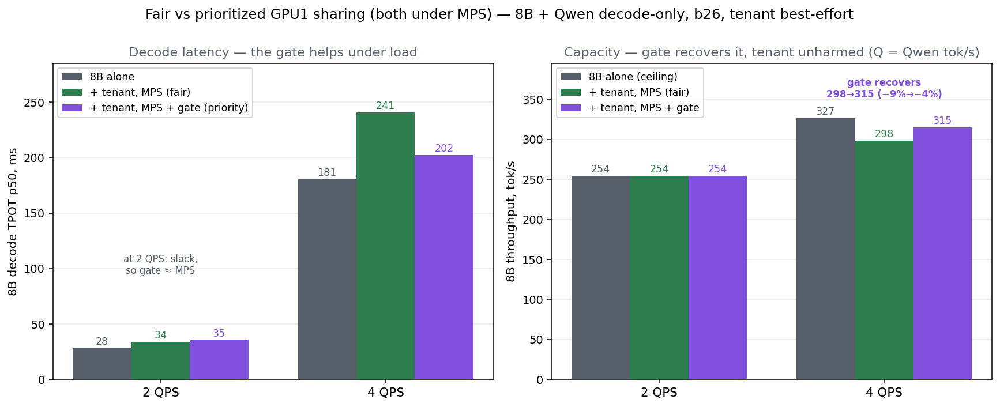

# A second tenant in the margins: colocating a 0.5B model with the 8B decode GPU

Sixth study. The [split-inference study](report_split_inference.md) left GPU1 with
≥1.9 GiB free beside the 8B decode at the 26 GiB budget (`split_lmcache_zipf_b26_fwd_ng`:
TTFT p50 92 ms, TPOT p50 28 ms, 254 tok/s). The [inf+ft study](report_colocation_ft.md)
filled that margin with a fine-tune neighbor. **This study fills it with a second
inference model** — a Qwen2.5-0.5B tenant — and asks a single question: *what does the 8B
incumbent pay, and what does the tenant get, for sharing the decode GPU?*

The short answer, established over §2–§5:

> At the reference 2 QPS a right-sized tenant looks almost free (−7% throughput). That
> number lies. The honest cost is **capacity**: without MPS the tenant steals ~25% of the
> 8B's serving ceiling, because two decode processes **time-slice GPU1** instead of
> sharing it. **MPS fixes that** — it lets the two decodes co-reside, dropping the cost to
> ~8% and making a resident second model about as cheap as a fine-tune neighbor. The one
> hazard unique to an inference tenant is letting its KV **oversubscribe the VRAM margin
> and stream from DRAM** (offload), which collapses TTFT and MPS only partly rescues.

---

## 1. The setup

### 1.1 The incumbent and the margin

The 8B split stack is the **fixed incumbent**. Every scenario keeps its configuration
bit-identical — same budget, router, workload, seeds — and the driver asserts the
engine-reported 8B KV grants match the baseline (9.77 GiB decode, 6.66 GiB prefill) on
every launch. So any movement in the 8B's numbers is the tenant's doing, not drift.

The 8B runs **disaggregated**: prefill on GPU0 writes each session's KV to a host-DRAM
LMCache store (:8300); decode on GPU1 retrieves it and generates. With the router's
`--forward-first-token`, token #1 is emitted by GPU0 the instant its forward pass
finishes — so **the 8B's TTFT is a GPU0 quantity and its TPOT is a GPU1 quantity.** Hold
onto that split; it is the spine of every result below.

The Qwen tenant drops into the **margin GPU1 leaves free** (≥1.9 GiB beside the 27 GiB
decode), with its **own** store (:8301) so the two models share no cache state.

The single most important fact about this layout — and the point of every system view in
§1.2 — is that the two stores are separate processes, but they drive the **same host copy
path** (CPU memcpy + host DRAM bandwidth). That path, not PCIe and not GPU compute, is
where the incumbent and tenant collide on the prefill (TTFT) leg.

### 1.2 The three placements of the tenant

What changes between scenarios is only **where the tenant's prefill runs and how its KV
reaches GPU1.** This is the legend to keep; it recurs at every figure.

| | 8B stack | Qwen prefill | Qwen decode | Qwen KV source |
|---|---|---|---|---|
| **solo** | absent | temp GPU0 (populate, killed) | GPU1 | DRAM store (:8301) |
| **A** | present | **GPU1 (live)** | GPU1 | own VRAM prefix cache + DRAM spill |
| **B** | present | temp GPU0 (populate, killed) | GPU1 | DRAM store (:8301) |
| **C** | present | GPU0 (live) | GPU1 | forwarded + DRAM store |

- **solo** — tenant alone on GPU1, decode-only. The baseline for B.
- **A — whole Qwen on GPU1.** One engine does prefill *and* decode on GPU1; on
  oversubscription it spills to / reloads from its own store. GPU0 carries only the 8B.
- **B — Qwen decode-only ("prefill from an invisible GPU").** The tenant's prefixes are
  computed once by a *temporary* GPU0 engine that writes their KV to the DRAM store and is
  then killed. During measurement the GPU1 engine only *retrieves* KV from DRAM and
  decodes — it never prefills. This is the disaggregated-decode case.
- **C — split Qwen.** A second full split (prefill GPU0 + decode GPU1 + own proxy) beside
  the 8B's. **Deferred** — it doubles the host-DRAM infrastructure and trips the
  pinned-memory guard (§3.3, *Why C is deferred*).

The system view of each scenario — the data flows, not just the memory:


*Physical columns GPU0 | host DRAM | GPU1. The 8B split (blue prefill → orange store →
green decode) is identical in all three panels; only the purple Qwen tenant moves. The grey
callout is the point of every panel: both stores drive the **same host copy path**. In **A**
the whole Qwen lives on GPU1 and spills to/reloads from its own store; in **B** a temporary
GPU0 prefill populates the store once and is killed, then GPU1 only retrieves KV and
decodes; in **C** Qwen runs its own full split (deferred by host memory).*

And the memory placement, boxes scaled to GiB:


*Memory placement of each scenario, boxes scaled to GiB. The 8B split (blue) is identical
in A/B/C; the Qwen tenant (red) is the only thing that moves. Dashed = transient (the
populate-then-kill prefill) or deferred (C).*

**Measured: solo + A + B, each at both workloads.** C is defined for completeness but is
memory-infeasible on this box.

### 1.3 The two tenant workloads

Both models share the reference session template (6,144-token fixed prefixes, 128 forced
output, 2 QPS open-loop, seeded). The tenant is run at two sizes — **the only difference
between them is working-set size, and that is the whole point.**

| | 8B (incumbent) | Qwen **W-fits** | Qwen **W-offload** |
|---|---|---|---|
| distinct prefixes / sessions | 32 | 8 | 48 |
| unique suffix (prefill work) | 128 tok | **0 (decode-only)** | **0 (decode-only)** |
| working set = **full KV** | 24.0 GiB | 0.56 GiB | 3.38 GiB |
| **GPU VRAM KV budget** | 9.77 GiB (b26) | ~1.04 GiB (util 0.08) | ~1.04 GiB (util 0.08) |
| working set vs that budget | 2.5× over → DRAM store | **fits → resident** | **3.2× over → DRAM spill** |
| KV streamed from DRAM (measured, B) | — | **~0.05 GiB** | **14.6 GiB** |

Both Qwen workloads get the **same ~1.04 GiB VRAM KV budget** — util 0.08 is all the margin
b26 leaves beside the 8B decode. The *working set* is the **full** KV, which lives in the
host-DRAM store, not on the GPU (even the 8B's 24 GiB sits in DRAM and streams into its
9.77 GiB GPU cache on demand). So:

- **W-fits** (0.56 GiB) fits inside the 1.04 GiB VRAM budget → stays GPU-resident, **~zero
  DRAM traffic** during measurement. This isolates the *compute/scheduling* cost of a
  neighbor.
- **W-offload** (3.38 GiB) is 3.2× the budget → the overflow lives in DRAM and the engine
  evicts/reloads prefixes over the host path **every request** (14.6 GiB streamed). This
  isolates the *memory-streaming* cost.

**Why B has no TTFT.** In B (and solo) the prefix KV already exists in DRAM, so a request
is a 100% prefix-cache hit — the engine skips prefill and only decodes. There is no
prompt→first-token transition to time, so the tenant's metric in B is decode
throughput/TPOT and its own TTFT is N/A. (The *8B's* TTFT is always measured; it is the
8B's prefill leg, unaffected by this.)

### 1.4 How a run executes

One GPU monitor (DCGM, both GPUs) → launch both stacks (8B flags copied byte-for-byte from
the split study) → assert 8B KV grants → [decode-only: populate the store from a temp GPU0
engine, verify, then kill it] → warm up → **measure both clients concurrently** over an
aligned window (8B in-process on the exact baseline path; Qwen as a separate process so it
can't contend for the GIL) → per-engine /metrics deltas + per-GPU telemetry + swap
counters → raw JSON. Experiments run **strictly serially** (one stack pair at a time) so
pinned host memory never overcommits — the failure mode that has hard-frozen this box.

---

## 2. Results — what it costs at 2 QPS, what the tenant keeps

Reference points: **8B alone** (b26) TTFT 92 ms / TPOT 28 ms / **254 tok/s** — reproduced
on the current box by a fresh control (92.4 ms / 254.4 tok/s), so nothing below is drift.
**Qwen solo** (alone on GPU1): **274 tok/s**, the same at W-fits and W-offload.


*Left: the 8B incumbent's cost — TTFT (orange) and TPOT (blue) as ratios to its alone
baseline (log), absolute throughput in green on the right axis. Right: the Qwen tenant's
achieved throughput vs its solo ceiling. Cells are scenario × workload; fits TTFT/TPOT are
means of n=4 with min–max bars. Legend: **A** = whole Qwen on GPU1, **B** = decode-only.*

| scenario × workload | 8B TTFT p50 | 8B TPOT p50 | 8B tok/s | Qwen tok/s (% of solo) | Qwen KV streamed |
|---|---|---|---|---|---|
| **8B alone** (baseline) | 92 ms | 28 ms | 254 | — | — |
| **A / fits** | 119 ms (n=4: 95–141) | 95 ms | 238 | 271 (99%) | 0.00 GiB |
| **B / fits** | 157 ms (n=4: 142–175) | 98 ms | 237 | 271 (99%) | 0.05 GiB |
| **A / offload** | 312 ms | 199 ms | 212 | 261 (95%) | 8.26 GiB |
| **B / offload** | 7.7 s | 370 ms | 175 | 230 (84%) | 14.6 GiB |

**What the figure shows** (left panel = the 8B's cost as ratios to its baseline; right panel
= Qwen's achieved bars vs its solo ceiling; the *why* is deferred to §3):

- **Right panel — the tenant's bars are nearly full height.** Qwen's achieved throughput
  reads ~99% of its solo ceiling at both fits cells and 84–95% at offload. The tenant keeps
  almost everything; the cost is paid by the incumbent on the left.

- **Blue TPOT line — one big step up, then flat across the fits cells.** It leaves 1× at the
  baseline and sits at ~3.4× for both A/fits and B/fits (95–98 ms vs the 28 ms baseline).
  Decode slows ~3.4× as soon as the tenant shares GPU1, even in the cells where nothing
  streams.

- **Orange TTFT line — low and flat at fits, then it explodes.** It stays ~1.3–1.7× across
  the fits cells and jumps to 3.4× (A/offload) and **83×** (B/offload, 7.7 s). TTFT only
  departs the baseline once the tenant starts streaming KV (rightmost table column).

- **Green throughput line (right axis) — a gentle downhill.** 254 → ~237 (fits) → 212 → 175
  (offload): the 8B's throughput erodes monotonically as the tenant's working set grows.

- **At fits, the orange A and B markers are visibly separated — their error bars don't
  touch.** B/fits's TTFT sits above A/fits's, and the n=4 min–max bars (A 95–141, B 142–175)
  don't overlap. B is reliably ~40 ms worse, not run-to-run jitter.

- **B/offload is the lone outlier.** Its orange marker leaps far above every other point and
  its Qwen bar is the only one clearly short (84%) — a collapse, qualitatively unlike the
  tightly clustered fits cells.

### 2.1 The real price: capacity, not the 2-QPS latency

At 2 QPS the 8B's throughput barely dips (254 → 237, −7%) because the open loop pins it at
the offered rate while both models still have headroom — a misleading number. Sweeping the
8B's QPS (tenant fixed at 2 QPS) turns the hidden cost into a visible ceiling.


| 8B QPS (offered tok/s) | achieved tok/s — alone / +tenant / +tenant+MPS | TTFT p50 ms — alone / +tenant / +tenant+MPS |
|---|---|---|
| 2 (256) | 254 / 237 / 254 | 92 / 175 / 123 |
| 3 (384) | 317 / 245 / 300 | 186 / 272 / 262 |
| 4 (512) | **327** / **245** / **298** (sat.) | 256 / 327 / 296 |

**Observations:**

- **The tenant costs ~25% of the 8B's serving capacity (no MPS).** The 8B alone saturates
  near 327 tok/s; with the decode-only tenant it saturates near **245**. The flattering −7%
  at 2 QPS becomes −25% once you ask for throughput the system doesn't have spare.

- **TTFT degrades faster under load, too.** With the tenant, the 8B's TTFT climbs more
  steeply with QPS (right panel) — the queue it has to clear is longer at every offered
  rate.

- **MPS recovers most of the capacity.** The +MPS ceiling is ~**300 tok/s (−8%)**, and its
  TTFT tracks the alone curve. The same lever that fixes per-request TPOT (§3) restores most
  of the lost throughput: the tenant's true cost, *given MPS*, is ~8% of headroom, not 25%.

---

## 3. Where the bottleneck is

Everything above reduces to **one mechanism with one mitigation.** A request has two legs,
and the tenant hits each differently:


- **Decode leg (GPU1) → TPOT + throughput.** Token #2 onward comes from GPU1, shared with
  the Qwen decode. This is where the ~3.4× fits cost lives.
- **Prefill leg (GPU0, via the host store path) → TTFT.** Token #1 comes from GPU0. This
  only moves when the tenant *streams KV* and loads the shared host copy path.

In the clean **fits** case these separate cleanly (decode-leg cost only). Under **offload**
they don't — the loaded decode back-pressures the prefill pipeline, so TTFT collapses too.
A single cause — **sharing GPU1 without spatial partitioning** — dominates both, with
offload adding a host-streaming residual on top.

### 3.1 The decode-leg cost is GPU1 context serialization — MPS proves it

Without MPS, two processes' CUDA contexts cannot run kernels concurrently on one GPU; they
**time-slice.** The tell is in the telemetry: when the tenant is added, GPU1's *mean*
utilization **falls** (SM 0.52→0.48, DRAM-active 0.46→0.39) — the 8B decode is **waiting for
GPU turns**, not saturating a resource (HBM saturation would make DRAM-active *rise*). And
decode runs at **<5% SM occupancy**, so there is ample room for two decodes to co-reside —
the large penalty despite that spare capacity is the signature of coarse context
serialization.

Turn on MPS (both engines become clients; their kernels co-reside on the SMs) and the
decode cost nearly vanishes:


Re-running the §2 results figure with MPS on — overlaid on the no-MPS points — shows the
same collapse across the board:



*Same layout as §2. Solid markers are +MPS; faded `×` are the no-MPS runs from the same
cells. The grey arrows are the drop MPS buys. Right panel: the tenant keeps ~100% either
way; offload's no-MPS dip (−16%) is recovered.*

| cell | 8B TTFT  no-MPS → +MPS | 8B TPOT  no-MPS → +MPS | 8B tok/s  no-MPS → +MPS | Qwen tok/s  no-MPS → +MPS |
|---|---|---|---|---|
| **8B alone** (baseline) | 92 ms | 28 ms | 254 | — |
| **A / fits** | 119 → 130 ms | 95 → **33 ms** | 238 → **254** | 271 → 273 |
| **B / fits** | 157 → 123 ms | 98 → **34 ms** | 237 → **254** | 271 → 273 |
| **B / offload** | 7.7 s → **348 ms** | 370 → **169 ms** | 175 → 221 | 230 → 271 |

**Observations (with vs without MPS):**

- **MPS collapses the decode slowdown from 3.4× to 1.2×.** A/fits TPOT 95 → **33 ms**,
  B/fits 98 → **34 ms** — within ~20% of the 28 ms baseline — and 8B throughput returns to
  the full 254 tok/s. The waiting was serialization; removing it removes the cost.

- **It costs the TTFT leg nothing.** MPS leaves fits TTFT essentially where it was
  (~120–130 ms): the decode-side fix doesn't perturb the prefill leg, confirming the two
  legs are genuinely separate contention points in the resident case.

- **It recovers the offload collapse by most of an order of magnitude.** B/offload TTFT
  drops **7.7 s → 348 ms** and TPOT 370 → 169 ms. Even the memory-streaming regime was
  *mostly* GPU1 serialization back-pressuring the prefill queue — not a pure host-bandwidth
  wall, as an earlier draft wrongly claimed.

- **The residual that MPS can't remove is the streaming cost itself.** Offload+MPS still
  sits at ~4× TTFT / 6× TPOT — the genuine host-copy load of moving 14.6 GiB every window.
  That is the inference tenant's distinctive, memory-bound cost (§5), and it is a
  capacity-planning problem, not a scheduling one.

So the decode-side cost is **GPU1 context serialization, and MPS is its mitigation** — the
same lever the [fine-tune study](report_colocation_ft.md) relied on. TPOT (which counts the
waits) is what moves; the raw single-gap ITL median (~17 ms) barely does, because most
individual gaps stay short — it is the per-request *average*, inflated by the wait-outs,
that triples.

### 3.2 Three things that are *not* the bottleneck

Ruled out by controls, so the attribution above is clean:

- **Not GPU0 compute.** The 8B-alone control reproduces 92 ms TTFT with the identical
  model — the prefill *compute* is untouched; the fits TTFT delta is entirely the host-side
  store step.
- **Not PCIe, not recomputation.** Copies run ~5 GB/s under independent ×8 links (~16 GB/s);
  counters show only 300 of 1.84 M Qwen prompt tokens ever recomputed (prefix caching on).
  The earlier faulty-B draft that re-fetched the 72 MiB prefix every request (21 GiB of
  needless copies) was a prefix-caching-off bug, since fixed.
- **Not cleanly host-DRAM *bandwidth* at fits.** W-fits adds ~0 host traffic yet still adds
  TTFT; the residual is a host-side effect on the GIL-bound Python-fallback LMCache path
  (the box bursts to 99% user CPU). A taskset test that isolated the 8B's store/proxy onto
  dedicated cores moved a control B/fits only from 182→152 ms — inside the normal 142–175
  range, so **not distinguishable from noise at n=1.** The finer host-side attribution is
  left open rather than overclaimed.

### 3.3 The offload comparison is confounded (stated honestly)

At ~57 GiB the offload runs sit at the box's RAM edge, and the no-MPS control paged in **27×
more** than the MPS run (36k vs 1.3k swap-in pages) because run-ordering changes the swap
state. So the offload collapse entangles GPU-serialization back-pressure, host-copy
streaming (14.6 GiB), and swap pressure — they can't be cleanly separated on this box. The
honest statement: offload is far worse than fits, MPS helps it a lot, and a real streaming
residual remains. **The fits result is the clean, unconfounded one.**

**Why C is deferred.** C stands up a *second* full split — another prefill engine, another
store, more pinned L1s. In the first pass its offload cell drove available RAM below the
mem-guard floor and the guard killed the engines (as designed — pinned overcommit has frozen
this box before). The pinned total that governs the freeze (8B 2×6 + Qwen 2×1 = 13 GiB) is
safe; it is the swappable store growth that is not. C is left for a box with more host RAM.

**Telemetry caveat.** DCGM is per-GPU, not per-process: on GPU1 the SM/occupancy/DRAM
counters blend the 8B decode and the Qwen tenant. Every per-model claim rests on client-side
latencies and per-engine /metrics deltas; the per-GPU numbers only bound the *combined*
load. Swap counters are recorded per run to rule host-DRAM thrash in or out before blaming
GPU contention.

---

## 4. Two ways to share GPU1 under MPS: fair vs prioritized

§3 showed the decode-side cost is context serialization and MPS is the fix. But MPS gives
**symmetric fair sharing** — both decodes co-reside and both pay. If the tenant is
**best-effort** (a cheap-tier model that may yield to the 8B), a second lever exists on top
of MPS: an **idle-window gate** that gives the 8B strict priority. This section runs both
methods — both under MPS — and compares them.

### 4.1 Method A — MPS alone (fair sharing)

Covered in §3.1: both engines become MPS clients, their decode kernels co-reside on the
~95%-idle SMs, and the 8B's cost drops from 3.4× TPOT (serialized) to ~1.2×. Symmetric —
the tenant keeps ~99% of its throughput and the 8B pays ~20% TPOT / ~8% capacity. This is
the right tool when the two models are **co-equal**.

### 4.2 Method B — MPS + idle-window gate (tenant as best-effort)

Ported from the [fine-tune study's gate](report_colocation_ft.md): the 8B decode (the
high-priority incumbent) publishes its GPU-busy window by wrapping `execute_model`
(`orion_gate/hp_patch`, to `/dev/shm`); the Qwen engine is the **gated best-effort** process
— a CUPTI callback (`orion_gate/cupti_gate.so`, `COLOC_ROLE=be`, credits `K=8`) delays its
kernel launches until the 8B is idle. Nothing in the 8B path is intercepted; only the tenant
is gated.

**One real limitation surfaced: gating forces the tenant eager.** The CUPTI gate records and
awaits CUDA events on the gated engine's stream; doing so *during vLLM's CUDA-graph capture*
aborts the capture (`cudaErrorStreamCaptureInvalidated`). The fine-tune trainer was eager so
it never hit this; an inference engine captures decode graphs, so a gated tenant must run
`--enforce-eager`. We measured the eager penalty separately (eager, no gate): **8B 128 ms /
35 ms / 254 tok/s, Qwen 273** — identical to MPS-fair (123/34/254/273), so for this small
tenant at these loads eager costs ~nothing and does not confound the gate result.

| arm (2 QPS / 4 QPS) | 8B TTFT | 8B TPOT | 8B tok/s | Qwen tok/s |
|---|---|---|---|---|
| 8B alone — 2 QPS | 92 | 28 | 254 | — |
| MPS fair — 2 QPS | 123 | 34 | 254 | 273 |
| **MPS + gate — 2 QPS** | 103 | 35 | 254 | 272 |
| 8B alone — 4 QPS | 256 | 181 | **327** | — |
| MPS fair — 4 QPS | 296 | 241 | 298 | 271 |
| **MPS + gate — 4 QPS** | **265** | **202** | **315** | 273 |

### 4.3 Comparison



*Both methods under MPS. Left: 8B decode TPOT; right: 8B throughput (Q = the tenant's
throughput, annotated at each colocated bar). Grouped by the 8B's offered load; the tenant
is fixed at 2 QPS.*

**Observations:**

- **At 2 QPS the gate ≈ MPS — there is nothing to protect.** TPOT 35 vs 34, tenant 272 vs
  273. Under MPS the serialization is already gone and GPU1 has ample slack at 2 QPS, so
  strict priority buys almost nothing (a possible ~20 ms TTFT edge, 103 vs 123, near the
  ±15 ms noise floor).

- **Under saturation (4 QPS) the gate recovers real 8B capacity.** Throughput **298 → 315
  tok/s** (the tenant's cost to the 8B falls from −9% to −4% of the ceiling) and decode
  **TPOT 241 → 202 ms**, both moving back toward the 8B-alone numbers (327 / 181). When the
  8B actually competes for GPU1, giving it priority pays.

- **The tenant is *not* sacrificed at these loads.** Qwen keeps **271–273 tok/s** in every
  arm, gated or not. The gate is a priority mechanism, but decode leaves so much GPU1 idle
  time that the best-effort tenant fills the gaps and keeps full throughput — the win to the
  8B is not (yet) zero-sum. A heavier tenant, or higher load, is where the priority would
  start costing it.

- **So MPS is the floor; the gate is a load-dependent top-up.** Use **MPS alone** for
  co-equal models; add the **gate** when the 8B is the priority tenant *and* runs near
  saturation — there it reclaims most of the remaining capacity for free. Its cost is
  operational: the tenant must run eager, and the gate adds host-CPU polling.

---

## 5. Colocating inference vs colocating fine-tuning

The [fifth study](report_colocation_ft.md) put a **fine-tune** neighbor in this same GPU1
margin, at b26, against the same workload. Side by side the two studies answer: *what kind
of neighbor can the decode GPU actually afford?*


*Left: decode TPOT × the decode-alone baseline (log), bars grouped into three regimes —
fine-tuning (always MPS), a second model resident in the margin, and a second model whose
KV oversubscribes the margin and streams. The two green-shaded bars (fine-tune 10%-cap and
second-model fits, both MPS + resident) are the apples-to-apples pair: both ~1.2×. Right:
why either neighbor fits — the decode GPU runs at ~5% SM occupancy, so its compute is the
spare resource; the inference tenant only touches the binding resource (HBM bandwidth) when
its KV streams.*

**Observations:**

- **The decode GPU's idle resource is compute, and MPS is what unlocks it.** Decode runs at
  <5% SM occupancy while DRAM-active sits at 45–62% — memory-bound, SMs nearly empty. But
  two processes can't use those idle SMs concurrently *without MPS*; they time-slice. This
  bites **both** neighbors — the fine-tune study's un-MPS'd arm collapsed decode to 1193 ms,
  the inference tenant's no-MPS arms serialize to 3.4× — so MPS is the shared enabler, not a
  fine-tune detail.

- **Given MPS, a resident right-sized tenant is cheap either way.** A fine-tune neighbor
  costs **+23%** TPOT at a 10% SM cap; the resident second-model tenant costs **+20%**
  (34 vs 28 ms) and recovers full throughput. When the neighbor's state fits the margin, the
  idle SMs absorb its kernels and the incumbent barely notices.

- **The inference tenant's one distinctive cost is KV streaming.** Its hazard the fine-tune
  neighbor lacks is that its KV can oversubscribe the VRAM margin and spill to DRAM
  (offload) — a host-path load MPS can't remove (offload+MPS still ~6× TPOT). A fine-tune
  adapter's state stays resident, so it never triggers this.

So the corrected lesson refines the fifth study's thesis. It is **not** "compute-dense good,
a decode tenant bad." It is: **MPS is mandatory** for either neighbor to share the decode GPU
without serializing; given MPS, a **resident, right-sized** tenant — fine-tune or a second
model — costs ~20% and is very affordable; the thing to avoid is letting the tenant's KV
**oversubscribe the VRAM margin and stream**, which is capacity planning (size the tenant to
fit), not an inherent property of colocating inference.

### 5.1 Pros and cons, side by side

Both neighbors live in the decode GPU's spare **compute** (SMs ~95% idle) and both **require
MPS**. They differ in what else they consume, how they fail, and what they buy you.

| dimension | **Colocate a 2nd inference model** | **Colocate fine-tuning** |
|---|---|---|
| spare resource it uses | decode SMs **+ KV VRAM + host store path** | decode SMs only (the genuinely spare one) |
| cost given MPS + resident | **+20% TPOT, ~8% capacity** | **+23% TPOT** |
| cost without MPS | 3.4× TPOT, −25% capacity (serializes) | collapses (~42× TPOT, time-slice) |
| state footprint | grows with context × sessions; **can spill to DRAM** | small, resident (LoRA adapter + optimizer) |
| distinctive hazard | **KV oversubscribes the margin → DRAM streaming → TTFT collapse** (offload) | bursty backward passes spike contention; needs SM-cap / gate |
| contends on the host store path? | **yes** — same LMCache copy machinery as the incumbent | no — trainer doesn't touch the inference store |
| operational surface | same serving runtime (one vLLM stack, uniform API) | separate trainer toolchain beside the server |
| what it buys you | **serve a 2nd model** on existing GPUs (latency work) | **train/improve a model** on spare capacity (throughput work) |

**Pros of a 2nd inference model.** One uniform serving stack; the tenant itself keeps ~99%
of its throughput; it can be run **decode-only** (scenario B) to borrow just the decode GPU;
and it directly adds serving capacity for a second product with no extra hardware.

**Cons of a 2nd inference model.** It is the only option with a **memory** failure mode —
let its KV exceed the VRAM margin and the host copy path saturates, collapsing the
incumbent's TTFT. It also loads that shared store path even when resident, giving the small,
real +40 ms B-vs-A TTFT gap (§2).

**Pros of fine-tuning.** It consumes the resource the decode GPU actually has spare (idle
SMs) and nothing else — no KV, no store contention, no streaming hazard — so under MPS it is
the most predictable neighbor, tunable precisely with an SM cap.

**Cons of fine-tuning.** A separate runtime to operate; it is throughput work that can't
absorb user traffic; and its backward passes are burstier than steady decode, so it leans
harder on SM gating to stay polite.

**Bottom line.** Given MPS and a resident footprint the two are **about equally cheap**
(~1.2× decode). Choose by what you need — *more serving* (second model) or *model
improvement* (fine-tuning) — and, if a second model, **size its KV to fit the margin**,
because that is the one failure mode fine-tuning doesn't have.

---

## 6. Takeaways

1. **A right-sized second model is affordable — but only with MPS.** Resident tenant +MPS:
   decode +20%, throughput recovered, ~8% capacity cost. Without MPS the two decodes
   time-slice and the cost is ~25% of capacity.
2. **Price colocation as capacity, not 2-QPS latency.** The single sub-saturation point
   flatters by ~3×; sweep QPS to see the real ceiling.
3. **Keep the tenant's KV resident.** Oversubscribing the VRAM margin spills to DRAM and
   collapses TTFT; this is the one failure mode MPS can't fully fix.
4. **A second inference model ≈ a fine-tune neighbor, given MPS and a resident footprint.**
   The decode GPU's spare resource is compute; both neighbors live in it equally well.
5. **If the tenant is best-effort, add an idle-window gate on top of MPS.** At saturation it
   reclaims most of the remaining 8B capacity (−9% → −4%) for free — the tenant keeps full
   throughput because decode leaves GPU1 idle time. Cost: the gate forces the tenant eager
   (CUDA-graph capture is incompatible with the CUPTI gate) and adds host-CPU polling; at low
   load it does nothing MPS doesn't already do.

---

## Reproducing

```bash
# this study: solo baseline + A (whole Qwen) + B (decode-only from DRAM), both workloads
.venv/bin/python scripts/inf_inf_coloc/coloc2_sweep.py --scenarios solo A B --wls fits offload
# MPS arms: start MPS, then re-run the fits/offload cells as clients
nvidia-cuda-mps-control -d            # export CUDA_MPS_PIPE_DIRECTORY first
.venv/bin/python scripts/inf_inf_coloc/coloc2_sweep.py --scenarios A B --wls fits --name-suffix _mps
# idle-window gate (§4.2), tenant best-effort: GATE=1 forces --enforce-eager on the Qwen
# engine (CUPTI gate ⊥ CUDA-graph capture). Run under MPS. --qps 4 shows the saturation win.
GATE=1 GATE_K=8 .venv/bin/python scripts/inf_inf_coloc/coloc2_sweep.py --scenarios B --wls fits --name-suffix _gate
GATE=1 GATE_K=8 .venv/bin/python scripts/inf_inf_coloc/coloc2_sweep.py --scenarios B --wls fits --qps 4 --name-suffix _gateq4
QWEN_ENFORCE_EAGER=1 .venv/bin/python scripts/inf_inf_coloc/coloc2_sweep.py --scenarios B --wls fits --name-suffix _eager  # eager-no-gate control
echo quit | nvidia-cuda-mps-control   # teardown
# 8B-alone control (current-box baseline, via the split harness)
.venv/bin/python scripts/inference/split_simple/disagg_sweep.py --stack lmcache \
    --skew zipf --budgets 26 --warmup-qps 0.5 --forward-first-token --max-inflight 999 \
    --name-suffix _ctrl --tag split_ctrl

# figures (run from the repo root; view them before believing them)
.venv/bin/python scripts/plots/plot_inf_coloc_view.py          # §1 system view (A/B/C)
.venv/bin/python scripts/plots/plot_inf_coloc_layout.py        # §1 memory placement (2x2)
.venv/bin/python scripts/plots/plot_inf_inf_coloc.py           # §2 results, 2 QPS
.venv/bin/python scripts/plots/plot_inf_coloc_qps.py           # §2.1 capacity sweep
.venv/bin/python scripts/plots/plot_inf_coloc_mechanism.py     # §3 the two legs
.venv/bin/python scripts/plots/plot_inf_coloc_mps.py           # §3.1 MPS collapses TPOT
.venv/bin/python scripts/plots/plot_inf_coloc_result_mps.py    # §3.1 results under MPS
.venv/bin/python scripts/plots/plot_inf_coloc_gate.py          # §4.3 fair vs gated sharing
.venv/bin/python scripts/plots/plot_inf_vs_ft.py               # §5 inf-vs-ft comparison
```

Data: `output/summary_inf_coloc*.csv`, raw per-request records in `output/raw/infc_*.json`
(fits cells have 4 repeats: `infc_{A,B}_fits` + `_r2/_r3/_r4` and `_iso/_legs/_cpu`; MPS
arms `*_mps`; QPS arms `*_q3/_q4`; gate arms `*_gate`/`*_gateq4` and the `*_eager` control),
per-second GPU telemetry in `output/gpumon/`, engine logs in `output/logs/`. The 8B-alone
control is `split_lmcache_zipf_b26_ctrl.json`. The idle-window gate lives in
`scripts/inf_inf_coloc/orion_gate/` (copied from the fine-tune study: `hp_patch/` publishes
the 8B busy window, `cupti_gate.so` gates the tenant; `GATE=1` in `coloc2_launch.sh`).
`scripts/inf_inf_coloc/` is self-contained (`workload.py`/`client.py`/`lmc_proxy.py`/
`lmc_server_main.py` are copies; `coloc2_*.sh` launch/stop/heartbeat drive both stacks with
a single teardown).
