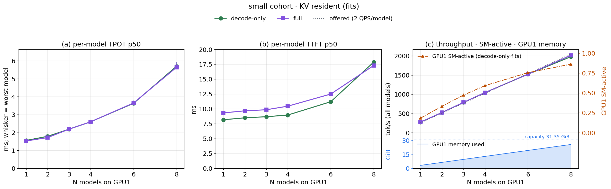
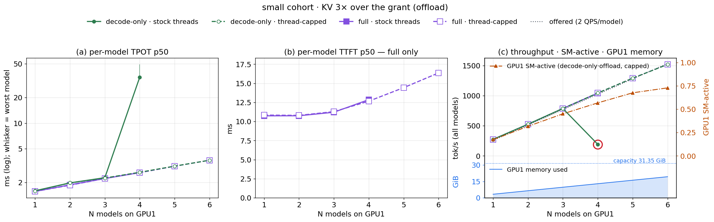
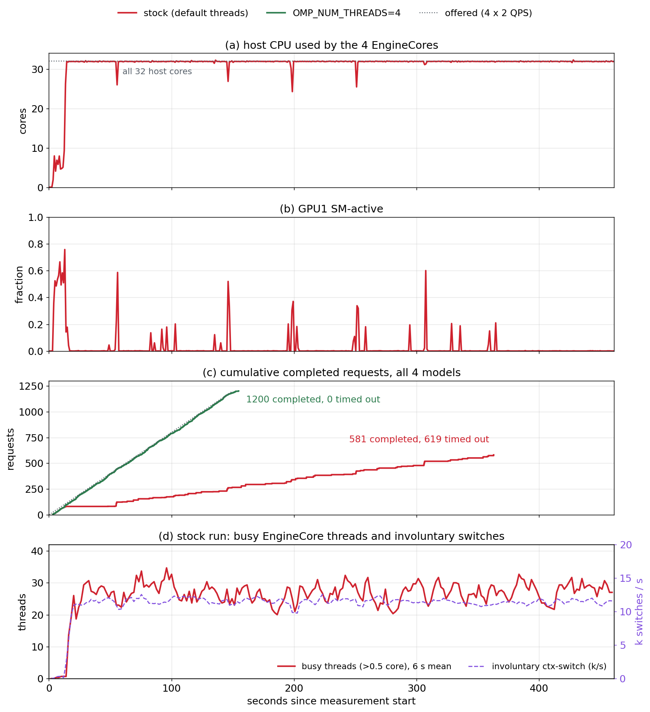
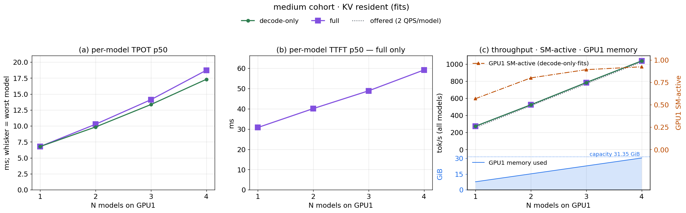
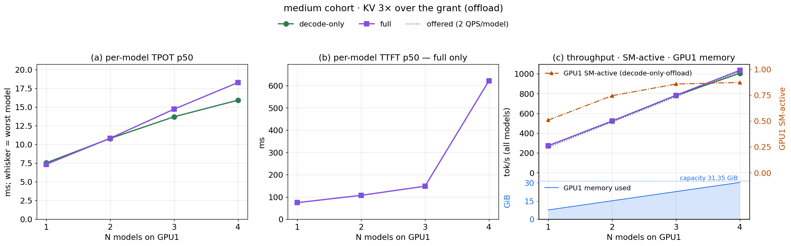

# N models in one GPU: scaling homogeneous colocated inference

Seventh study. The [sixth](report_colocation_inf.md) put **one** small tenant beside the
8B decode and found: two decodes on one GPU time-slice without MPS (~3.4× TPOT, −25%
capacity); with MPS a resident tenant costs ~1.2×; and the inference tenant's distinctive
hazard is KV oversubscription streaming from DRAM. This study drops the incumbent and asks
the scaling question: **put N identical inference models on one GPU — how do per-model
latency and aggregate throughput move as N grows, and what binds first?**

The short answer:

> Under MPS, N small models share one GPU almost for free until the GPU itself runs
> out: eight 0.5B models each still serve their full offered load, at 3.6× the solo
> per-token time, and the knee (N≈6–8) is GPU1 compute, not memory or host CPU. A 3B
> model reaches the same point at N≈2–3. **The failure that actually stops colocation is
> on the host, not the GPU**: every vLLM engine sizes its CPU thread pool for the whole
> machine, so at N=4 with DRAM-streamed KV the engines' threads spin against each other,
> pin all 32 cores, starve the GPU, and the system collapses (throughput falls to 18% of
> the offered load, ~130 of 300 requests per model time out).
> Capping each engine's CPU threads removes it completely and costs nothing at N=1.

---

## 1. The setup

### 1.1 What is colocated

All N models live on **GPU1**, each a separate vLLM engine (separate process, separate
CUDA context) with its own LMCache DRAM store, so the models share no cache state. GPU0
only ever hosts the *temporary* prefill engines of the decode-only config (below).
Engines are brought up **one at a time** (each waits for the previous to be healthy), so
no engine's memory-profiling pass races another's; the driver asserts every engine
reports the same KV grant.

| | **small cohort** | **medium cohort** |
|---|---|---|
| model | Qwen2.5-0.5B | Qwen2.5-3B |
| weights | 0.93 GiB | 5.76 GiB |
| KV per token | 12 KiB | 36 KiB |
| KV of one 6144-token prefix | 0.07 GiB | 0.21 GiB |
| vLLM budget (`gpu-memory-utilization`) | 0.08 (2.5 GiB) | 0.22 (6.9 GiB) |
| `max-num-seqs` / batched tokens | 64 / default | 16 / 1024 |
| **KV grant (engine-reported)** | **1.04 GiB** | **0.94 GiB** |
| GPU1 footprint per model (incl. CUDA/MPS context) | 3.2 GiB | 7.7 GiB |
| N swept | 1, 2, 3, 4, 6, 8 (offload: to 6) | 1, 2, 3, 4 |
| VRAM ceiling | ~9 models | 4 models |

The medium sizing was set by probes, not guessed: at util 0.24 a 3B gets 1.09 GiB of KV
but occupies 8.24 GiB, so only three fit; util 0.22 keeps four (7.7 GiB each, ~31 of
31.35 GiB). At util 0.22 the KV grant is decided by non-KV overhead — cutting
`max-num-seqs` 64 → 16 (≈3× the in-flight requests per model at 2 QPS) frees 0.35 GiB
for KV at the same footprint (0.59 → 0.94 GiB).

### 1.2 The four serving cells

Every model gets its own client at the reference rate — **2 QPS open-loop, 6144-token
fixed prefixes, 128 forced output tokens, seeded** — and all N clients start at the same
instant (aligned windows). Model *i* uses seed 1000+100*i*: distinct prefixes and
arrival schedules, same statistics. What varies is the cell:

| cell | prefill happens | sessions (small / medium) | working set vs KV grant |
|---|---|---|---|
| **decode-only · fits** | never in the window (temp GPU0 prefill populated the store, then was killed) | 8 / 3 | 54% / 67% → **resident** |
| **decode-only · offload** | never | 48 / 14 | **3.2× / 3.1× over** → every miss streams a prefix from DRAM |
| **full · fits** | on GPU1: 128-token unique suffix per request | 8 / 3 | resident |
| **full · offload** | on GPU1 | 48 / 14 | over → spill to / reload from the model's store |

Decode-only requests are 100% prefix hits with no suffix, uniform over sessions — the
disaggregated-decode case (scenario B of the sixth study). Full requests add a 128-token
suffix and use zipf-1.1 session reuse (scenario A).

**Decode-only TTFT is reported N/A.** With no prefill, its "first token"
time is just queueing plus, under offload, reloading the prefix from DRAM — a KV-fetch
time, not a time-to-first-token, and not comparable to the full cells' TTFT (same
convention as the sixth study). Decode-only cells are judged on TPOT, throughput and
failed requests. One launch serves all four cells — engine flags are identical, only
the clients' workload changes — and each cell has its own warmup.

### 1.3 Sharing arms

Co-located models are **equal priority**. Every run is under **MPS with the default
(equal, uncapped) share** — MPS is mandatory for co-resident decodes (sixth study:
without it two decodes serialize to ~3.4× TPOT), and that cost is carried over rather
than re-measured here. No idle-window gate, no per-model SM caps.

One knob turned out to matter: the **per-engine CPU thread cap**
(`OMP_NUM_THREADS=4`). The small cohort was first run with stock threads; §3 shows why
the cap exists. The medium cohort, the small offload runs beyond N=4, and a capped N=8
control use it; the cap is neutral for a single model (medium N=1: all four cells within
1–3% of uncapped).

### 1.4 How a run executes

GPU + host monitors (DCGM per GPU; a per-second host sampler of CPU cores by process
role: stores / EngineCores / API servers / clients, plus RAM and swap) → for i in 1..N:
RAM gate, start model *i*'s store + GPU1 engine (+ temp GPU0 prefill), wait healthy,
[decode-only: populate the store, probe retrieval, kill the temp prefill] → per cell:
warm up all N, then measure all N concurrently (300 requests each) with a stall watchdog
on the engines' generated-token counters → per-engine `/metrics` deltas, client
latencies, telemetry → raw JSON. Strictly one stack set at a time. A cell is `ok` only
with **zero** failed requests.

**Telemetry caveat.** DCGM is per-GPU: on GPU1 it blends all N models. Every per-model
claim rests on client latencies and per-engine metrics; GPU counters bound the combined
load only.

---

## 2. Small cohort: N × 0.5B under MPS

### 2.1 KV resident (fits)



*(a) per-model TPOT p50 (mean over models; whisker = worst model), (b) per-model TTFT
p50 of the full cells (decode-only TTFT is N/A), (c) aggregate throughput against the
offered rate (dotted), with GPU1 SM-active
(orange, right axis). Green = decode-only, purple = full (prefill + decode). Stock thread
settings.*

| N | decode-only TPOT | full TTFT / TPOT | agg tok/s (decode-only / full) | GPU1 SM-active | GPU1 used | host CPU |
|---|---|---|---|---|---|---|
| 1 | 1.56 ms | 9.3 / 1.53 ms | 274 / 274 | 0.18 | 3.3 GiB | — |
| 2 | 1.79 | 9.7 / 1.72 | 526 / 526 | 0.33 | 6.5 | — |
| 3 | 2.19 | 9.9 / 2.19 | 788 / 788 | 0.47 | 9.7 | — |
| 4 | 2.60 | 10.5 / 2.60 | 1045 / 1045 | 0.59 | 12.9 | — |
| 6 | 3.63 | 12.5 / 3.65 | 1522 / 1522 | 0.76 | 19.3 | 15% |
| 8 | 5.70 | 17.3 / 5.64 | 1979 / 2015 | 0.86 | 25.7 | 19–32% |

*TTFT/TPOT are p50, mean over the N models; zero failed requests in every cell. N=8
decode-only TPOT is the zero-failure rerun (`_r2`); the first run lost one request to a
client-side broken pipe and otherwise agrees (5.6 ms). SM-active is from the
first run (0.86, same as full); the rerun's transient CPU storm (§3.2) pulls its mean to
0.78. Host CPU was not recorded before N=6.*

**Observations:**

- **Every model keeps its full offered load up to N=8.** Aggregate throughput sits on
  the offered line (256 tok/s per model) at every N — 2,000 tok/s from eight models on
  one GPU, no failed requests.

- **The price is per-token time, and it is gradual.** TPOT climbs 1.56 → 2.6 ms by N=4
  (+67%) and 5.7 ms by N=8 (3.6×). Up to N=6 each added model costs ~0.4 ms; from N=6 to
  N=8 the slope more than doubles (~1 ms per model).

- **Decode-only and full are the same curve on TPOT.** The 128-token suffix prefill per
  request is too small to matter at 2 QPS: both cells pay the same shared decode cost at
  every N.

- **The knee is GPU1 compute, at N≈6–8.** SM-active grows ~0.14 per model to N=4,
  slows to ~0.09 per model by N=6 and is 0.86 at N=8 while TPOT keeps rising — the GPU
  has no idle time left to absorb another model. Host CPU (15–32%) and GPU1 memory (26 of
  31 GiB) are not binding.

- **Full TTFT is flat until the knee, then moves with TPOT.** The 128-token prefill is a
  single short step: 9–10 ms to N=4, 12.5 ms at N=6, 17 ms at N=8, where every step —
  prefill included — waits on a saturated GPU.

### 2.2 KV 3× over the grant (offload)



*Same panels. Solid = stock thread settings (N=1–4); dashed with hollow markers =
per-engine CPU thread cap (`OMP_NUM_THREADS=4`, N=1–6). Where decode-only and full
coincide, the decode-only circle sits inside the full square. Red ring = failed cell
(>1% of requests). SM-active follows the capped decode-only runs.*

| N | decode-only TPOT, stock → capped | full TTFT, stock → capped | full TPOT, stock → capped | agg tok/s, capped (decode-only / full) | GPU1 SM-active (capped) | swap-in pages (capped) |
|---|---|---|---|---|---|---|
| 1 | 1.60 → 1.59 ms | 10.7 → 10.8 ms | 1.57 → 1.57 ms | 274 / 274 | 0.17 | 83 |
| 2 | 1.98 → 1.98 | 10.8 → 10.8 | 1.88 → 1.86 | 526 / 526 | 0.32 | 164 |
| 3 | 2.28 → 2.26 | 11.2 → 11.3 | 2.23 → 2.23 | 788 / 788 | 0.45 | 33 |
| 4 | **35 ✗** → 2.64 | 12.9 → 12.7 | 2.62 → 2.61 | 1045 / 1045 | 0.57 | 1 |
| 5 | — → 3.12 | — → 14.4 | — → 3.11 | 1292 / 1292 | 0.68 | 142 |
| 6 | — → 3.66 | — → 16.4 | — → 3.66 | 1520 / 1521 | 0.73 | **29,262** |

*Stock = default threads; capped = `OMP_NUM_THREADS=4` (§3). ✗ = stock decode-only N=4:
~130 of 300 requests per model timed out, aggregate 192 tok/s (reproduced 3×; §3).
Every capped cell has zero failed requests. Stock was not run beyond N=4.*

**Observations:**

- **With the thread cap, offload scales exactly like resident KV.** Decode-only and full
  offload both keep the full offered load to N=6, and TPOT follows the resident curve
  (3.66 ms at N=6, same as fits) — reloading prefixes from DRAM adds no per-token cost.

- **The cap is free wherever stock works.** At N=1–3 capped and stock agree within
  noise on every metric (TPOT ±0.02 ms, full TTFT ±0.1 ms). It only matters at N=4,
  where stock decode-only collapses (§3) and capped is just the next point on the curve.

- **Full·offload TTFT rises gently, not stepwise.** 10.7 ms at N=1 to 16.4 ms at N=6:
  zipf reuse keeps each model's hot prefixes resident, so few requests reload, and the
  rise tracks the per-step slowdown.

- **Host RAM becomes the limit at N=6.** At N=6 the host is swap-backed: 29k pages
  swapped in during the decode-only window (97k out) versus at most a few hundred below,
  with 4.8 of 7.6 GiB swap in use — yet latency stays on trend. N=7 would leave ~9 GB
  available, just above the launcher's RAM gate, and N=8 would be refused; offload was
  stopped at N=6 rather than run deep into swap (§5).

- **The GPU still has room.** GPU1 is at 0.73 SM-active and 19 of 31 GiB at N=6 — for
  offload the binding resource is host memory, not the GPU.

---

## 3. The failure that stops colocation: CPU thread oversubscription

### 3.1 What happens at N=4

Decode-only·offload at N=4 collapsed in **four of four** stock runs: ~130 of 300
requests per model timed out, aggregate throughput fell from the offered
1,045 to ~185 tok/s — while GPU1 sat at ~5% SM-active. N=3 was healthy in all four runs.
A cliff, not a slope, and the GPU is idle through it: the bottleneck is on the host.



*Same cell, two runs differing only in `OMP_NUM_THREADS` (stock = the 4th reproduction,
run with every monitor). (a) host CPU cores used by the four EngineCores (the stores stay
at ~0 in both runs and are omitted); (b) GPU1 SM-active; (c) cumulative completed
requests vs the offered arrivals; (d) stock run only — the capped run predates the
per-thread sampler — busy EngineCore threads and involuntary context switches (6 s
rolling mean).*

| decode-only·offload | TPOT p50 | agg tok/s | failed (of 1,200) | host CPU | EngineCore cores | GPU1 SM-active |
|---|---|---|---|---|---|---|
| N=3, stock (×2) | 2.3 ms | 787 | 0 | 13% | — | 0.45 |
| N=4, stock (×4) | 23–74 ms | 158–192 | 489–619 | 93–97% | **31.8–31.9 / 32** (traced runs) | 0.03–0.05 |
| N=4, stock, 2 GiB L1 | 23 ms | 193 | 492 | 94% | — | 0.05 |
| **N=4, `OMP_NUM_THREADS=4`** | **2.6 ms** | **1045** | **0** | **10%** | **2.9 (mean)** | 0.57 |

**Observations:**

- **For ~35 s the stock run is indistinguishable from the capped one** — same SM-active,
  same completion slope. Then the EngineCores jump from ~7 to all 32 host cores within a
  few seconds and **stay pinned until the clients time out**. At that instant GPU1 drops
  to ~0 and completions flatten to a trickle.

- **The CPU is burned inside the engines, not in the stores.** The four LMCache store
  servers stay at ~0 cores throughout; it is the EngineCores — the processes that run
  LMCache's CPU-side copy path (the Python fallback, see CLAUDE.md).

- **Capping each engine's thread pool removes the collapse entirely.** With
  `OMP_NUM_THREADS=4` the same cell sits exactly on the N≤3 curve (TPOT 2.6 ms, full
  throughput), zero failures, the engines averaging 2.9 cores. GPU1 does the work again (0.57).

- **It is not the LMCache staging pool.** The pinned-L1 "failed to allocate" warnings
  that first looked like the cause are present at N=3 (~5,000 per model) and in the
  capped N=4 run (~5,000) — both healthy — and doubling the pool does not help.

**The mechanism — measured at the thread level.** Each vLLM engine's torch/OpenMP
pool is sized to the whole machine (each uncapped EngineCore runs ~135 threads), so N
engines field far more threads than cores. Stack sampling is not possible on this box
(no ptrace/perf/sudo), so a per-thread sampler reads `/proc/<pid>/task/*` every 2 s for
every EngineCore (experiment E2, a 4th stock reproduction):

| stock N=4 decode-only offload, 4 EngineCores | threads | busy threads (>0.5 core) | user-mode CPU | kernel-mode CPU | involuntary ctx-switch/s | voluntary ctx-switch/s |
|---|---|---|---|---|---|---|
| before the collapse (first 14 s) | 540 | 0.5 | 5.3 cores | 0.0 | 276 | 10,437 |
| during the collapse | 540 | **26.8** | **31.8 cores** | **0.0** | **11,542** | 4,303 |

At the onset ~27 threads (~7 per engine) start burning all 32 cores **entirely in user
mode** — no syscall time — and involuntary context switches jump 42× while voluntary ones
fall: threads are preempted while still runnable instead of blocking. That is the
signature of spin-waiting threads stealing cores from each other: each copy slows, more
pile up, and the box settles where all cores spin and little completes — a **cliff with
hysteresis** (normal service, then a flip that never recovers). Capping each engine's
pool at 4 threads (4 × 4 ≤ 32 cores) removes it. What remains unidentified is *which*
code spins (the sampler sees behaviour, not stacks); torch's OpenMP pool is the
consistent candidate, since `OMP_NUM_THREADS` alone controls it.

### 3.2 It is not offload-only

The stock N=8 **resident** rerun showed the same signature once, transiently: at t≈78 s
the eight EngineCores went from ~7 to 31.8 of 32 cores for ~20 s, GPU1 SM-active fell
from 0.95 to 0.03–0.5, and then it **recovered on its own**. Median latency was
untouched (e2e p50 0.72–0.79 s, as in the first run), but every model's tail blew up:
e2e p95 1.5–8.4 s versus 0.9 s, TPOT p95 up to 38 ms versus 7 ms in the first N=8 run,
which had no storm. With more engines the threshold
is lower; resident KV makes the storm brief instead of permanent.

With the cap, N=8 resident ran **without a storm**: TPOT p50 5.4–5.9 ms, TPOT p95 at most
7.2 ms and e2e p95 at most 0.93 s across the eight models — the same tail as the storm-free
stock run — and the same median cost, so the cap is free at N=8 too. One caveat: the stock
storm showed in one of two runs, so a single clean capped run is consistent with the cap
preventing it, not proof. (One request of 2,400 again failed with a client-side broken
pipe, as in the first stock N=8 run — no engine error; recorded, not rerun.)

**Rule for colocation:** cap each engine's CPU threads to about cores ÷ N. The stock
defaults assume one engine per machine; at N=1 the cap costs nothing (medium N=1: all
cells within 1–3% of uncapped).

---

## 4. Medium cohort: N × 3B under MPS

Same design, a model 6× larger: Qwen2.5-3B, 0.94 GiB KV grant each, fits = 3 sessions
(resident), offload = 14 sessions (3.1× over). Every medium cell runs with the per-engine
thread cap (the cap is neutral at N=1: all four cells within 1–3% of uncapped).

### 4.1 KV resident (fits)



*Same panels as §2. Thread cap on throughout.*

| N | decode-only TPOT | full TTFT / TPOT | agg tok/s (% of offered) | GPU1 SM-active / DRAM-active | GPU1 used | host CPU |
|---|---|---|---|---|---|---|
| 1 | 6.78 ms | 30.8 / 6.78 ms | 273 (99%) | 0.57 / 0.44 | 7.7 GiB | 3% |
| 2 | 9.84 | 40.1 / 10.27 | 523 (99%) | 0.80 / 0.66 | 15.2 | 6% |
| 3 | 13.36 | 48.9 / 14.12 | 783 (99%) | 0.89 / 0.77 | 22.8 | 10% |
| 4 | 17.31 | 59.2 / 18.73 | 1036 (99%) | 0.92 / 0.82 | 30.4 | 13% |

*p50, mean over models; zero failed requests in every cell. "% of offered" divides by
each client's actual arrival span (end effects keep it at ~99%).*

**Observations:**

- **A 3B reaches the small cohort's N=8 state at N=2.** One 3B alone keeps GPU1 0.57
  SM-active; two reach 0.80 (small needed N=6 for 0.76). Each added 3B costs ~3.5 ms of
  TPOT — linear from N=1 (6.8 → 9.8 → 13.4 → 17.3 ms), 2.55× at N=4.

- **Memory bandwidth climbs with compute.** DRAM-active rises 0.44 → 0.82 alongside
  SM-active: a 3B decode step reads 5.8 GB of weights, so N decodes compete for HBM
  bandwidth, not just SMs — the predicted bandwidth-bound regime (P7).

- **Every model still serves its offered load at N=4** — no failures, throughput on the
  offered line. At 2 QPS the cost is entirely per-token latency.

- **VRAM binds at N=4.** 30.4 of 31.35 GiB: a fifth 3B does not fit, so for this cohort
  VRAM and GPU compute run out together.

### 4.2 KV 3× over the grant (offload)



*Same panels. Decode-only TTFT is N/A (§1.2); its queueing is decomposed below from the
engines' own metrics.*

| N | decode-only TPOT | full TTFT / TPOT | agg tok/s decode-only / full (% of offered) | worst e2e p95 decode-only / full | GPU1 SM-active |
|---|---|---|---|---|---|
| 1 | 7.54 ms | 74 / 7.34 ms | 272 / 273 (99 / 99%) | 1.7 / 1.2 s | 0.51 |
| 2 | 10.80 | 107 / 10.83 | 522 / 523 (99 / 99%) | 2.9 / 2.2 s | 0.75 |
| 3 | 13.70 | 148 / 14.72 | 781 / 783 (99 / 99%) | 5.3 / 3.7 s | 0.86 |
| 4 | 15.92 | 621 / 18.28 | **1006** / 1035 (**96** / 99%) | **21** / 7.5 s | 0.87 |

**Where decode-only offload time goes** — engine-side request metrics (`/metrics`
histogram deltas), summed over the N engines:

| N | queue wait (mean) | KV load / prefill step (mean) | GPU prefix-cache hit | DRAM (LMCache) hit | running / waiting reqs, engine 0 (mean) | KV cache in use (mean) |
|---|---|---|---|---|---|---|
| 1 | 82 ms | 85 ms | 8% | 70% | 2.0 / 0.1 | 43% |
| 2 | 213 ms | 104 ms | 6% | 71% | — | — |
| 3 | 717 ms | 161 ms | 5% | 69% | 3.8 / 2.4 | 71% |
| 4 | **4,687 ms** | **401 ms** | 4% | 69% | 2.1 / **13.6** | 43% |

**Observations:**

- **Offload costs the 3B far more than the 0.5B — and the cost grows with N.** Decode-only
  e2e p95 goes 1.7 → 2.9 → 5.3 → 21 s, and at N=4 throughput finally drops below the
  offered rate (96%). The small cohort's offload, capped, never left the resident curve.

- **It is queueing, not per-token slowness.** Decode-only TPOT stays on (even slightly
  below) the resident curve; the growth is all in the time requests wait to be
  scheduled — 82 ms at N=1, 4.7 s at N=4.

- **Nearly every request reloads its prefix.** The GPU prefix cache serves only 4–8% of
  tokens: the 0.94 GiB grant holds ~4 of the 14 prefixes, and in-flight requests pin
  theirs, so a request rarely finds its prefix resident. Each reload moves 216 MiB (3×
  the 0.5B's 72 MiB).

- **Up to N=3 the grant caps concurrency.** Each in-flight request holds a whole prefix in
  KV, so the grant fits ~4.4 at once. Little's law gives the concurrency needed — 2 QPS ×
  (load + 128 × TPOT) = 2.1 at N=1, 3.8 at N=3 — and engine 0's logs show 2.0 and 3.8
  running with KV in use rising to 71%: as neighbours stretch TPOT, each request holds
  its KV slot longer and the same grant serves fewer requests per second.

- **At N=4 something else binds.** 13.6 requests wait while only 2.1 run and KV is 43%
  used — the grant is no longer the constraint. What grew is the per-request KV load:
  401 ms vs 85 ms at N=1.

- **The thread cap is what keeps this N=4 cell alive at all.** Run with stock threads
  (experiment E1), the same cell collapses exactly like the small cohort's did: 180 of
  1,200 requests time out, throughput falls to 28% of offered, host CPU 85%, GPU1
  0.29 SM-active, mean KV load 5.6 s and mean queue wait 204 s. So the 401 ms loads are
  not caused by the cap — uncapped they are 14× slower — and the oversubscription
  collapse is not specific to the small model. Whether the residual 85 → 401 ms growth is
  contention or a cap that is too tight is tested by the cap dose-response (E1b, below).

- **Full·offload degrades later.** Zipf reuse keeps hot prefixes resident (TTFT 74 →
  148 ms to N=3), and only at N=4 does its TTFT jump (621 ms) — the same pressure, less
  of it.

---

## 5. What binds first

<!-- TODO: VRAM / host RAM / host CPU / GPU compute ceilings per cohort, incl. small
offload N=5,6 with the cap (RAM ceiling) -->

---

## 6. Takeaways

<!-- TODO -->

---

## Reproducing

```bash
# small cohort, stock threads, all four cells
.venv/bin/python scripts/inf_multi_coloc/multi_sweep.py --cohort small --n 1 2 3 4 --arm mps
.venv/bin/python scripts/inf_multi_coloc/multi_sweep.py --cohort small --n 6 8 --arm mps --cells dfits ffits
# the N=4 collapse and its fix
.venv/bin/python scripts/inf_multi_coloc/multi_sweep.py --cohort small --n 4 --arm mps --cells doff --name-suffix _trace
OMP_NUM_THREADS=4 .venv/bin/python scripts/inf_multi_coloc/multi_sweep.py --cohort small --n 4 --arm mps --cells doff --name-suffix _omp4
# medium cohort (sizing: scripts/inf_multi_coloc/probe_kv.sh), thread cap on
OMP_NUM_THREADS=4 .venv/bin/python scripts/inf_multi_coloc/multi_sweep.py --cohort medium --n 1 2 3 4 --arm mps

# figures (view them before believing them)
.venv/bin/python scripts/plots/plot_mc_scaling.py --cohort small
.venv/bin/python scripts/plots/plot_mc_collapse.py
```

The driver starts/stops its own MPS daemon (`/tmp/mc_mps_pipe`). Data: per-cell summaries
`output/summary_mc_{small,medium}.csv` and per-model `*_models.csv` (rebuilt from raw on
every run); raw records `output/raw/mc_*.json` (gitignored); per-second GPU and host
telemetry `output/gpumon/mc_*{,_host}.csv`; engine logs archived per launch under
`output/logs/mc_archive/`. Variants kept under distinct names: `_r2` reruns, `_trace` /
`_l1x2` / `_omp4` collapse diagnostics, medium `_thin` (0.59 GiB grant) and `_nocap`.
