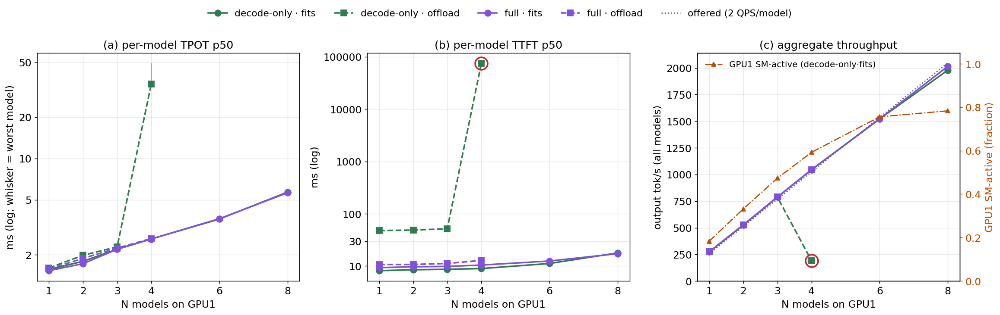

# N models in one GPU: scaling homogeneous colocated inference

Seventh study. The [sixth](report_colocation_inf.md) put **one** small tenant beside the
8B decode and found: two decodes on one GPU time-slice without MPS (~3.4× TPOT, −25%
capacity); with MPS a resident tenant costs ~1.2×; and the inference tenant's distinctive
hazard is KV oversubscription streaming from DRAM. This study drops the incumbent and asks
the scaling question: **put N identical inference models on one GPU — how do per-model
latency and aggregate throughput move as N grows, and what binds first?**

The short answer:

> Under MPS, N small models share one GPU almost for free until the GPU itself runs
> out: eight 0.5B models each still serve their full offered load, at 3.6× the solo
> per-token time, and the knee (N≈6–8) is GPU1 compute, not memory or host CPU. A 3B
> model reaches the same point at N≈2–3. **The failure that actually stops colocation is
> on the host, not the GPU**: every vLLM engine sizes its CPU thread pool for the whole
> machine, so at N=4 with DRAM-streamed KV the engines' threads spin against each other,
> pin all 32 cores, starve the GPU, and the system collapses (TTFT 52 ms → 39–104 s).
> Capping each engine's CPU threads removes it completely and costs nothing at N=1.

---

## 1. The setup

### 1.1 What is colocated

All N models live on **GPU1**, each a separate vLLM engine (separate process, separate
CUDA context) with its own LMCache DRAM store, so the models share no cache state. GPU0
only ever hosts the *temporary* prefill engines of the decode-only config (below).
Engines are brought up **one at a time** (each waits for the previous to be healthy), so
no engine's memory-profiling pass races another's; the driver asserts every engine
reports the same KV grant.

| | **small cohort** | **medium cohort** |
|---|---|---|
| model | Qwen2.5-0.5B | Qwen2.5-3B |
| weights | 0.93 GiB | 5.76 GiB |
| KV per token | 12 KiB | 36 KiB |
| KV of one 6144-token prefix | 0.07 GiB | 0.21 GiB |
| vLLM budget (`gpu-memory-utilization`) | 0.08 (2.5 GiB) | 0.22 (6.9 GiB) |
| `max-num-seqs` / batched tokens | 64 / default | 16 / 1024 |
| **KV grant (engine-reported)** | **1.04 GiB** | **0.94 GiB** |
| GPU1 footprint per model (incl. CUDA/MPS context) | 3.2 GiB | 7.7 GiB |
| N swept | 1, 2, 3, 4, 6, 8 (offload: to 6) | 1, 2, 3, 4 |
| VRAM ceiling | ~9 models | 4 models |

The medium sizing was set by probes, not guessed: at util 0.24 a 3B gets 1.09 GiB of KV
but occupies 8.24 GiB, so only three fit; util 0.22 keeps four (7.7 GiB each, ~31 of
31.35 GiB). At util 0.22 the KV grant is decided by non-KV overhead — cutting
`max-num-seqs` 64 → 16 (≈3× the in-flight requests per model at 2 QPS) frees 0.35 GiB
for KV at the same footprint (0.59 → 0.94 GiB).

### 1.2 The four serving cells

Every model gets its own client at the reference rate — **2 QPS open-loop, 6144-token
fixed prefixes, 128 forced output tokens, seeded** — and all N clients start at the same
instant (aligned windows). Model *i* uses seed 1000+100*i*: distinct prefixes and
arrival schedules, same statistics. What varies is the cell:

| cell | prefill happens | sessions (small / medium) | working set vs KV grant |
|---|---|---|---|
| **decode-only · fits** | never in the window (temp GPU0 prefill populated the store, then was killed) | 8 / 3 | 54% / 67% → **resident** |
| **decode-only · offload** | never | 48 / 14 | **3.2× / 3.1× over** → every miss streams a prefix from DRAM |
| **full · fits** | on GPU1: 128-token unique suffix per request | 8 / 3 | resident |
| **full · offload** | on GPU1 | 48 / 14 | over → spill to / reload from the model's store |

Decode-only requests are 100% prefix hits with no suffix, uniform over sessions — the
disaggregated-decode case (scenario B of the sixth study). Full requests add a 128-token
suffix and use zipf-1.1 session reuse (scenario A). In decode-only cells TTFT contains
**no prefill**: it is queueing plus a one-token step (plus a DRAM reload on an offload
miss). One launch serves all four cells — engine flags are identical, only the clients'
workload changes — and each cell has its own warmup.

### 1.3 Sharing arms

Co-located models are **equal priority**. Every run is under **MPS with the default
(equal, uncapped) share** — MPS is mandatory for co-resident decodes (sixth study:
without it two decodes serialize to ~3.4× TPOT), and that cost is carried over rather
than re-measured here. No idle-window gate, no per-model SM caps.

One knob turned out to matter: the **per-engine CPU thread cap**
(`OMP_NUM_THREADS=4`). The small cohort was first run with stock threads; §3 shows why
the cap exists. The medium cohort, the small offload runs beyond N=4, and a capped N=8
control use it; the cap is neutral for a single model (medium N=1: all four cells within
1–3% of uncapped).

### 1.4 How a run executes

GPU + host monitors (DCGM per GPU; a per-second host sampler of CPU cores by process
role: stores / EngineCores / API servers / clients, plus RAM and swap) → for i in 1..N:
RAM gate, start model *i*'s store + GPU1 engine (+ temp GPU0 prefill), wait healthy,
[decode-only: populate the store, probe retrieval, kill the temp prefill] → per cell:
warm up all N, then measure all N concurrently (300 requests each) with a stall watchdog
on the engines' generated-token counters → per-engine `/metrics` deltas, client
latencies, telemetry → raw JSON. Strictly one stack set at a time. A cell is `ok` only
with **zero** failed requests.

**Telemetry caveat.** DCGM is per-GPU: on GPU1 it blends all N models. Every per-model
claim rests on client latencies and per-engine metrics; GPU counters bound the combined
load only.

---

## 2. Small cohort: N × 0.5B under MPS



*(a) per-model TPOT p50 (mean over models; whisker = worst model), (b) per-model TTFT
p50, both log; (c) aggregate throughput against the offered rate (dotted), with GPU1
SM-active (orange, right axis). Red rings = cells with failed requests. Stock thread
settings throughout this figure.*

| N | decode-only·fits TTFT / TPOT | full·fits TTFT / TPOT | decode-only·offload TTFT / TPOT | full·offload TTFT / TPOT | agg tok/s (fits) | GPU1 SM-active | GPU1 used |
|---|---|---|---|---|---|---|---|
| 1 | 8.2 / 1.56 ms | 9.3 / 1.53 | 48 / 1.60 | 10.7 / 1.57 | 274 | 0.18 | 3.3 GiB |
| 2 | 8.5 / 1.79 | 9.7 / 1.72 | 49 / 1.98 | 10.8 / 1.88 | 526 | 0.33 | 6.5 |
| 3 | 8.7 / 2.19 | 9.9 / 2.19 | 52 / 2.28 | 11.2 / 2.23 | 788 | 0.47 | 9.7 |
| 4 | 9.0 / 2.60 | 10.5 / 2.60 | **75 s / 35** ✗ | 12.9 / 2.62 | 1045 | 0.59 | 12.9 |
| 6 | 11.2 / 3.63 | 12.5 / 3.65 | — | — | 1522 | 0.76 | 19.3 |
| 8 | 17.9 / 5.70 | 17.3 / 5.64 | — | — | 1979 | 0.86 | 25.7 |

*TTFT/TPOT are p50, mean over the N models. ✗ = failed cell (~130 timeouts per model;
§3). N=8 decode-only·fits latencies are the zero-failure rerun (`_r2`); the first run
lost one request to a client-side broken pipe and otherwise agrees (16.6 / 5.6 ms). N=8
SM-active is from the storm-free runs (first dfits, ffits: 0.86); the rerun's transient
storm (§3.2) pulls its mean to 0.78.*

**Observations:**

- **Every model keeps its full offered load up to N=8.** Aggregate throughput sits on
  the offered line (256 tok/s per model) at every N with no failures in any resident
  cell — 2,000 tok/s from eight models on one GPU.

- **The price is per-token time, and it is gradual.** TPOT climbs 1.56 → 2.6 ms by N=4
  (+67%) and 5.7 ms by N=8 (3.6×). Up to N=6 each added model costs ~0.4 ms; from N=6 to
  N=8 the slope doubles (~1 ms per model). The four cells are indistinguishable on
  TPOT — decode is the shared cost no matter how the KV got there.

- **The knee is GPU1 compute, at N≈6–8.** SM-active grows ~0.14 per model to N=4,
  slows to ~0.09 per model by N=6, and is 0.86 at N=8 (storm-free runs) while TPOT keeps
  rising — the GPU has no idle time left to
  absorb another model, so each step waits. Host CPU is 15–30% busy at N=6–8; GPU1
  memory is at 26 of 31 GiB. Neither is binding.

- **TTFT is flat until the knee, then moves with TPOT.** Resident TTFT stays at 8–11 ms
  to N=4 and reaches ~17 ms at N=8: with no prefill in the way it is essentially one
  queued step, so it tracks per-step time.

- **Offload adds a constant reload cost — until it collapses.** Decode-only offload
  pays ~40 ms of TTFT for streaming a 72 MiB prefix from DRAM (48 vs 8 ms) and is flat
  to N=3. At N=4 it falls off a cliff (§3). Full·offload pays almost nothing extra (11 vs
  9 ms) because zipf reuse keeps its hot prefixes resident.

---

## 3. The failure that stops colocation: CPU thread oversubscription

### 3.1 What happens at N=4

Decode-only·offload at N=4 collapsed in **three of three** stock runs: TTFT p50 39–104 s,
~130 of 300 requests per model timed out, aggregate throughput fell from the offered
1,045 to ~185 tok/s — while GPU1 sat at ~5% SM-active. N=3 was healthy in all four runs.
A cliff, not a slope, and the GPU is idle through it: the bottleneck is on the host.


*Same cell, two runs differing only in `OMP_NUM_THREADS`. (a) host CPU cores used by the
four EngineCores (the stores stay at ~0 in both runs and are omitted); (b) GPU1
SM-active; (c) cumulative completed requests vs the offered arrivals.*

| decode-only·offload, N=4 | TTFT p50 | TPOT p50 | agg tok/s | failed | host CPU | EngineCore cores | GPU1 SM-active |
|---|---|---|---|---|---|---|---|
| N=3, stock (×2) | 52 ms | 2.3 ms | 787 | 0 | 13% | — | 0.45 |
| N=4, stock (×3) | 39–104 s | 23–44 ms | 179–192 | 489–537 | 93% | **31.9 / 32** (traced run) | 0.05 |
| N=4, stock, 2 GiB L1 | 83 s | 23 ms | 193 | 492 | 94% | — | 0.05 |
| **N=4, `OMP_NUM_THREADS=4`** | **52 ms** | **2.6 ms** | **1045** | **0** | **10%** | **2.9 (mean)** | 0.57 |

**Observations:**

- **For ~35 s the stock run is indistinguishable from the capped one** — same SM-active,
  same completion slope. Then the EngineCores jump from ~7 to all 32 host cores within a
  few seconds and **stay pinned until the clients time out**. At that instant GPU1 drops
  to ~0 and completions flatten to a trickle.

- **The CPU is burned inside the engines, not in the stores.** The four LMCache store
  servers stay at ~0 cores throughout; it is the EngineCores — the processes that run
  LMCache's CPU-side copy path (the Python fallback, see CLAUDE.md).

- **Capping each engine's thread pool removes the collapse entirely.** With
  `OMP_NUM_THREADS=4` the same cell runs at exactly the N≤3 latency (52 ms TTFT), zero
  failures, the engines averaging 2.9 cores. GPU1 does the work again (0.57).

- **It is not the LMCache staging pool.** The pinned-L1 "failed to allocate" warnings
  that first looked like the cause are present at N=3 (~5,000 per model) and in the
  capped N=4 run (~5,000) — both healthy — and doubling the pool does not help.

**The mechanism — what is measured and what is inferred.** Measured: (1) the collapse is
the engines' CPU use going to all 32 cores while the GPU idles; (2) capping each engine's
torch/OpenMP pool at 4 threads, and changing nothing else, removes it; (3) the cap does
nothing at N=1. Inferred, not profiled: each vLLM engine's pool is sized to the whole
machine (32 threads), so N engines field 32·N threads on 32 cores; under offload every
request runs CPU-side copy work on that pool, and once enough copies overlap, threads
that spin-wait for their peers get descheduled by other engines' spinners, each copy
slows, more pile up, and the box settles where all cores are busy and little completes.
That reading explains the **cliff with hysteresis** (35 s of normal service, then a flip
that never recovers) and why a pool that fits each engine's share of the cores
(4 × 4 ≤ 32) removes it — but the spinning threads were not stack-sampled, so the
spin-wait step is the one link not directly observed.

### 3.2 It is not offload-only

The stock N=8 **resident** rerun showed the same signature once, transiently: at t≈78 s
the eight EngineCores went from ~7 to 31.8 of 32 cores for ~20 s, GPU1 SM-active fell
from 0.95 to 0.03–0.5, and then it **recovered on its own**. Median latency was
untouched (TTFT 18 ms), but every model's tail blew up (TTFT p95 0.9–2.9 s, max 6 s,
versus 25 ms in the first N=8 run, which had no storm). With more engines the threshold
is lower; resident KV makes the storm brief instead of permanent.

<!-- TODO: capped N=8 fits result (mc_small_*_n8_mps_omp4) -->

**Rule for colocation:** cap each engine's CPU threads to about cores ÷ N. The stock
defaults assume one engine per machine; at N=1 the cap costs nothing (medium N=1: all
cells within 1–3% of uncapped).

---

## 4. Medium cohort: N × 3B under MPS

<!-- TODO: medium figure + table + observations (mc_medium_*_mps, thread cap on) -->

---

## 5. What binds first

<!-- TODO: VRAM / host RAM / host CPU / GPU compute ceilings per cohort, incl. small
offload N=5,6 with the cap (RAM ceiling) -->

---

## 6. Takeaways

<!-- TODO -->

---

## Reproducing

```bash
# small cohort, stock threads, all four cells
.venv/bin/python scripts/inf_multi_coloc/multi_sweep.py --cohort small --n 1 2 3 4 --arm mps
.venv/bin/python scripts/inf_multi_coloc/multi_sweep.py --cohort small --n 6 8 --arm mps --cells dfits ffits
# the N=4 collapse and its fix
.venv/bin/python scripts/inf_multi_coloc/multi_sweep.py --cohort small --n 4 --arm mps --cells doff --name-suffix _trace
OMP_NUM_THREADS=4 .venv/bin/python scripts/inf_multi_coloc/multi_sweep.py --cohort small --n 4 --arm mps --cells doff --name-suffix _omp4
# medium cohort (sizing: scripts/inf_multi_coloc/probe_kv.sh), thread cap on
OMP_NUM_THREADS=4 .venv/bin/python scripts/inf_multi_coloc/multi_sweep.py --cohort medium --n 1 2 3 4 --arm mps

# figures (view them before believing them)
.venv/bin/python scripts/plots/plot_mc_scaling.py --cohort small
.venv/bin/python scripts/plots/plot_mc_collapse.py
```

The driver starts/stops its own MPS daemon (`/tmp/mc_mps_pipe`). Data: per-cell summaries
`output/summary_mc_{small,medium}.csv` and per-model `*_models.csv` (rebuilt from raw on
every run); raw records `output/raw/mc_*.json` (gitignored); per-second GPU and host
telemetry `output/gpumon/mc_*{,_host}.csv`; engine logs archived per launch under
`output/logs/mc_archive/`. Variants kept under distinct names: `_r2` reruns, `_trace` /
`_l1x2` / `_omp4` collapse diagnostics, medium `_thin` (0.59 GiB grant) and `_nocap`.
