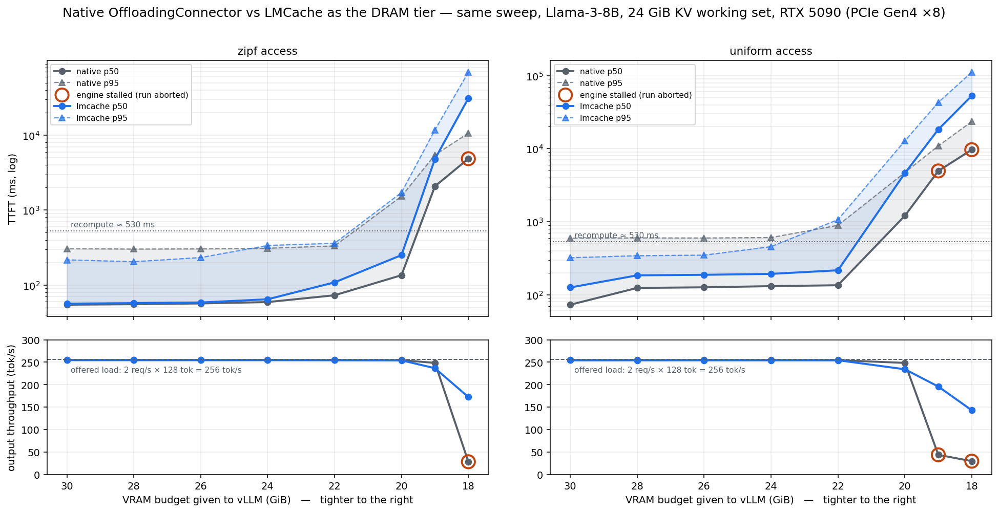

# The same VRAM sweep with LMCache: same cliff, kinder collapse

Third pass over the Case A question — *how far can a serving GPU's VRAM budget shrink before
DRAM offloading stops saving you?* — with one variable changed: the DRAM tier is
**LMCache** (`LMCacheConnectorV1`) instead of vLLM's native `OffloadingConnector`. Same
machine, same model, same workload generator, same seed, same 2 QPS open loop as
[report_simple_inference.md](report_simple_inference.md), so every row here compares
directly with a row there.

**Headline: the wall does not move, but the failure mode changes sides.** LMCache pays a
higher per-retrieval cost above the wall (visible in uniform medians) and buys tighter tails;
below the wall it never preempts and never stalls — it fails like a queue, where the native
backend failed like a crash.

---

## 1. What changed, and only what changed

| | native arm (original) | lmcache arm (this report) |
|---|---|---|
| offload connector | `OffloadingConnector` (in-tree) | `LMCacheConnectorV1` + lmcache 0.4.4 (pip) |
| DRAM tier | 24 GiB pinned pool | 24 GiB pinned local-CPU cache (`max_local_cpu_size`) |
| transfer granularity | 16-token blocks | 256-token chunks |
| cache keys | block hashes (vLLM) | token-chunk hashes (`PYTHONHASHSEED=0` pinned) |
| disk | none | none — `local_disk: null`, everything in DRAM |
| invocation | `--kv-offloading-backend native` | `--kv-offloading-backend lmcache` |

Single GPU, single process, no server — the cache is in-process, exactly as the native pool
was. One caveat to keep in mind throughout: lmcache 0.4.4's compiled CUDA ops do not load
against torch 2.9.1 (`undefined symbol`), so it runs on its Python/torch fallback path.
Its per-retrieval overhead below is therefore an upper bound.

Workload, unchanged: 32 sessions × 6144-token block-aligned prefixes (24 GiB KV working
set), request = prefix + 128 unique tokens, 128 out, Poisson 2 QPS, 300 measured requests
per config, zipf-1.1 and uniform session draws.

## 2. Results



*Columns: access pattern. Top: TTFT p50 with the band out to p95, log scale. Bottom:
output throughput against the 256 tok/s offered load. Grey = native backend (original
study), blue = LMCache. Red rings mark configs where the engine stalled mid-run — all of
them are native's; at the 18–19 GiB floor the blue line keeps flowing at 143–172 tok/s
where the grey one wedges below 45.*

### zipf-1.1 (hot set: 17 of 32 sessions)

| budget | GPU KV | native p50/p95 (ms) | lmcache p50/p95 (ms) | lmcache GPU/DRAM hits | tok/s |
|---|---|---|---|---|---|
| 30 | 13.77 | 54 / 305 | **56 / 217** | 75% / 23% | 254.8 |
| 28 | 11.77 | 55 / 302 | **57 / 204** | 73% / 25% | 254.7 |
| 26 | 9.77 | 57 / 303 | **58 / 232** | 69% / 29% | 254.8 |
| 24 | 7.77 | 59 / 315 † | 64 / 337 | 63% / 35% | 254.8 |
| 22 | 5.77 | 73 / 332 | 108 / 361 | 49% / 43% | 254.5 |
| 20 | 3.77 | 135 / 1528 | 250 / 1715 | 11% / 53% | 254.2 |
| 19 | 2.77 | 2078 / 5451 | 4804 / 11792 | 4% / 61% | 236.7 |
| 18 | 1.77 | 4856 / 10666 **stalled** | 31186 / 69639 *flowing* | 3% / 71% | **172.4** |

### uniform (no hot set — the adversarial case)

| budget | native p50/p95 (ms) | lmcache p50/p95 (ms) | tok/s |
|---|---|---|---|
| 30 | 73 / 594 | 126 / **321** | 254.5 |
| 28 | 124 / 600 | 184 / **342** | 254.5 |
| 26 | 126 / 598 | 187 / **348** | 254.5 |
| 24 | 131 / 606 | 193 / **455** | 254.5 |
| 22 | 135 / 892 | 216 / 1067 | 254.4 |
| 20 | 1205 / 4720 | 4612 / 12805 | 234.3 |
| 19 | 4952 / 10923 **stalled** (43.7 tok/s) | 18340 / 43030 *flowing* | **195.8** |
| 18 | 9675 / 23528 **stalled** (29.5 tok/s) | 52984 / 111835 *flowing* | **142.9** |

† the native zipf/b24 raw files were accidentally overwritten during this study's smoke test
and re-measured the same day; the printed numbers are the original report's, which the
re-measurement reproduced within noise.

## 3. Discussion

### What actually differs between the two arms

Both arms are the same vLLM server with the same idea: a second KV cache tier in DRAM
behind the GPU cache. When a request arrives and its session prefix is on the GPU, it is
served instantly (a *GPU hit* — the backend never runs). When it is not, the prefix is
either **fetched from DRAM over PCIe** (a *DRAM hit*, tens to hundreds of ms) or, if the
DRAM tier does not have it either, **recomputed from scratch** (~530 ms of prefill). The
only thing that changes between the arms is the software managing that DRAM tier:

| | native (`OffloadingConnector`) | lmcache (`LMCacheConnectorV1`) |
|---|---|---|
| unit of storage/eviction | 16-token blocks | 256-token chunks |
| cache keys | vLLM's own block hashes, already computed | its own token-chunk hashes, computed at lookup |
| copy path | one dedicated CUDA kernel (`swap_blocks`) | its own memory layer — here on a pure-Python/torch fallback, since no published wheel matches torch 2.9.1+cu128 |
| measured fetch of one 0.75 GB prefix | ~65 ms (~11 GB/s) | ~151 ms (~5 GB/s) |

Everything in the results follows from three causal chains rooted in this table.

### Chain 1: slower fetch → higher medians where fetches are common

lmcache pays ~86 ms more per DRAM fetch (Python copy path + per-chunk hashing and
reassembly). Under zipf this is invisible — the median request is a GPU hit and the
backend never runs, hence the identical 56 vs 54 ms medians. Under uniform access,
40–90% of requests take the DRAM path, and the extra fetch cost surfaces directly as the
~1.5× median gap (126 vs 73 ms at 30 GiB). This is the one difference that is an
implementation artifact rather than a design property: with compiled ops the fetch cost
shrinks and the median gap should shrink with it (re-measurement in progress).

### Chain 2: coarser eviction → fewer total misses → tighter tails

A prefix lookup must match *contiguously from token zero* — one missing piece ends the
match and everything after it is recomputed. Native evicts in 16-token blocks, so under
memory pressure a warm session can lose interior blocks piecemeal, and a single hole
converts the rest of that 768 MiB prefix into a 530 ms recompute. lmcache evicts whole
256-token chunks: a session is either resident or gone, rarely Swiss-cheesed. The effect
is visible in tier coverage: adding both hit rates, lmcache captures **98%** of requests
(zipf and uniform alike) against native's 93–95% — i.e. a third the recompute rate. Since
p95 is exactly where the recompute victims live, lmcache's tails are tighter at every
healthy budget (321–455 vs 594–606 ms on uniform) *despite* its slower fetches: **a slow
fetch beats a recompute, and lmcache substitutes fetches for recomputes more often.**

### Chain 3: cheap re-admission → the overload spiral never ignites

The native arm's collapse below 20 GiB was a feedback loop: under memory pressure the
scheduler evicts a running request, whose prefix must then be *recomputed in full* —
530 ms of already-paid work turned back into new work, which deepens the pressure that
caused the eviction. That spiral took native to 28–44 tok/s with a wedged engine (the red
rings). With lmcache, an evicted or delayed request re-enters via a ~151 ms fetch instead
of a recompute, so falling behind does not compound — the sweep recorded **zero
preemptions in all 16 configs**, no engine ever stalled, and at the 18 GiB floor the
server still delivered 143–172 tok/s with every request completing. Overload became a
deep queue instead of a death spiral.

### What does not change, and why: the cliff

Both arms break at the same budgets (19–20 GiB) because decoding must read a sequence's
KV from *VRAM* on every step — a DRAM tier can eliminate recompute, but it cannot shrink
the resident KV that running requests need. At 19 GiB the GPU holds ~3.5 requests' KV
against an offered load needing 5+ concurrent; that arithmetic is backend-independent,
and indeed the two arms' GPU hit rates track point-for-point down the entire sweep.
Swapping the whole offload implementation moved the cliff not one GiB: **the wall belongs
to the workload, not to the cache.**

One reading note for the floor rows: native's latency numbers there *look* lower (4.9 s
vs 31 s p50 at 18 GiB) but come from runs the stall watchdog aborted — snapshots of a
server that had stopped serving. lmcache's are complete measurements of one that finished
all 300 requests. At the floor, compare throughput and completion, not latency.

## 4. Operational notes, learned the hard way

- **Version pairing is strict.** lmcache 0.5.4 fails to import against vLLM 0.15.1's
  vendored adapter (`CudaIPCWrapper` missing); 0.4.4 pairs cleanly. The pip resolver also
  silently upgraded `transformers` to 5.x during install, which vLLM 0.15.1 forbids —
  re-pin after installing.
- **`PYTHONHASHSEED=0` is mandatory**, not advisory: chunk keys are Python builtin hashes.
  Unset, keys differ per process and across restarts; in a single-process run this silently
  empties the cache on every restart, and in the split deployment (companion work) it made
  the decode node recompute everything while *looking* correct.
- The compiled CUDA ops don't load against torch 2.9.1; everything ran on the Python
  fallback. The uniform-skew median toll should be re-measured if a matching wheel appears.
- Environment drift vs the original run: transformers 4.56.x → 4.57.6, lmcache and its
  dependency tree newly installed. The zipf/b24 re-measurement doubling as a drift control
  reproduced the original numbers.

## 5. Where this fits

This is the colocated arm of a larger comparison. The companion split-system work
(prefill on GPU0, decode on GPU1) has both a bespoke P2P-transfer arm and an
LMCache-server arm standing; the decode-node VRAM sweep over those is the next experiment.
Between them, the three studies now hold the same workload against: a single GPU with a
native DRAM tier, a single GPU with LMCache (this report), and a disaggregated pair — with
the failure mode at the VRAM floor as the sharpest differentiator so far.

## Reproducing

```bash
cd scripts/inference/simple
../../../.venv-matched/bin/python run_sweep.py --backend lmcache --arms offload --tag lmcache
../../../.venv/bin/python ../../plots/plot_lmcache.py
```

Data: `output/summary_lmcache.csv`, raw per-request records in `output/raw/*_lmcache.json`,
per-config engine logs in `output/logs/*_lmcache.log`. 59.3 min wall-clock for the 16
configs on this machine.
