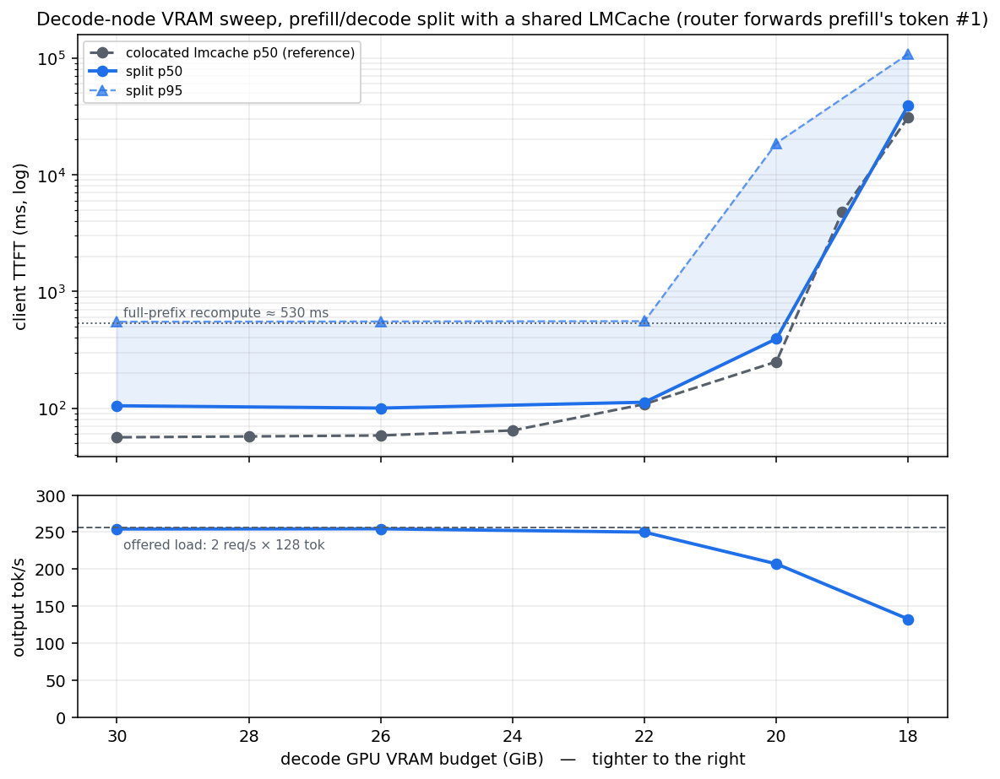
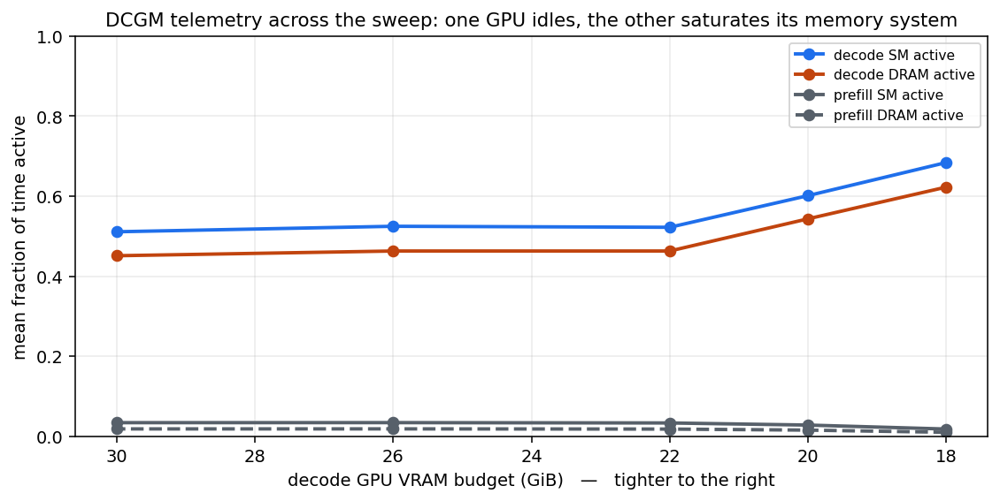

# A prefill/decode split on two consumer GPUs: build it by hand, then do it right

Fourth study on this machine, and the first to use both RTX 5090s at once: **GPU0 runs
prefill only, GPU1 runs decode only, and GPU1's VRAM budget is swept 30 → 18 GiB** under
the reference workload every study here shares (32 sessions × 6144-token prefixes,
prefix + 128 unique tokens, 128 out, zipf-1.1, 2 QPS open loop — see
[report_simple_inference.md](report_simple_inference.md)).

The study became two stories. **Act I** builds the split the way the vLLM box parts
suggest — a point-to-point KV transfer plus pinned-DRAM pools — and hits two structural
problems that no amount of patching fixes. **Act II** replaces the transfer with a shared
KV cache (LMCache) and runs the sweep. A methodology finding along the way changes how
split TTFT should be measured at all.

---

## 1. Act I: the hand-built split, and why it was abandoned

### Making it work at all

vLLM 0.15.1's in-tree `P2pNcclConnector` was the natural starting point: prefill pushes
each layer's KV to the decode instance over NCCL (these GeForce cards have no
peer-to-peer DMA — `CNS` — so NCCL stages through host DRAM, a measured 13% penalty:
12.6 vs 14.5 GB/s). Getting one request through end-to-end required four local patches,
each worth recording because each failure mode was a silent hang, not an error:

1. **Request-id agreement.** vLLM appends a random per-process suffix to every request id;
   the connector keys transfers on that internal id, so producer and consumer could
   *never* agree on a key — the connector is simply broken in this release, and it fails
   by waiting forever on a condition variable.
2. **A deadline on the consumer's wait**, so a missing transfer degrades instead of
   wedging the engine permanently.
3. **The spill copy on its own CUDA stream.** The consumer parks arriving KV in a pinned
   host pool; upstream issues that copy on the default stream, behind decode kernels, and
   because one listener thread serves all transfers, every producer send waited on it —
   80% of each send was waiting for the ack. The one-line stream fix took the producer's
   per-layer send from 33 to 12.5 ms and saturated decode throughput from 448 to
   588 tok/s (+31%).
4. **Backpressure on the send queue**, after prefix caching made prefills cheap enough to
   enqueue ~11 GiB of pending KV copies in one step and OOM the prefill GPU.

The pinned pools carry their own traps: the connector's default is **32 GiB of pinned
host memory per instance** — two instances on a 60 GiB box is not an OOM kill but a hard
freeze (it rebooted this machine once); the pool allocator rounds up to powers of two, so
asking for 24 GiB pins 32; and the pool holds **one full copy of the prompt KV
(1.00 GiB, measured) per in-flight request** from arrival until the request finishes.

### Structural problem 1: DRAM for decode only means prefill recomputes

The transfer pool gives *decode* a DRAM tier. Prefill has none — its session cache is
whatever fits in leftover VRAM (~9 of 32 sessions). So when a request from an older
session returns, prefill recomputes the entire 6144-token prefix from scratch: **~31% of
requests paid ~530 ms**, and the prefill leg's p95 reached 5.7 s. Bolting a DRAM tier
onto prefill (vLLM's `OffloadingConnector` composed via `MultiConnector`) fixed the
recompute — retrieval is ~65 ms — but exposed the deeper disease: the same session's KV
now existed in **up to five places at once** (prefill's VRAM cache, prefill's DRAM tier,
in transit, the decode pool — once *per in-flight request*, undeduplicated — and GPU1's
VRAM), with 29 GiB of pinned RAM holding roughly 3 GiB of distinct hot bytes.

### Structural problem 2: one shared pool between the processes is not trivial

The obvious fix — one host-DRAM pool both instances use — looks like a config change and
is not, because the two engines are separate processes on separate GPUs:

- **Pinned memory is per-process.** A `cudaHostAlloc` buffer exists only in its owner's
  address space. Sharing requires OS shared memory plus each process independently
  host-registering its own mapping. (The primitive does work here — a `/dev/shm` segment
  registered from both processes moved KV at the full 14.5 GB/s pinned rate — but neither
  vLLM's pool nor any connector is written over it.)
- **The allocator itself must be shared.** Free lists, refcounts and locks have to live
  *in* the shared segment with cross-process synchronization, and survive either process
  dying mid-operation without corrupting or leaking the pool.
- **The processes must agree on names.** Content keys have to hash identically across
  processes — not a given: Python randomizes its hash per process, which later bit the
  LMCache setup as silent full recompute until `PYTHONHASHSEED` was pinned.
- **Entry lifetime is a distributed problem.** KV must survive until the last consumer is
  done (the decode node re-reads entries to recover from preemption), which means
  cross-process reference counting with crash cleanup.

Solving all four is not a patch — it is building a KV-cache service. Services that have
already solved them exist (LMCache; Mooncake's store is the same idea at datacenter
scale), so Act II adopts one rather than rebuilding it.

## 2. Act II: the split over a shared LMCache

```
GPU0 prefill ──store once──▶  LMCache server (DRAM, content-addressed)  ◀──retrieve── GPU1 decode
```

One cache replaces all three private pools. KV is keyed by 256-token chunk hashes, so a
session's prefix is stored **once ever** (32 stores for 32 sessions, measured, across
hundreds of requests) and read by whoever needs it; no GPU-to-GPU path exists; the two
legs of a request need no shared request id at all. Everything stays in DRAM — no disk.

Operational findings, all now handled in `scripts/inference/split_lmcache/`:
`PYTHONHASHSEED=0` is mandatory for cross-process key agreement; the per-instance staging
pool overflows (and in one version, kills both engines) if a cold-cache warmup stores
faster than the ~1 GB/s server drain, so warmup runs at 0.5 QPS; the stock server binds
without `SO_REUSEADDR` and dies on restart-in-place, wrapped and fixed; and lmcache
0.4.4 is the newest release whose adapter pairs with vLLM 0.15.1 — its compiled CUDA ops
do not load against this torch (every escape route tried, including a source build that
deadlocks at init), so all copies run a Python fallback at roughly half speed. Retrieval
costs are therefore upper bounds.

## 3. Methodology: the router must let prefill emit the first token

Prefill's final forward pass *produces* token #1. The demo-style two-leg router — ours,
and vLLM's own disagg example — throws it away and streams only the decode leg, which
silently redefines TTFT as "time until the decode node has re-materialized the KV":
~580 ms flat, dominated by a ~430 ms retrieval that the client need not have waited for.
The router was fixed to stream leg 1's token immediately and drop the decode leg's
regenerated duplicate (exact at temperature 0). The accounting balances precisely:
end-to-end time is unchanged and the retrieval moved into the token-1→2 gap (ITL mean
rose ~4 ms ≈ 500 ms spread over 127 gaps).

**All results below use the token-forwarding router.** Discard-router numbers appear
nowhere in this report; client TTFT here means what it means in a colocated benchmark.

## 4. Results



| decode budget | decode KV | TTFT p50 | TTFT p95 | tok/s | e2e p50 | ITL p50 | preempt |
|---|---|---|---|---|---|---|---|
| 30 | 13.77 | **105 ms** | 551 ms | 254.2 | 3.88 s | 15.9 ms | 0 |
| 26 | 9.77 | **100 ms** | 554 ms | 254.4 | 3.77 s | 15.2 ms | 0 |
| 22 | 5.77 | **112 ms** | 557 ms | 249.9 | 4.24 s | 14.4 ms | 0 |
| 20 | 3.77 | 393 ms | 18.7 s | 207.1 | 15.0 s | 12.5 ms | 0 |
| 18 | 1.77 | 39.5 s | 108.6 s | 132.4 | 66.4 s | 11.7 ms | 0 |

Zero failed requests and zero preemptions at every point; the stall watchdog never fired.

- **Above 22 GiB the curve is flat at ~105 ms** — within 2× of the colocated LMCache
  reference (56 ms), the residue being the router hop and second HTTP leg. TTFT p95 sits
  at ~550 ms: the ~40% of requests whose prefix misses prefill's VRAM cache and pays
  DRAM retrieval or recompute *on the prefill side*. Decode-side pressure does not touch
  first-token latency at all in this regime.
- **The wall arrives between 22 and 20 GiB**, and it is a capacity wall, not a latency
  path: at 2 QPS with ~3.8 s in the system, ~7–8 requests are decoding at once, needing
  ~6 GiB of resident KV. A 22 GiB budget (5.8 GiB KV) just holds it; 20 GiB (3.8 GiB)
  cannot, the running batch shrinks, service time stretches, and the admission gate
  backs up — first into the p95, then (at 18 GiB) into the median, which is pure queue.
- **The floor degrades, it does not die.** At 1.77 GiB of KV — barely two sequences —
  the system still moved 132 tok/s and finished all 300 requests. Same
  queue-instead-of-spiral behavior the colocated LMCache study found, now confirmed on
  the split: retrieval-priced eviction removes the recompute feedback loop
  ([report_lmcache_inference.md](report_lmcache_inference.md)).
- A prediction from the plan corrected: the decode node does *not* survive to ~8 GiB.
  Its floor is weights + in-flight KV ≈ 21 GiB *for this workload's* concurrency — the
  split moves the working-set problem off the decode GPU but not the in-flight one.



The telemetry (DCGM SMACT/SMOCC/DRAMA, per-second traces in `output/gpumon/`) shows the
split's economics in two lines: **the prefill GPU is ~97% idle at every budget** (SM
active 1.8–3.4%; session hits leave it 128-token suffixes), while the decode GPU runs SM
active 51% → 68% as the budget shrinks, with **DRAM active 45% → 62%** and SM occupancy
never above 5% — memory-bandwidth-bound decode, exactly as the plan's cost model
assumed, working hardest precisely where it delivers least.

## 5. What this buys and costs

Against the colocated LMCache system on one GPU, the split costs ~2× TTFT (105 vs 56 ms)
and an idle second GPU — and buys isolation: first-token latency that is entirely
insensitive to decode-side memory pressure until the admission gate itself saturates,
plus a prefill GPU with ~97% of its compute free. That idle capacity, and the decode
GPU's measured 45–62% DRAM utilization, are the two numbers the next phase — resizing
decode VRAM live and colocating other workloads beside it — will trade against each
other.

## Reproducing

```bash
cd scripts/inference/split_simple
../../../.venv/bin/python disagg_sweep.py --stack lmcache --skew zipf \
    --budgets 30 26 22 20 18 --warmup-qps 0.5 --forward-first-token \
    --name-suffix _fwd --tag split_lmc_fwd
../../../.venv/bin/python ../../plots/plot_split_lmcache.py
```

Data: `output/summary_split_lmc_fwd*.csv`, raw per-request records in
`output/raw/split_lmcache_zipf_b*_fwd.json`, per-second GPU traces in
`output/gpumon/`, per-config engine logs in `output/logs/`. The Act I stack, its four
connector patches (`split_simple/p2p_patch/`), and its probes remain runnable via
`disagg_sweep.py --stack p2p`.
